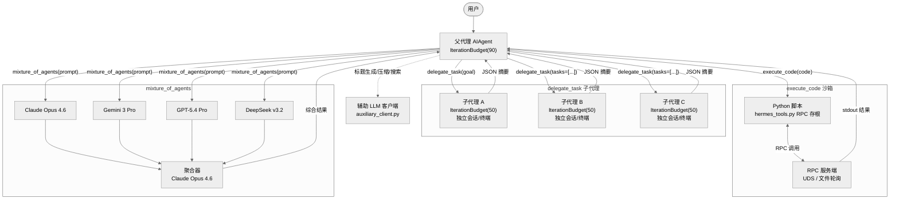
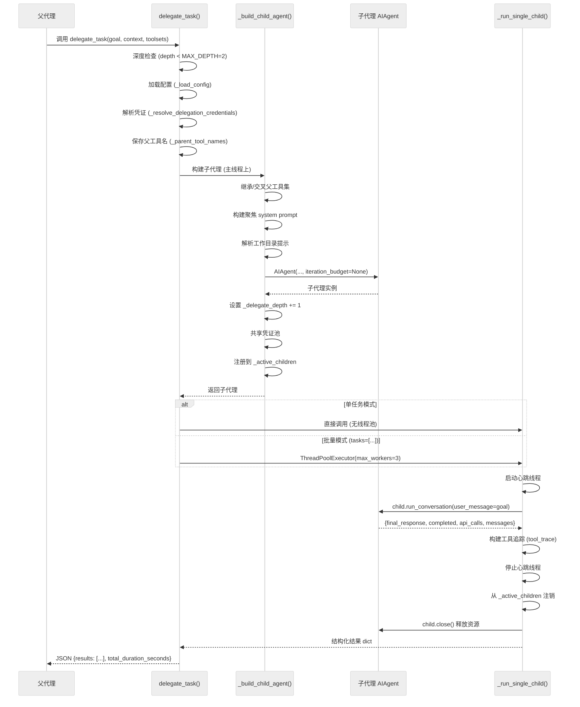
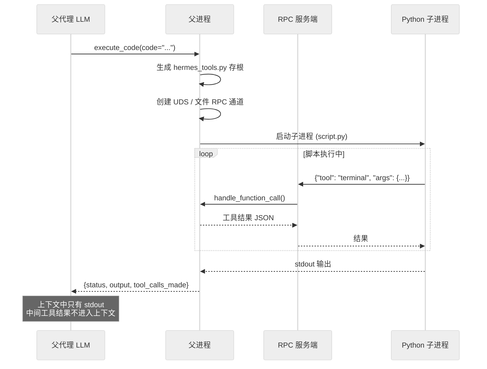
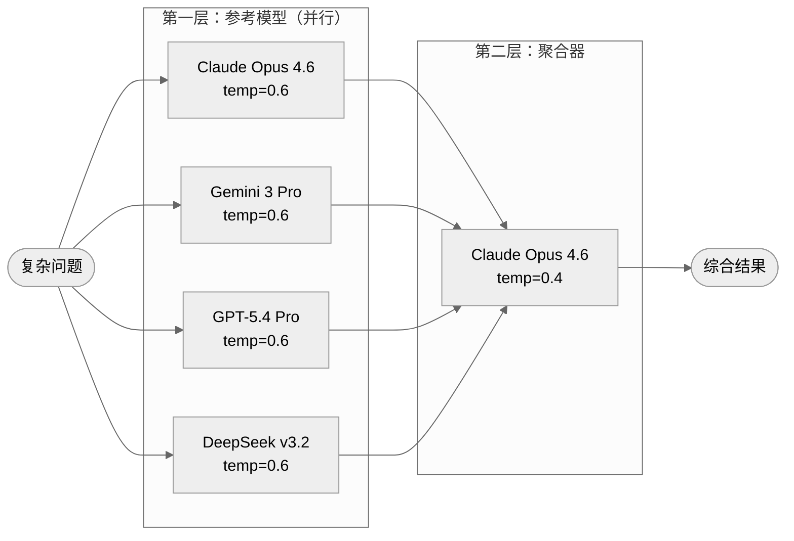
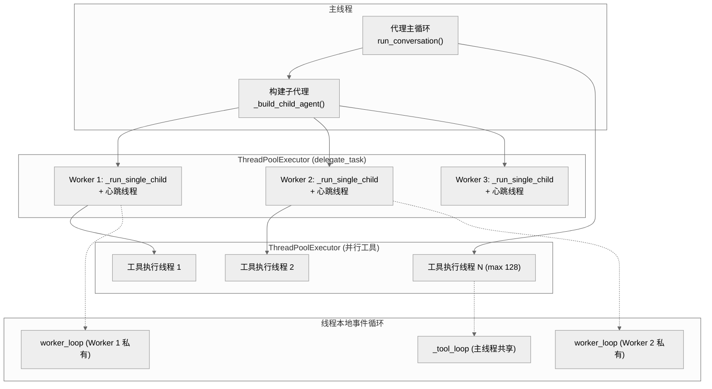

# 第十一章：委派与子代理（Delegation & Subagents）

## 一句话概要

hermes-agent 通过 `delegate_task`、`execute_code` 和 `mixture_of_agents` 三个互补工具，实现了从"推理密集型子任务委派"到"零上下文成本的程序化工具编排"再到"多模型协同推理"的完整子代理架构，每个子实体拥有独立的上下文窗口、迭代预算和终端会话，父代理仅接收最终摘要。

---

## 架构总览



---

## delegate_task 工具：子代理委派

### 设计哲学

`delegate_task` 的核心目标是**上下文隔离**——父代理的上下文窗口只需要承载委派调用和返回的摘要，子代理的所有中间推理、工具调用和错误处理都被封装在独立的对话历史中，不会污染父代理的上下文。

### 子代理创建流程



### 子代理得到什么

每个子代理在创建时获得一组精心裁剪的资源（`tools/delegate_tool.py:238-397`）：

| 维度 | 子代理获得的内容 | 不获得的内容 |
|------|-----------------|-------------|
| **对话历史** | 全新的空对话 | 父代理的所有历史消息 |
| **系统提示词** | 聚焦于 goal + context 的专用提示 | 父代理的完整系统提示 |
| **工具集** | 父工具集与请求工具集的**交集** | `delegate_task`, `clarify`, `memory`, `send_message`, `execute_code` |
| **终端会话** | 独立的 task_id（独立沙箱/容器） | 父代理的终端状态 |
| **迭代预算** | 独立的 IterationBudget(50) | 与父预算的任何关联 |
| **凭证** | 继承父凭证或配置覆盖 | — |
| **工作目录** | 最佳推测的 workspace 路径提示 | 硬编码的容器路径 |

### 禁用工具列表

```python
# tools/delegate_tool.py:32-38
DELEGATE_BLOCKED_TOOLS = frozenset([
    "delegate_task",   # 禁止递归委派
    "clarify",         # 禁止用户交互
    "memory",          # 禁止写入共享 MEMORY.md
    "send_message",    # 禁止跨平台副作用
    "execute_code",    # 子代理应逐步推理，不应写脚本
])
```

这个设计体现了一个关键原则：子代理是**推理工作者**，不是**编排者**。它们应该使用工具一步步解决问题，而不是再次委派或编写脚本。

### 深度限制与递归防护

系统通过 `MAX_DEPTH = 2` 硬限制委派层级（`tools/delegate_tool.py:53`）：

- 深度 0：父代理（用户直接交互的代理）
- 深度 1：子代理（由父代理委派）
- 深度 2：**被拒绝**——子代理尝试再次委派时立即返回错误

每次创建子代理时，`_delegate_depth` 递增 1（`tools/delegate_tool.py:380`）：
```python
child._delegate_depth = getattr(parent_agent, '_delegate_depth', 0) + 1
```

### 批量模式与并发执行

`delegate_task` 支持两种模式（`tools/delegate_tool.py:623-813`）：

1. **单任务模式**：提供 `goal` 参数，直接调用 `_run_single_child`，无线程池开销
2. **批量模式**：提供 `tasks` 数组（最多 `max_concurrent_children` 个，默认 3），使用 `ThreadPoolExecutor` 并行执行

```python
# tools/delegate_tool.py:741
with ThreadPoolExecutor(max_workers=max_children) as executor:
    futures = {}
    for i, t, child in children:
        future = executor.submit(_run_single_child, ...)
        futures[future] = i
```

并发上限可通过三个渠道配置（优先级递减）：
1. `config.yaml` 中的 `delegation.max_concurrent_children`
2. 环境变量 `DELEGATION_MAX_CONCURRENT_CHILDREN`
3. 默认值 3

### 心跳机制

子代理运行期间，一个后台心跳线程每 30 秒向父代理报告活跃状态（`tools/delegate_tool.py:439-469`），防止网关因父代理"无活动"而超时杀死连接：

```python
def _heartbeat_loop():
    while not _heartbeat_stop.wait(_HEARTBEAT_INTERVAL):
        desc = f"delegate_task: subagent {task_index} working"
        parent_agent._touch_activity(desc)
```

### 中断传播

当用户中断父代理时，中断信号级联传播到所有活跃子代理（`run_agent.py:2847-2854`）：

```python
def interrupt(self, message=None):
    self._interrupt_requested = True
    _set_interrupt(True, self._execution_thread_id)
    with self._active_children_lock:
        children_copy = list(self._active_children)
    for child in children_copy:
        child.interrupt(message)
```

关闭时同样级联清理（`run_agent.py:2973-2984`），确保子代理的终端沙箱、浏览器守护进程等资源被释放。

### 凭证管理

子代理的凭证解析遵循层次化策略（`tools/delegate_tool.py:848-934`）：

1. **配置覆盖**：`delegation.provider` / `delegation.base_url` 可以让子代理使用完全不同的提供商（例如父代理用 Nous Portal，子代理用 OpenRouter 上的廉价模型）
2. **父代理继承**：无配置时，子代理继承父代理的所有凭证
3. **凭证池共享**：同一提供商时共享凭证池，实现速率限制时的凭证轮换（`tools/delegate_tool.py:816-845`）

---

## 迭代预算（IterationBudget）

### 设计

`IterationBudget` 是一个线程安全的计数器类（`run_agent.py:170-211`），控制代理可以执行的最大 API 调用轮次：

```python
class IterationBudget:
    def __init__(self, max_total: int):
        self.max_total = max_total
        self._used = 0
        self._lock = threading.Lock()

    def consume(self) -> bool:
        """尝试消耗一次迭代。允许则返回 True。"""
        with self._lock:
            if self._used >= self.max_total:
                return False
            self._used += 1
            return True

    def refund(self) -> None:
        """归还一次迭代（用于 execute_code 轮次）。"""
        with self._lock:
            if self._used > 0:
                self._used -= 1
```

### 父子预算独立性

关键设计决策：**父代理和子代理拥有完全独立的迭代预算**。

| 角色 | 默认迭代上限 | 配置来源 |
|------|-------------|---------|
| 父代理 | 90 | `max_iterations` 参数 |
| 子代理 | 50 | `delegation.max_iterations` 配置 |

这意味着一个父代理（90 轮）委派 3 个子代理（各 50 轮）后，理论上整个会话可以执行 90 + 3*50 = 240 轮 API 调用。这是有意为之——子代理的工作量不应侵蚀父代理的预算。

### execute_code 的退款机制

当代理调用 `execute_code` 时，该轮 API 调用会被**退款**：

```python
budget.refund()  # execute_code 轮次不计入预算
```

原因是 `execute_code` 本身是一个"元工具"——它在单次 API 调用中可以触发数十个工具调用，但这些调用发生在沙箱进程中，不消耗 LLM 上下文。如果计入预算，会不公平地惩罚使用程序化工具调用的代理。

---

## execute_code 工具：程序化工具调用（PTC）

### 零上下文成本模型

`execute_code` 实现了一种与 `delegate_task` 截然不同的子代理模式——它不创建新的 LLM 对话，而是让当前 LLM 编写一段 Python 脚本，该脚本通过 RPC 回调父进程来调用工具。



### 双传输架构

`execute_code` 支持两种 RPC 传输（`tools/code_execution_tool.py:9-28`）：

| 传输方式 | 适用场景 | 机制 |
|----------|---------|------|
| **UDS（Unix Domain Socket）** | 本地后端 | 父进程开启 UDS 服务端，子进程通过 `HERMES_RPC_SOCKET` 环境变量连接 |
| **文件轮询** | 远程后端（Docker/SSH/Modal/Daytona） | 父进程在远程环境创建 RPC 目录，通过 `req_*/res_*` 文件交换请求和响应 |

### 沙箱工具白名单

沙箱中只允许 7 个工具（`tools/code_execution_tool.py:56-64`）：

```python
SANDBOX_ALLOWED_TOOLS = frozenset([
    "web_search", "web_extract",     # 网络访问
    "read_file", "write_file",       # 文件操作
    "search_files", "patch",         # 文件搜索与编辑
    "terminal",                      # Shell 命令（仅前台）
])
```

实际可用工具 = `SANDBOX_ALLOWED_TOOLS` 与当前会话启用工具的**交集**。例如，如果用户禁用了 web 工具，则 `web_search` 和 `web_extract` 不会出现在生成的 `hermes_tools.py` 中。

### 安全隔离

子进程的环境变量经过严格过滤（`tools/code_execution_tool.py:988-1021`）：

- **允许**：PATH、HOME、LANG 等安全前缀
- **禁止**：包含 KEY、TOKEN、SECRET、PASSWORD 等关键词的变量
- **例外**：通过 `env_passthrough` 注册的技能声明变量

这确保 LLM 生成的脚本无法通过环境变量泄露 API 密钥。即使脚本从磁盘读取了密钥，输出也会经过 `redact_sensitive_text()` 脱敏处理（`tools/code_execution_tool.py:1165-1167`）。

### 资源限制

| 限制项 | 默认值 | 说明 |
|-------|--------|------|
| 超时 | 300 秒 | 脚本执行的硬超时 |
| 最大工具调用 | 50 次 | 单次执行中的 RPC 调用上限 |
| stdout 上限 | 50 KB | 超出部分使用首尾截断策略（40% 头 + 60% 尾） |
| stderr 上限 | 10 KB | 仅保留头部 |

---

## Mixture of Agents（MoA）：多模型协同

### 架构

基于论文 "Mixture-of-Agents Enhances Large Language Model Capabilities"（arXiv:2406.04692），MoA 工具采用固定的两层架构（`tools/mixture_of_agents_tool.py`）：



### 工作流程

1. **参考层**：4 个前沿模型通过 `asyncio.gather` 并行生成回答，使用较高温度（0.6）以获得多样性
2. **聚合层**：将所有成功的参考回答编号后注入聚合器的系统提示，使用较低温度（0.4）进行保守综合
3. **容错**：只需 `MIN_SUCCESSFUL_REFERENCES = 1` 个模型成功即可继续；每个模型最多重试 6 次，采用指数退避

### 使用场景

MoA 是重量级工具（每次调用 5 个 API 请求），仅适用于：
- 复杂数学证明
- 高级算法设计
- 需要跨领域专业知识的多步分析
- 单模型表现不佳的问题

所有调用通过 OpenRouter 路由，需要 `OPENROUTER_API_KEY` 环境变量。

---

## 辅助客户端（Auxiliary Client）

### 用途

`auxiliary_client.py` 为**非主对话的旁路 LLM 任务**提供统一的客户端路由，这些任务包括：

| 任务 | 说明 | 典型模型 |
|------|------|---------|
| `compression` | 上下文压缩/摘要 | gemini-3-flash-preview |
| `title_generator` | 会话标题生成 | gemini-3-flash-preview |
| `session_search` | 会话历史语义搜索 | gemini-3-flash-preview |
| `web_extract` | 网页内容提取 | gemini-3-flash-preview |
| `vision` | 图像分析 | 取决于提供商 |
| `flush_memories` | 记忆整理 | gemini-3-flash-preview |

### 提供商解析链

辅助客户端采用级联回退策略（`agent/auxiliary_client.py:8-16`）：

```
文本任务自动检测顺序:
  1. OpenRouter     (OPENROUTER_API_KEY)
  2. Nous Portal    (~/.hermes/auth.json)
  3. 自定义端点     (config.yaml model.base_url)
  4. Codex OAuth    (Responses API)
  5. 原生 Anthropic
  6. 直接 API 密钥提供商 (z.ai, Kimi, MiniMax...)
  7. None（无可用提供商）
```

当解析到的提供商返回 HTTP 402（余额不足）或连接错误时，`call_llm()` 自动沿链条尝试下一个可用提供商（`agent/auxiliary_client.py:1103-1147`）。

### 集中式 LLM 调用 API

所有辅助消费者通过 `call_llm()` / `async_call_llm()` 统一入口调用（`agent/auxiliary_client.py:2261-2431`），该入口处理：

1. 提供商+模型解析（任务配置 > 显式参数 > 自动检测）
2. 客户端缓存（按 `(provider, async_mode, base_url, api_key, loop_id)` 缓存）
3. 请求参数格式化（`max_tokens` vs `max_completion_tokens` 适配）
4. Codex Responses API 适配（透明地将 `chat.completions.create()` 翻译为 Responses API）
5. 付费/连接错误时的自动回退

### Codex 适配器

对于使用 Codex OAuth 的场景，`CodexAuxiliaryClient`（`agent/auxiliary_client.py:431-447`）将标准的 `chat.completions.create()` 调用透明地转换为 Codex Responses API 流式调用：

```python
class CodexAuxiliaryClient:
    def __init__(self, real_client: OpenAI, model: str):
        adapter = _CodexCompletionsAdapter(real_client, model)
        self.chat = _CodexChatShim(adapter)
```

消费者无需知道底层是 Chat Completions 还是 Responses API——适配器完全隐藏了这一差异。

---

## 线程安全与并发管理

### 线程模型

hermes-agent 的并发模型涉及多层线程使用：



### 关键线程安全机制

1. **子代理构建在主线程**（`tools/delegate_tool.py:710-729`）：所有 `_build_child_agent` 调用在提交到线程池之前完成，避免在工作线程中创建 AIAgent 时的竞态条件

2. **全局工具名称保护**（`tools/delegate_tool.py:705-729`）：`model_tools._last_resolved_tool_names` 是进程全局变量，子代理构建会改变它。代码在构建前保存父工具名，在 `finally` 块中无条件恢复：
   ```python
   _parent_tool_names = list(_model_tools._last_resolved_tool_names)
   try:
       for i, t in enumerate(task_list):
           child = _build_child_agent(...)
           child._delegate_saved_tool_names = _parent_tool_names
   finally:
       _model_tools._last_resolved_tool_names = _parent_tool_names
   ```

3. **线程本地事件循环**（`model_tools.py:59-78`）：每个工作线程维护自己的持久 asyncio 事件循环，避免跨线程复用 AsyncOpenAI 客户端导致的死锁：
   ```python
   def _get_worker_loop():
       loop = getattr(_worker_thread_local, 'loop', None)
       if loop is None or loop.is_closed():
           loop = asyncio.new_event_loop()
           asyncio.set_event_loop(loop)
           _worker_thread_local.loop = loop
       return loop
   ```

4. **IterationBudget 线程安全**：通过 `threading.Lock` 保护 `_used` 计数器，确保并发工具调用不会导致预算超支

5. **子代理注册锁**（`run_agent.py:719-720`）：`_active_children` 列表通过 `_active_children_lock` 保护，确保中断传播和关闭清理操作的线程安全

6. **辅助客户端缓存**（`agent/auxiliary_client.py:1931-2000`）：缓存键包含事件循环 ID，确保异步客户端不会跨事件循环复用。过时的客户端（事件循环已关闭）在访问时被检测并丢弃

---

## 关键文件索引

| 文件 | 核心职责 | 关键行 |
|------|---------|--------|
| `tools/delegate_tool.py` | 子代理委派：创建、执行、结果聚合 | `DELEGATE_BLOCKED_TOOLS` :32, `_build_child_agent` :238, `delegate_task` :623, `MAX_DEPTH` :53 |
| `tools/code_execution_tool.py` | 程序化工具调用：UDS/文件 RPC 沙箱 | `SANDBOX_ALLOWED_TOOLS` :56, `generate_hermes_tools_module` :130, `_rpc_server_loop` :307, `execute_code` :890 |
| `tools/mixture_of_agents_tool.py` | 多模型协同推理 | `REFERENCE_MODELS` :63, `mixture_of_agents_tool` :233, `_run_aggregator_model` :179 |
| `run_agent.py` | IterationBudget、并行工具执行、子代理生命周期 | `IterationBudget` :170, `_active_children` :719, `interrupt()` :2840, `close()` :2965, 并行工具执行 :6900 |
| `agent/auxiliary_client.py` | 旁路 LLM 客户端路由与缓存 | `_resolve_auto` :1150, `call_llm` :2261, `CodexAuxiliaryClient` :431, `_try_payment_fallback` :1103 |
| `model_tools.py` | sync->async 桥接、线程本地事件循环 | `_run_async` :81, `_get_worker_loop` :59 |
| `toolsets.py` | 工具集注册（delegation, code_execution, moa） | `delegation` :189, `code_execution` :183, `moa` :100 |

---

## 三种子代理模式对比

| 维度 | delegate_task | execute_code | mixture_of_agents |
|------|--------------|--------------|-------------------|
| **创建新 LLM 对话** | 是（独立 AIAgent） | 否（脚本调用工具） | 是（多个外部模型） |
| **上下文成本** | 仅摘要进入父上下文 | 仅 stdout 进入父上下文 | 综合结果进入父上下文 |
| **适用场景** | 推理密集型子任务 | 机械化多步操作 | 极难问题的多视角分析 |
| **工具访问** | 父工具子集（禁止递归） | 7 个白名单工具 via RPC | 无（纯 LLM 推理） |
| **并发** | 最多 3 个子代理并行 | 单脚本顺序执行 | 4 个参考模型并行 |
| **迭代预算** | 独立预算（默认 50） | 父预算退款 | N/A（一次性调用） |
| **LLM 提供商** | 可配置（同/异于父代理） | N/A | OpenRouter（固定） |
| **平台依赖** | 无 | POSIX（UDS 需要非 Windows） | OPENROUTER_API_KEY |

这三种模式覆盖了代理工作的完整频谱：`delegate_task` 处理需要深度推理的子任务，`execute_code` 处理可预测的批量操作，`mixture_of_agents` 处理需要多模型智慧碰撞的极端难题。辅助客户端则在后台默默地支撑着标题生成、上下文压缩等日常运维任务。
