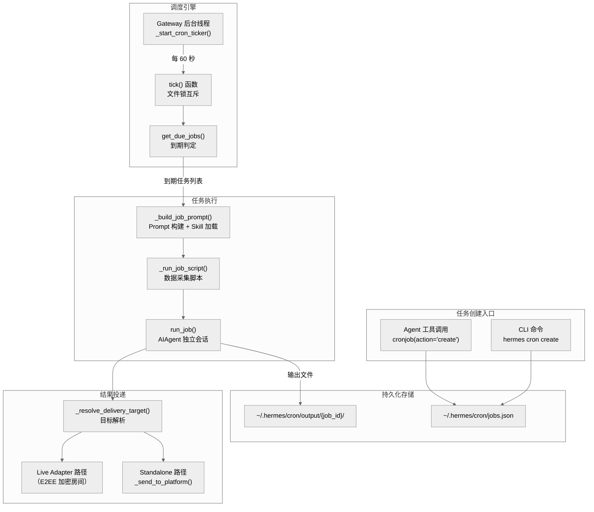
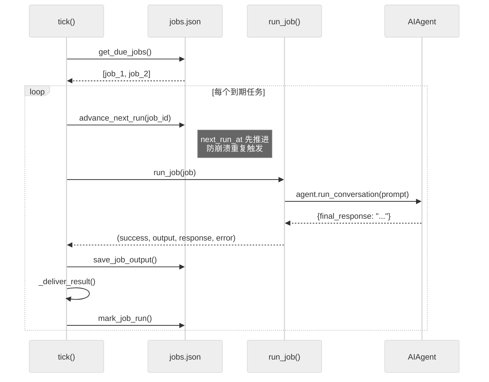
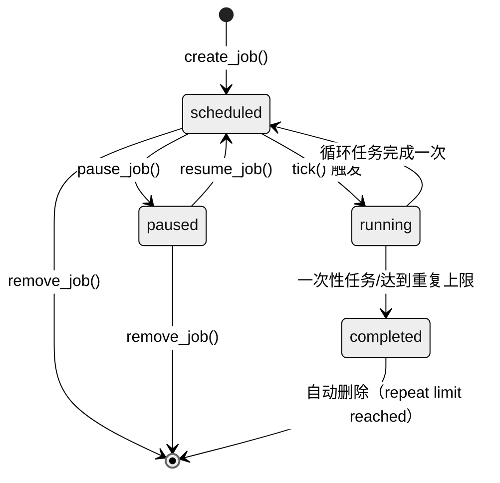

# 第十二章：定时调度与自动化（Cron Scheduling & Automation）

Hermes Agent 内置了一套完整的定时任务调度系统，允许 Agent 自主创建、管理和执行定时任务，并将结果自动投递到消息平台——本质上是一个面向 LLM Agent 的 "cron-as-a-service"。

---

## 12.1 架构总览



系统的核心数据流：**创建任务 -> JSON 持久化 -> Gateway 线程定期 tick -> 到期判定 -> 启动独立 Agent 会话 -> 结果投递到消息平台**。

---

## 12.2 调度器设计

### 12.2.1 运行模型：后台线程 + 文件锁

调度器并非独立进程，而是作为 Gateway 进程内的一个后台守护线程运行。Gateway 启动时创建名为 `cron-ticker` 的线程（`gateway/run.py:8778`），每 60 秒调用一次 `cron.scheduler.tick()`。

```python
# gateway/run.py:8572-8595
def _start_cron_ticker(stop_event, adapters=None, loop=None, interval=60):
    while not stop_event.is_set():
        cron_tick(verbose=False, adapters=adapters, loop=loop)
        # ... 每 5 分钟刷新频道目录，每小时清理缓存
```

为防止多个进程（Gateway + 手动 `hermes cron tick` + systemd timer）同时执行，`tick()` 使用文件锁实现互斥（`cron/scheduler.py:912-926`）：

| 平台 | 锁机制 | 锁文件路径 |
|------|--------|-----------|
| Unix/Linux | `fcntl.flock(LOCK_EX \| LOCK_NB)` | `~/.hermes/cron/.tick.lock` |
| Windows | `msvcrt.locking(LK_NBLCK)` | 同上 |

若获取锁失败，当前 tick 直接跳过（返回 0），不会阻塞等待。这保证了无论有多少调度入口并存，同一时刻只有一个 tick 实例在运行。

### 12.2.2 Cron 表达式解析

调度字符串由 `cron/jobs.py:parse_schedule()` 解析，支持四种格式：

| 格式 | 示例 | 类型 | 语义 |
|------|------|------|------|
| 持续时间 | `30m`, `2h`, `1d` | `once` | 从当前时刻起延迟执行一次 |
| 周期间隔 | `every 30m`, `every 2h` | `interval` | 循环执行 |
| Cron 表达式 | `0 9 * * *` | `cron` | 标准五字段 cron（依赖 `croniter` 库） |
| ISO 时间戳 | `2026-02-03T14:00` | `once` | 指定绝对时间执行一次 |

解析结果是一个结构化字典，包含 `kind`（"once" / "interval" / "cron"）和对应的参数。持续时间字符串通过 `parse_duration()`（`cron/jobs.py:96`）转换为分钟数，支持 `m/h/d` 三个单位。

### 12.2.3 下次运行时间计算

`compute_next_run()` 函数（`cron/jobs.py:284`）根据调度类型计算下次触发时间：

- **once**: 若从未执行过且在 120 秒宽限期内，返回预定时间；否则返回 `None`（任务结束）
- **interval**: `last_run_at + interval_minutes`（首次为 `now + interval_minutes`）
- **cron**: 通过 `croniter(expr, now).get_next(datetime)` 获取下一个匹配时刻

所有时间均使用 `hermes_time.now()` 获取（支持用户配置的时区），并通过 `_ensure_aware()` 确保时区感知，兼容旧版存储的 naive 时间戳。

### 12.2.4 到期判定与防重机制

`get_due_jobs()` 函数（`cron/jobs.py:658`）是调度核心。它遍历所有已启用的任务，比较 `next_run_at <= now`。关键的防重设计包括：

**快进机制（Fast-Forward）**：当 Gateway 长时间停机后重启，到期任务可能已过期很久。系统通过 `_compute_grace_seconds()` 计算宽限窗口——取调度周期的一半，夹紧在 120 秒到 2 小时之间。超过宽限期的任务不会触发，而是直接快进到下一个未来时刻（`cron/jobs.py:708-727`）。

**预推进机制（Advance Before Execution）**：在 `tick()` 中，每个循环任务在执行前会先调用 `advance_next_run()`（`cron/scheduler.py:945`），将 `next_run_at` 推进到下一个时刻。这样即使进程在执行中途崩溃，任务也不会在下次重启时重复触发——实现了 **至多一次（at-most-once）** 语义。



---

## 12.3 任务定义与存储

### 12.3.1 存储格式

所有任务保存在单一 JSON 文件 `~/.hermes/cron/jobs.json` 中，结构为：

```json
{
  "jobs": [ ... ],
  "updated_at": "2026-04-12T10:00:00+08:00"
}
```

写入时采用 **原子替换**（`cron/jobs.py:352-365`）：先写入临时文件并 `fsync`，再用 `os.replace()` 原子覆盖。这避免了进程崩溃导致 JSON 文件损坏。同时设置文件权限为 `0600`（仅限所有者读写）。

### 12.3.2 任务元数据

每个任务的完整字段定义（`cron/jobs.py:432-461`）：

| 字段 | 类型 | 说明 |
|------|------|------|
| `id` | `str` | 12 字符十六进制 UUID 前缀 |
| `name` | `str` | 人类友好名称（自动截取 prompt 前 50 字符） |
| `prompt` | `str` | 执行时发给 Agent 的提示词 |
| `skills` | `list[str]` | 执行前加载的 Skill 列表 |
| `model` / `provider` / `base_url` | `str?` | 任务级模型/提供商覆写 |
| `script` | `str?` | 预运行数据采集脚本路径（相对于 `~/.hermes/scripts/`） |
| `schedule` | `dict` | 解析后的调度配置 `{kind, expr/minutes/run_at, display}` |
| `repeat` | `dict` | `{times: int?, completed: int}` — `times=None` 表示永久 |
| `enabled` / `state` | `bool` / `str` | 启用标志和状态（scheduled / paused / completed） |
| `deliver` | `str` | 投递目标（`"local"` / `"origin"` / `"platform:chat_id"` 等） |
| `origin` | `dict?` | 创建时的来源信息 `{platform, chat_id, thread_id, chat_name}` |
| `next_run_at` / `last_run_at` | `str?` | ISO 时间戳 |
| `last_status` / `last_error` / `last_delivery_error` | `str?` | 最近执行状态与错误信息 |

### 12.3.3 任务生命周期



当循环任务的 `repeat.completed >= repeat.times` 时，`mark_job_run()` 直接从 jobs 列表中移除该任务（`cron/jobs.py:608-612`）。一次性任务完成后状态设为 `completed` 并禁用（`cron/jobs.py:618-619`）。

---

## 12.4 任务执行

### 12.4.1 Prompt 构建

`_build_job_prompt()` 函数（`cron/scheduler.py:485`）将任务配置转化为完整的 Agent 输入，包含三个层次的内容注入：

1. **系统指引**（始终注入）：告知 Agent 当前处于 cron 执行模式，最终响应将被自动投递，不要使用 `send_message` 工具。同时引入 `[SILENT]` 标记协议——当 Agent 判断无新内容需要报告时，响应 `[SILENT]` 以抑制投递（`cron/scheduler.py:518-529`）。

2. **数据采集脚本输出**（可选）：若任务配置了 `script` 字段，先执行该 Python 脚本并将 stdout 作为上下文注入到 prompt 前部。脚本必须位于 `~/.hermes/scripts/` 目录内，并经过路径遍历验证（`cron/scheduler.py:404-482`）。脚本超时时间可通过环境变量 `HERMES_CRON_SCRIPT_TIMEOUT` 或配置文件 `cron.script_timeout_seconds` 设定，默认 120 秒。脚本输出会经过 `redact_sensitive_text()` 脱敏处理。

3. **Skill 内容**（可选）：遍历 `skills` 列表，逐一调用 `skill_view()` 加载内容，以系统指令格式注入。未找到的 Skill 会被跳过并生成告警通知。

### 12.4.2 Agent 会话隔离

`run_job()` 函数（`cron/scheduler.py:575`）为每个任务创建一个完全独立的 `AIAgent` 实例。关键的隔离策略：

| 隔离维度 | 机制 | 代码位置 |
|---------|------|---------|
| 工具集禁用 | `disabled_toolsets=["cronjob", "messaging", "clarify"]` | `cron/scheduler.py:748` |
| 上下文隔离 | `skip_context_files=True, skip_memory=True` | `cron/scheduler.py:750-751` |
| 独立会话 ID | `cron_{job_id}_{timestamp}` 格式 | `cron/scheduler.py:597` |
| SQLite 持久化 | 初始化 `SessionDB` 记录对话 | `cron/scheduler.py:587-590` |
| 环境变量注入 | 设置 `HERMES_SESSION_PLATFORM` 等 | `cron/scheduler.py:605-623` |
| 环境变量清理 | `finally` 块中清除所有注入的环境变量 | `cron/scheduler.py:876-885` |

禁用 `cronjob` 工具集是一个关键的递归防护——防止 cron 任务在执行过程中再次创建 cron 任务，形成无限循环。

### 12.4.3 不活动超时

Agent 运行在一个 `ThreadPoolExecutor` 中，主线程每 5 秒轮询一次（`cron/scheduler.py:768-798`）。系统不使用绝对超时，而是基于 **不活动时间** 判断超时：Agent 的每次 API 调用、工具调用和流式 token 接收都会更新活动时间戳。如果空闲时间超过限制（默认 600 秒，可通过 `HERMES_CRON_TIMEOUT` 环境变量覆写），则中断执行并抛出 `TimeoutError`。

这种设计允许长时间运行的任务（如数据分析）正常执行，同时捕获卡死的 API 调用或工具。

### 12.4.4 模型与提供商路由

每个任务可独立配置 `model` 和 `provider`，也可继承全局配置。解析优先级为（`cron/scheduler.py:625-745`）：

1. 任务级 `job.model` / `job.provider`
2. 环境变量 `HERMES_MODEL` / `HERMES_INFERENCE_PROVIDER`
3. `config.yaml` 中的 `model.default`

此外还支持智能路由（`resolve_turn_route`）、凭据池（`credential_pool`）和回退模型（`fallback_model`）——cron 任务享受与交互式会话完全相同的提供商路由能力。

---

## 12.5 结果投递

### 12.5.1 投递目标解析

`_resolve_delivery_target()` 函数（`cron/scheduler.py:77`）根据任务的 `deliver` 字段解析具体的投递目标：

| `deliver` 值 | 行为 |
|-------------|------|
| `"local"` | 不投递，仅保存输出文件 |
| `"origin"` | 投递到任务创建时的原始聊天（保留 `thread_id`） |
| `"platform:chat_id"` | 投递到指定平台和聊天（如 `"telegram:-1001234567890"` ） |
| `"platform:chat_id:thread_id"` | 投递到指定平台、聊天和话题 |
| 纯平台名（如 `"telegram"`） | 尝试用 origin 的 chat_id，否则回退到该平台的 `HOME_CHANNEL` 环境变量 |

当 `deliver=origin` 但 origin 信息缺失时（如通过 API 或脚本创建的任务），系统会按优先级尝试 Matrix、Telegram、Discord、Slack、BlueBubbles 的 home channel 作为回退（`cron/scheduler.py:94-107`）。

安全方面，`_KNOWN_DELIVERY_PLATFORMS` 白名单（`cron/scheduler.py:44-48`）防止通过构造平台名进行环境变量枚举攻击。人类友好的频道标签（如 "Alice (dm)"）通过 `resolve_channel_name()` 解析为实际 ID。

### 12.5.2 双路径投递

投递采用 **优先活适配器、回退独立发送** 的双路径设计（`cron/scheduler.py:199-363`）：

```mermaid
%%{init: {'theme': 'neutral'}}%%
flowchart TD
    A["_deliver_result()"] --> B{Gateway 运行中?<br/>有 Live Adapter?}
    B -->|是| C["Live Adapter 路径<br/>asyncio.run_coroutine_threadsafe()"]
    C --> D{发送成功?}
    D -->|是| E["发送媒体附件<br/>_send_media_via_adapter()"]
    D -->|否| F["Standalone 路径<br/>_send_to_platform()"]
    B -->|否| F
    F --> G{asyncio.run() 成功?}
    G -->|RuntimeError| H["新线程中重试<br/>ThreadPoolExecutor"]
    G -->|成功| I["投递完成"]
    H --> I
    E --> I
```

**Live Adapter 路径**：当 Gateway 运行时，tick 线程可访问各平台的 Live Adapter 实例。通过 `asyncio.run_coroutine_threadsafe()` 将发送操作投递到 Gateway 的事件循环。这条路径的关键优势是支持端到端加密房间（如 Matrix E2EE），因为加密需要 Adapter 的持久会话状态。

**Standalone 路径**：当 Live Adapter 不可用或发送失败时，回退到 `_send_to_platform()` 独立发送。若当前线程已有运行中的事件循环（`RuntimeError`），则在新的 `ThreadPoolExecutor` 线程中通过 `asyncio.run()` 重试。

### 12.5.3 SILENT 协议与媒体处理

Agent 可以在响应中返回 `[SILENT]` 标记来抑制投递（`cron/scheduler.py:958`）。这对于"仅在有变化时通知"的监控任务非常有用——输出仍会保存到本地文件用于审计，但不会打扰用户。

投递前，`BasePlatformAdapter.extract_media()` 提取响应中的 `MEDIA:` 标签，将媒体文件（图片、音频、视频、文档）作为原生附件发送，而非原始文本路径（`cron/scheduler.py:300`）。路由逻辑按文件扩展名分发到 `send_voice`、`send_image_file`、`send_video`、`send_document`（`cron/scheduler.py:167-196`）。

### 12.5.4 响应包装

默认情况下，投递内容会被包装在 Cron 任务头尾中（`cron/scheduler.py:287-295`），包含任务名称和"Agent 无法看到此消息"的提示。可通过 `config.yaml` 中的 `cron.wrap_response: false` 关闭包装以获得干净输出。

---

## 12.6 CLI 管理命令

`hermes_cli/cron.py` 提供了完整的 CLI 管理界面：

| 命令 | 函数 | 说明 |
|------|------|------|
| `hermes cron list [--all]` | `cron_list()` | 列出所有任务（`--all` 包括禁用的） |
| `hermes cron create` | `cron_create()` | 创建任务（`--schedule`, `--prompt`, `--name`, `--skill`, `--script`） |
| `hermes cron edit <job_id>` | `cron_edit()` | 修改任务（支持 `--add-skills`, `--remove-skills`, `--clear-skills`） |
| `hermes cron pause <job_id>` | `_job_action("pause")` | 暂停任务 |
| `hermes cron resume <job_id>` | `_job_action("resume")` | 恢复任务 |
| `hermes cron run <job_id>` | `_job_action("run")` | 立即触发（下次 tick 执行） |
| `hermes cron remove <job_id>` | `_job_action("remove")` | 删除任务 |
| `hermes cron status` | `cron_status()` | 显示 Gateway 运行状态和任务概览 |
| `hermes cron tick` | `cron_tick()` | 手动执行一次调度 tick |

CLI 内部通过 `_cron_api()` 调用 `tools/cronjob_tools.py` 中的 `cronjob()` 函数，保证 CLI 和 Agent 工具使用完全相同的业务逻辑。`cron_list()` 还会检测 Gateway 是否运行，未运行时提示用户安装服务。

Skill 管理支持精细操作：`cron_edit` 可以通过 `--add-skills` 增量添加、`--remove-skills` 移除特定 Skill、`--clear-skills` 清空所有 Skill，或 `--skills` 整体替换（`hermes_cli/cron.py:195-209`）。

---

## 12.7 Agent 工具接口

### 12.7.1 统一工具设计

`tools/cronjob_tools.py` 将所有 cron 操作收敛为单一的 `cronjob` 工具（`cronjob_tools.py:219`），通过 `action` 参数区分操作类型，避免注册多个工具导致的 schema/上下文膨胀。支持的操作：

| action | 必需参数 | 说明 |
|--------|---------|------|
| `create` | `schedule` + (`prompt` 或 `skills`) | 创建任务 |
| `list` | 无 | 列出任务 |
| `update` | `job_id` + 至少一个更新字段 | 修改任务 |
| `pause` | `job_id` | 暂停 |
| `resume` | `job_id` | 恢复 |
| `remove` | `job_id` | 删除 |
| `run` / `run_now` / `trigger` | `job_id` | 立即触发 |

### 12.7.2 安全防护

工具层实现了多重安全防护：

**Prompt 注入扫描**（`cronjob_tools.py:39-66`）：由于 cron 任务在无人监督的独立会话中执行，prompt 需要经过关键威胁模式扫描。检测项包括：
- 不可见 Unicode 字符（零宽空格、方向控制符等）
- 提示注入模式（"ignore previous instructions"、"system prompt override" 等）
- 凭据窃取命令（`curl`/`wget` + 环境变量、`cat .env` 等）
- 危险系统操作（`rm -rf /`、修改 sudoers、写 authorized_keys）

**脚本路径验证**（`cronjob_tools.py:151-187`）：脚本必须是相对路径，解析后必须位于 `~/.hermes/scripts/` 目录内。拒绝绝对路径和 `~` 展开，防止通过路径注入执行任意脚本。运行时还有二次验证（`cron/scheduler.py:428-441`），通过 `path.relative_to()` 检查防止符号链接逃逸。

**模型覆写固定**（`cronjob_tools.py:117-139`）：当 Agent 创建任务时指定了模型但未指定 provider，系统会自动固定当前 provider，确保任务不会因用户后续切换默认 provider 而偏移。

**可用性检查**（`cronjob_tools.py:500-512`）：`cronjob` 工具仅在交互式 CLI 或 Gateway 会话中可用（检查 `HERMES_INTERACTIVE` / `HERMES_GATEWAY_SESSION`），非交互模式下不暴露。

### 12.7.3 Origin 上下文自动捕获

当 Agent 通过消息平台创建任务时，`_origin_from_env()` 自动从会话环境变量中捕获来源信息（platform、chat_id、thread_id、chat_name），默认投递目标设为 `"origin"`（`cronjob_tools.py:69-86`）。这使得用户在 Telegram 群组中说 "每天早上 9 点给我天气报告" 时，Agent 创建的任务会自动投递回同一个群组和话题。

---

## 12.8 关键文件索引

| 文件 | 职责 | 核心函数/类 |
|------|------|------------|
| `cron/__init__.py` | 包入口，导出公共 API | 导出 `create_job`, `tick` 等 |
| `cron/scheduler.py` | 调度引擎：tick 循环、任务执行、结果投递 | `tick()`, `run_job()`, `_deliver_result()`, `_build_job_prompt()` |
| `cron/jobs.py` | 任务存储：CRUD、调度解析、到期判定 | `create_job()`, `get_due_jobs()`, `parse_schedule()`, `compute_next_run()` |
| `tools/cronjob_tools.py` | Agent 工具接口：统一 cronjob 工具 + 安全扫描 | `cronjob()`, `_scan_cron_prompt()`, `CRONJOB_SCHEMA` |
| `hermes_cli/cron.py` | CLI 子命令：list/create/edit/pause/resume/run/remove/status/tick | `cron_command()`, `cron_list()`, `cron_create()` |
| `gateway/run.py:8572` | Gateway 集成：后台 ticker 线程 | `_start_cron_ticker()` |

---

## 12.9 设计亮点与权衡

**至多一次语义**：通过预推进 `next_run_at` 实现，代价是进程崩溃时可能丢失一次执行。对于"通知类"任务（天气、摘要），偶尔丢失一次远好于崩溃重启后一次性触发几十次积压任务。

**文件锁而非数据库锁**：选择文件锁而非 SQLite 事务锁，使得存储层保持简单（纯 JSON），同时跨进程互斥仍然可靠。这是一个面向单用户场景的务实选择——jobs 数量通常在几十个以内，JSON 读写性能完全足够。

**双路径投递**：Live Adapter 优先路径解决了 E2EE 房间无法通过独立 HTTP 发送消息的问题，Standalone 路径确保即使 Gateway Adapter 异常也能投递。两条路径的存在是对可靠性与功能性的折中。

**递归防护**：通过禁用 `cronjob` 工具集而非运行时检查来阻止 cron 任务创建新的 cron 任务。这是一种声明式防护，比运行时检测更加可靠且无法绕过。
