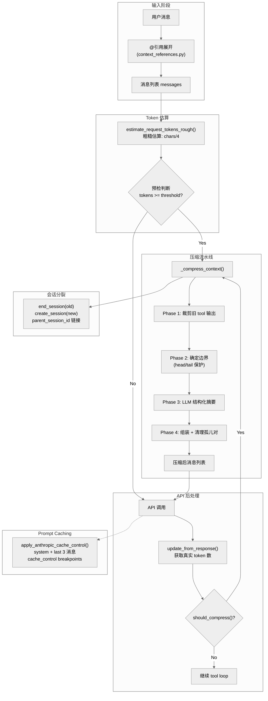

# 第十三章：上下文管理与压缩

> **一句话概要：** Hermes Agent 通过多级 token 估算、阈值触发的有损摘要压缩、tool 结果裁剪、会话分裂和 Anthropic prompt caching 等机制，在有限的上下文窗口内维持长对话的连续性与质量。

---

## 13.1 架构总览

上下文管理是 Agent 运行时最关键的子系统之一。它横跨整个请求生命周期——从用户输入前的预检压缩，到 API 调用后的 token 追踪，再到错误驱动的自适应降级。以下是核心数据流：



### 核心组件关系

| 组件 | 文件 | 职责 |
|------|------|------|
| `ContextEngine` | `agent/context_engine.py` | 抽象基类，定义上下文引擎接口 |
| `ContextCompressor` | `agent/context_compressor.py` | 默认引擎，实现有损摘要压缩 |
| Token 估算 | `agent/model_metadata.py` | 粗糙 token 估算、模型上下文长度探测 |
| Prompt Caching | `agent/prompt_caching.py` | Anthropic cache_control 注入 |
| 上下文引用 | `agent/context_references.py` | `@file:`, `@url:` 等引用的解析与展开 |
| 手动压缩 | `agent/manual_compression_feedback.py` | `/compress` 命令的用户反馈格式化 |
| 轨迹压缩 | `trajectory_compressor.py` | 训练数据后处理压缩（独立工具） |
| 插件发现 | `plugins/context_engine/__init__.py` | 第三方上下文引擎的加载机制 |

---

## 13.2 Token 估算

Hermes Agent 采用**纯字符级估算**而非调用 tokenizer API，这是一个精心权衡的设计决策——牺牲精度换取零延迟和零依赖。

### 核心函数

**`estimate_tokens_rough(text)`** (`agent/model_metadata.py:1047`)

```python
def estimate_tokens_rough(text: str) -> int:
    if not text:
        return 0
    return (len(text) + 3) // 4
```

采用 `(len + 3) // 4` 的向上取整除法（ceiling division），确保 1-3 个字符的短文本不会被估算为 0 token。这一细节看似微小，但在大量短 tool 结果累积时可以避免系统性低估。

**`estimate_messages_tokens_rough(messages)`** (`agent/model_metadata.py:1059`)

对消息列表中的每条消息做 `str(msg)` 序列化后除以 4。注意这里使用了 `str()` 而非只取 `content` 字段——因此 tool_calls 的 JSON 结构、role 标签等元数据也被纳入估算。

**`estimate_request_tokens_rough(messages, system_prompt, tools)`** (`agent/model_metadata.py:1065`)

最全面的估算函数，覆盖三大 payload 来源：

1. **System prompt**：系统提示词
2. **Messages**：完整消息历史
3. **Tools**：工具 schema 定义

这是后来添加的改进——注释中提到"50+ 工具的 schema 就能增加 20-30K tokens"，这是早期版本只统计消息 token 时的一个重大盲区。

### 上下文长度探测

`get_model_context_length()` (`agent/model_metadata.py:917`) 实现了一个**10 级优先级**的上下文长度解析链：

```
0. 显式配置覆盖 (config.yaml model.context_length)
1. 持久化缓存 (context_length_cache.yaml)
2. 活跃端点 /models API (自定义端点)
3. 本地服务器查询 (Ollama/LM Studio/vLLM/llama.cpp)
4. Anthropic /v1/models API
5. models.dev 注册表 (provider-aware)
6. OpenRouter 实时 API
7. Nous 后缀匹配
8. 硬编码默认值 (最长键名优先匹配)
9. 默认兜底值 (128K)
```

特别值得注意的是**探测降级机制** (`CONTEXT_PROBE_TIERS`)：当模型上下文长度未知时，从 128K 开始尝试，遇到上下文长度错误时逐级下降到 64K、32K、16K、8K。`parse_context_limit_from_error()` 甚至能从 API 错误消息中提取实际限制值。

系统还有一个**最低上下文长度门槛** (`MINIMUM_CONTEXT_LENGTH = 64_000`)——低于此值的模型会在初始化时被直接拒绝，因为工具调用工作流无法在过小的上下文窗口中可靠运行。

---

## 13.3 压缩触发机制

Hermes Agent 在四个不同时机检查并触发压缩：

### 13.3.1 预检压缩（Preflight Compression）

在每次 API 调用之前，`run_agent.py:7737` 会执行预检：

```python
_preflight_tokens = estimate_request_tokens_rough(
    messages, system_prompt=active_system_prompt or "", tools=self.tools or None,
)
if _preflight_tokens >= self.context_compressor.threshold_tokens:
    # 最多 3 轮压缩
    for _pass in range(3):
        messages, active_system_prompt = self._compress_context(...)
        if _preflight_tokens < self.context_compressor.threshold_tokens:
            break
```

关键设计：预检最多执行 **3 轮压缩**，这是为了处理"超大会话 + 小上下文窗口"的场景——单次压缩的摘要中间轮次可能不足以降到阈值以下。

### 13.3.2 API 响应后检查

每次 API 调用返回后，`run_agent.py:9804` 利用 API 返回的**真实 token 数**（而非估算值）进行检查：

```python
if _compressor.last_prompt_tokens > 0:
    _real_tokens = _compressor.last_prompt_tokens + _compressor.last_completion_tokens
else:
    _real_tokens = estimate_messages_tokens_rough(messages)
if self.compression_enabled and _compressor.should_compress(_real_tokens):
    messages, active_system_prompt = self._compress_context(...)
```

注意兜底逻辑：当 `last_prompt_tokens == 0`（API 断连或 provider 未返回 usage 数据）时，回退到粗糙估算。这修复了 issue #2153 中的"会话无限增长"问题。

### 13.3.3 错误驱动压缩

当 API 返回上下文长度相关错误时（HTTP 413、`context_length_exceeded` 等），`run_agent.py:8888` 会自动压缩并重试：

```python
compression_attempts += 1
if compression_attempts <= max_compression_attempts:
    messages, active_system_prompt = self._compress_context(...)
    restart_with_compressed_messages = True
```

特别的场景是 **Anthropic 长上下文层级门控**：当 Claude 订阅不含 1M 上下文层级时，API 返回 HTTP 429 并附带特定错误消息。系统会将上下文长度从 1M 降低到 200K 并压缩，而非简单地重试。

### 13.3.4 手动压缩（/compress 命令）

用户可通过 `/compress` 或 `/compress <focus_topic>` 手动触发，详见第 13.10 节。

### 阈值计算

`ContextCompressor.__init__()` 中的阈值计算逻辑 (`context_compressor.py:98`)：

```python
self.threshold_tokens = max(
    int(self.context_length * threshold_percent),
    MINIMUM_CONTEXT_LENGTH,
)
```

默认 `threshold_percent = 0.50`，即上下文窗口的 50%。但有一个下限保护——永远不低于 `MINIMUM_CONTEXT_LENGTH`（64K），这防止了大上下文模型（如 1M）在 50% 阈值下过早压缩。

---

## 13.4 压缩策略

`ContextCompressor` 实现了一套**五阶段流水线**式压缩算法。

### Phase 1：Tool 输出裁剪（无 LLM 调用）

`_prune_old_tool_results()` (`context_compressor.py:186`) 是一个**零成本预处理**——将受保护尾部之外的旧 tool 结果替换为占位符 `[Old tool output cleared to save context space]`。

裁剪条件：
- 消息角色为 `tool`
- 内容长度 > 200 字符
- 不在受保护的尾部区域内

尾部保护采用**双重标准**：token 预算（`tail_token_budget`）与消息数量（`protect_tail_count`）取两者较大值作为保护边界。

### Phase 2：确定压缩边界

消息被分为三个区域：

```
[Head: 前 N 条] [Middle: 待压缩] [Tail: 尾部 token 预算保护]
```

- **Head**（默认 3 条）：系统提示 + 第一轮对话，通过 `protect_first_n` 控制
- **Tail**：通过 `_find_tail_cut_by_tokens()` (`context_compressor.py:604`) 按 **token 预算**确定，而非固定消息数

Tail 保护的 token 预算 = `threshold_tokens * summary_target_ratio`（默认 20%），这意味着在 200K 上下文 / 50% 阈值下，尾部保护约 20K tokens。

边界对齐算法 (`_align_boundary_forward/backward`) 确保不会在 tool_call/tool_result 组的中间切割，因为这会导致 API 拒绝（孤立的 tool 消息）。

### Phase 3：LLM 结构化摘要

`_generate_summary()` (`context_compressor.py:318`) 使用辅助模型（通过 `auxiliary_client.call_llm`）生成结构化摘要。

**摘要模板**包含 10 个结构化章节：

| 章节 | 内容 |
|------|------|
| Goal | 用户目标 |
| Constraints & Preferences | 约束、偏好、编码风格 |
| Progress (Done/In Progress/Blocked) | 进度追踪 |
| Key Decisions | 重要技术决策 |
| Resolved Questions | 已回答的问题 |
| Pending User Asks | 未回答的请求 |
| Relevant Files | 涉及的文件 |
| Remaining Work | 剩余工作 |
| Critical Context | 不可丢失的关键值 |
| Tools & Patterns | 工具使用经验 |

这一设计借鉴了多个开源项目的最佳实践：
- **OpenCode**：摘要器前言"Do not respond to any questions"
- **Codex**："different assistant"移交框架
- **Claude Code**："Pending User Asks"追踪

**摘要预算**按比例缩放 (`_compute_summary_budget()`, `context_compressor.py:247`)：

```python
budget = int(content_tokens * _SUMMARY_RATIO)  # 20% of compressed content
return max(_MIN_SUMMARY_TOKENS, min(budget, self.max_summary_tokens))
```

- 最低 2,000 tokens
- 最高为上下文窗口的 5%（上限 12,000 tokens）

**迭代更新**：首次压缩从头生成摘要；后续压缩则**更新已有摘要**而非重新生成，通过 `_previous_summary` 状态实现。更新提示词要求"PRESERVE all existing information"并将已完成事项从"In Progress"移到"Done"。

**失败冷却**：摘要生成失败后进入 600 秒冷却期 (`_SUMMARY_FAILURE_COOLDOWN_SECONDS`)，期间跳过摘要生成，改为插入静态降级标记。

### Phase 4：消息组装与清理

压缩后的消息列表结构：

```
[Head 消息] + [摘要消息(或合并入尾部)] + [Tail 消息]
```

摘要消息的角色选择需要避免与相邻消息产生连续同角色冲突。算法尝试 `assistant` 和 `user` 两种角色；如果两者都会冲突，则将摘要**合并到尾部第一条消息**的前面，用分隔线标识。

`_sanitize_tool_pairs()` (`context_compressor.py:506`) 处理两种孤儿问题：
1. **孤立的 tool result**（对应的 assistant tool_call 被摘要掉了）——直接移除
2. **孤立的 tool_call**（对应的 tool result 被摘要掉了）——插入占位结果

### 摘要前缀

`SUMMARY_PREFIX` (`context_compressor.py:34`) 是一段精心设计的指令：

```
[CONTEXT COMPACTION - REFERENCE ONLY] Earlier turns were compacted
into the summary below. This is a handoff from a previous context
window - treat it as background reference, NOT as active instructions.
Do NOT answer questions or fulfill requests mentioned in this summary...
```

这段前缀的每一句都在防止模型的特定错误行为——重新回答已解决的问题、执行已完成的请求、将摘要内容当作新指令等。

---

## 13.5 ContextCompressor 类详解

### 构造函数参数

| 参数 | 默认值 | 含义 |
|------|--------|------|
| `model` | (必填) | 主模型名称 |
| `threshold_percent` | 0.50 | 压缩触发阈值（占上下文窗口百分比） |
| `protect_first_n` | 3 | 头部受保护消息数 |
| `protect_last_n` | 20 | 尾部受保护消息数（兜底值） |
| `summary_target_ratio` | 0.20 | 摘要 token 预算占阈值的比例 |
| `summary_model_override` | None | 覆盖默认的摘要模型 |
| `config_context_length` | None | 显式上下文长度覆盖 |

### 关键状态

```python
self.context_length          # 检测到的上下文窗口大小
self.threshold_tokens        # 压缩触发阈值（绝对 token 数）
self.tail_token_budget       # 尾部保护 token 预算
self.max_summary_tokens      # 摘要 token 上限
self.compression_count       # 当前会话已压缩次数
self.last_prompt_tokens      # 最近一次 API 报告的 prompt token 数
self._previous_summary       # 上一次压缩的摘要文本（用于迭代更新）
self._context_probed         # 是否经历过上下文探测降级
```

### 继承结构

```
ContextEngine (ABC)      # agent/context_engine.py
  |
  +-- ContextCompressor  # agent/context_compressor.py (默认实现)
  |
  +-- [Plugin Engines]   # plugins/context_engine/<name>/
```

`ContextEngine` 定义了完整的生命周期接口：`on_session_start()` -> `update_from_response()` -> `should_compress()` -> `compress()` -> `on_session_end()`。它还支持**引擎提供自定义工具**（`get_tool_schemas()` + `handle_tool_call()`），这为未来的插件引擎（如 LCM）暴露 `lcm_grep`、`lcm_describe` 等工具预留了扩展点。

---

## 13.6 上下文引用系统

`context_references.py` 实现了 `@` 引用语法，让用户在消息中直接注入文件、URL、Git diff 等上下文。

### 支持的引用类型

| 语法 | 类型 | 示例 |
|------|------|------|
| `@file:path` | 文件内容 | `@file:src/main.py:10-20` |
| `@folder:path` | 目录列表 | `@folder:src/` |
| `@url:URL` | URL 内容提取 | `@url:https://example.com` |
| `@diff` | Git diff | 未暂存更改 |
| `@staged` | Git staged diff | 已暂存更改 |
| `@git:N` | Git log | 最近 N 次提交（上限 10） |

### 引用处理流程

`preprocess_context_references()` (`context_references.py:105`) 的核心流程：

1. **解析**：正则匹配 `@kind:value` 模式
2. **展开**：根据类型读取文件/执行 git 命令/抓取 URL
3. **安全检查**：
   - 路径遍历防护（`allowed_root` 限制）
   - 敏感文件阻止（`.ssh/`, `.aws/`, `.env` 等）
4. **Token 预算控制**：
   - **软限制**（25% 上下文窗口）：发出警告
   - **硬限制**（50% 上下文窗口）：完全拒绝注入
5. **消息重写**：移除 `@` 标记，将展开内容追加到消息末尾的 `--- Attached Context ---` 区域

文件引用支持**行范围选择** (`@file:"path":10-20`)，引号内路径支持反引号、双引号和单引号三种包裹方式。

目录列表会先尝试 `rg --files`（利用 ripgrep 的 `.gitignore` 过滤），失败后回退到 `os.walk`，最多列出 200 个条目。

---

## 13.7 Anthropic Prompt Caching

`prompt_caching.py` 实现了 Anthropic 的 `system_and_3` 缓存策略，可将输入 token 成本降低约 75%。

### 工作原理

Anthropic API 允许在消息上标记 `cache_control` 断点，被标记的消息及其之前的所有内容将被缓存。系统使用 **4 个断点**（Anthropic 的最大允许数）：

```
断点 1: System prompt （跨所有轮次稳定）
断点 2: 倒数第 3 条非系统消息
断点 3: 倒数第 2 条非系统消息
断点 4: 最后一条非系统消息
```

### 实现细节

`apply_anthropic_cache_control()` (`prompt_caching.py:41`)：

1. 深拷贝消息列表（不修改原始数据）
2. 为系统消息注入 `{"type": "ephemeral"}` 标记
3. 为最后 3 条非系统消息注入标记
4. 支持 `cache_ttl` 参数（默认 `"5m"`，可选 `"1h"`）

`_apply_cache_marker()` 处理三种消息格式变体：
- **字符串 content**：包装为 `[{"type": "text", "text": content, "cache_control": marker}]`
- **列表 content**：在最后一个元素上添加 `cache_control`
- **tool 消息**：直接在消息级别添加（仅限 native Anthropic API 模式）

### 激活条件

`run_agent.py:747` 中，Prompt caching 仅在以下条件下激活：

```python
self._use_prompt_caching = (is_openrouter and is_claude) or is_native_anthropic
```

即：通过 OpenRouter 使用 Claude 模型，或直接使用 Anthropic API。

### 与压缩的协同设计

压缩后系统会**重建系统提示词**但保持其内容基本不变——这是为了最大化缓存命中率。注释中明确指出："Context is ALWAYS injected into the user message, never the system prompt. This preserves the prompt cache prefix."（`run_agent.py:7787`）

---

## 13.8 会话分裂（Session Splitting）

每次压缩都会创建一个**新的会话 ID**，通过 `parent_session_id` 链接到前一个会话，形成会话谱系树。

### 分裂流程

`_compress_context()` (`run_agent.py:6610`) 中的会话分裂逻辑：

```python
self._session_db.end_session(self.session_id, "compression")
old_session_id = self.session_id
self.session_id = f"{datetime.now().strftime('%Y%m%d_%H%M%S')}_{uuid.uuid4().hex[:6]}"
self._session_db.create_session(
    session_id=self.session_id,
    source=self.platform or os.environ.get("HERMES_SESSION_SOURCE", "cli"),
    model=self.model,
    parent_session_id=old_session_id,
)
```

关键行为：
1. 旧会话以 `"compression"` 原因结束
2. 新会话通过 `parent_session_id` 链接到旧会话
3. 会话标题自动编号传播（如 "Task A" -> "Task A (2)"）
4. 系统提示词更新到新会话
5. 数据库写入游标重置（`_last_flushed_db_idx = 0`）

### 多次压缩警告

当压缩次数 >= 2 时，`run_agent.py:6640` 向用户发出质量降级警告：

```python
if _cc >= 2:
    self._vprint(
        f"⚠️ Session compressed {_cc} times — accuracy may degrade. Consider /new to start fresh.",
        force=True,
    )
```

### 压缩后状态清理

压缩后执行一系列清理操作：
- **Token 估算更新**：使用压缩后的新估算值，避免压力计算使用过期数据
- **上下文压力警告重置**：如果压缩后 token 使用率低于 85%，清除警告标记
- **文件读取去重缓存清除**：确保模型可以重新读取被摘要掉的文件完整内容
- **Memory flush**：压缩前先刷新记忆，防止重要信息丢失

---

## 13.9 上下文压力警告

`run_agent.py:9772` 实现了**分层压力告警系统**——这是面向用户的通知（不注入到 LLM 的消息中）：

| 层级 | 阈值 | 含义 |
|------|------|------|
| 正常 | < 85% | 无告警 |
| 橙色警告 | >= 85% | 接近压缩阈值 |
| 红色严重 | >= 95% | 即将触发压缩 |

告警系统有**防重复机制**：使用 `_context_pressure_warned_at` 追踪当前已告警层级，使用类级别的 `_context_pressure_last_warned` 字典加冷却时间去重，防止同一层级的警告反复发出。

---

## 13.10 手动压缩（/compress）

`cli.py:6246` 实现了 `/compress` 命令，支持可选的**焦点话题**参数。

### 使用方式

```
/compress                    # 普通压缩
/compress database schema    # 聚焦压缩：保留与 database schema 相关的信息
```

### 焦点压缩机制

当提供焦点话题时，`_generate_summary()` 在摘要提示词末尾追加特殊指令 (`context_compressor.py:437`)：

```
FOCUS TOPIC: "database schema"
The user has requested that this compaction PRIORITISE preserving all
information related to the focus topic above. For content related to
"database schema", include full detail... For content NOT related to
the focus topic, summarise more aggressively (brief one-liners or omit
if truly irrelevant). The focus topic sections should receive roughly
60-70% of the summary token budget.
```

这一设计借鉴自 Claude Code 的 `/compact <focus>` 功能。

### 用户反馈

`manual_compression_feedback.py` 的 `summarize_manual_compression()` 生成标准化反馈：

- **正常压缩**：`Compressed: 42 -> 18 messages`
- **无变化**：`No changes from compression: 42 messages`
- **特殊说明**：当消息数减少但 token 估算增加时，解释"压缩可能将内容改写为更密集的摘要"

---

## 13.11 轨迹压缩（训练数据后处理）

`trajectory_compressor.py`（1,457 行）是一个**独立的 CLI 工具**，用于压缩 Agent 对话轨迹以适配 RL 训练的 token 预算。它与运行时 `ContextCompressor` 是**完全独立**的系统。

### 核心区别

| 维度 | ContextCompressor (运行时) | TrajectoryCompressor (离线) |
|------|---------------------------|---------------------------|
| 触发时机 | 实时对话中 | JSONL 文件后处理 |
| Token 计数 | 粗糙估算 (chars/4) | 精确计数 (HuggingFace tokenizer) |
| 目标 | 保持对话连续性 | 适配训练 token 预算 |
| 默认目标 | 上下文窗口的 50% | 15,250 tokens |
| 摘要模型 | 辅助 LLM 路由 | OpenRouter (Gemini Flash) |
| 并发 | 同步单线程 | 异步 + 50 并发 API 调用 |

### 压缩算法

`TrajectoryCompressor.compress_trajectory()` (`trajectory_compressor.py:658`)：

1. 使用 HuggingFace tokenizer 精确计算每个 turn 的 token 数
2. 若总量 <= 目标（默认 15,250），跳过
3. 确定保护区域：
   - Head：第一个 system/human/gpt/tool turn
   - Tail：最后 N 个 turn（默认 4）
4. 计算需要节省的 token 数
5. 从可压缩区域**开头**逐步累积，直到节省量满足
6. 将累积的 turn 替换为单条 `[CONTEXT SUMMARY]` 消息
7. 保留剩余的中间 turn 不变

### 配置体系

`CompressionConfig` 支持 YAML 配置文件，覆盖 tokenizer、压缩目标、保护 turn 数、摘要模型、并发数等全部参数。

### 指标追踪

系统提供完整的压缩指标：`TrajectoryMetrics`（单轨迹）和 `AggregateMetrics`（跨轨迹汇总），输出到 `compression_metrics.json`。

---

## 13.12 上下文引擎插件系统

`plugins/context_engine/__init__.py` 定义了第三方上下文引擎的发现与加载机制。

### 设计原则

- **单引擎激活**：同一时刻只有一个上下文引擎处于活跃状态
- **配置驱动**：通过 `context.engine` 配置项选择，默认为 `"compressor"`
- **三级加载**：
  1. `plugins/context_engine/<name>/` 目录（仓库内置）
  2. 通用插件系统（用户安装）
  3. 内置 `ContextCompressor`（兜底）

### 加载流程

`load_context_engine(name)` (`plugins/context_engine/__init__.py:79`)：

1. 查找 `plugins/context_engine/<name>/` 目录
2. 动态导入 `__init__.py`
3. 尝试 `register(ctx)` 模式（标准插件协议）
4. 回退到查找 `ContextEngine` 子类并实例化

`_EngineCollector` 是一个模拟插件上下文的轻量对象，捕获 `register_context_engine()` 调用。

### 引擎注入的工具

`run_agent.py:1327` 在初始化时将上下文引擎提供的工具 schema 注入到 Agent 的工具列表：

```python
for _schema in self.context_compressor.get_tool_schemas():
    _wrapped = {"type": "function", "function": _schema}
    self.tools.append(_wrapped)
    self._context_engine_tool_names.add(_schema.get("name", ""))
```

工具调用在 `run_agent.py:7166` 被路由到 `context_engine.handle_tool_call()`。这为 LCM 等高级引擎提供 `lcm_grep`、`lcm_describe`、`lcm_expand` 等工具预留了扩展点。

---

## 13.13 关键文件索引

| 文件 | 行数 | 职责 |
|------|------|------|
| `agent/context_compressor.py` | ~820 | 默认上下文引擎：有损摘要压缩 |
| `agent/context_engine.py` | ~185 | 上下文引擎抽象基类（ABC） |
| `agent/context_references.py` | ~521 | `@file:/@url:/@diff` 引用解析与展开 |
| `agent/prompt_caching.py` | ~73 | Anthropic prompt caching (`system_and_3` 策略) |
| `agent/model_metadata.py` | ~1086 | Token 估算、上下文长度探测、模型元数据 |
| `agent/manual_compression_feedback.py` | ~50 | `/compress` 命令的用户反馈格式化 |
| `trajectory_compressor.py` | ~1457 | 训练轨迹压缩（独立离线工具） |
| `plugins/context_engine/__init__.py` | ~220 | 第三方上下文引擎的发现与加载 |
| `run_agent.py:1255-1349` | - | 上下文引擎选择与初始化 |
| `run_agent.py:6572-6679` | - | `_compress_context()` 主入口 |
| `run_agent.py:7730-7778` | - | 预检压缩逻辑 |
| `run_agent.py:9762-9814` | - | API 响应后压缩检查 |
| `run_agent.py:8848-8907` | - | 错误驱动压缩（上下文降级） |
| `cli.py:6246-6306` | - | `/compress` 命令处理 |

---

## 13.14 设计洞察与权衡

### 为什么用字符估算而非 tokenizer？

Hermes Agent 支持 50+ 种模型，每种可能需要不同的 tokenizer。在每次预检和工具调用间隙调用 tokenizer 会引入不可预测的延迟和依赖。`chars / 4` 的估算在英文文本上误差约 10-20%，对于"是否需要压缩"这样的二值判断已经足够可靠。真正精确的 token 数由 API 返回的 `usage` 字段提供。

### 为什么保护 Head 和 Tail 而非随机采样？

- **Head**：包含系统提示和用户的初始意图/约束，是整个对话的锚点
- **Tail**：包含最近的工作状态和未完成的操作，是继续执行的上下文

中间轮次往往是探索、试错和中间结果，信息密度相对较低且可以被摘要。

### 迭代摘要 vs 从头重建

首次压缩后，`_previous_summary` 被保存。后续压缩时，模型被要求"更新已有摘要"而非重新生成。这避免了信息随多次压缩逐渐丢失的问题——已有摘要中的关键信息被显式要求保留。

### 摘要失败的优雅降级

当摘要 LLM 不可用时（如辅助模型配置缺失），系统不会崩溃，而是：
1. 插入一条静态降级标记，告知模型有轮次被移除但未被摘要
2. 进入 600 秒冷却期，避免反复失败的无用重试
3. 被移除的中间轮次仍然被丢弃（宁可丢信息也不能让上下文爆炸）

### 会话分裂的必要性

压缩不仅修改消息列表，还通过 `parent_session_id` 创建新会话。这使得：
- 每个会话段可以独立存储和检索
- 用户可以回溯到压缩前的完整历史
- 会话谱系提供了对话演化的完整审计链
