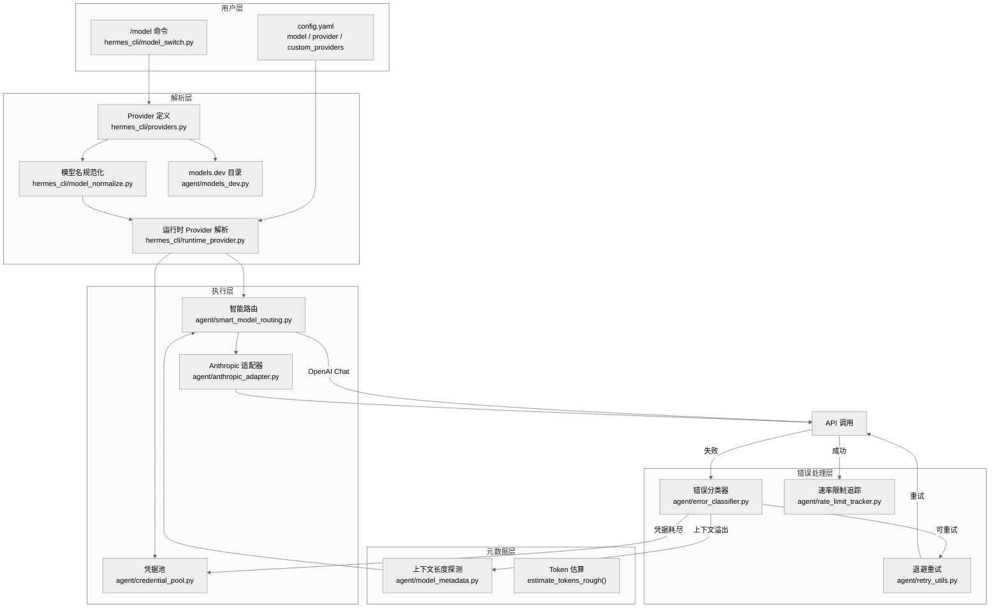

# 第十四章：模型路由与 Provider 抽象层

## 一句话总结

Hermes Agent 通过一个多层级的 Provider 抽象体系，将 20+ 个 LLM 供应商统一到三种传输协议之下，配合凭据池轮转、分级上下文探测、结构化错误分类和抖动退避重试，实现了对模型端点的透明路由与自动故障转移。

---

## 架构总览



---

## Provider 全景

Hermes Agent 支持的供应商通过三个数据源合并：models.dev 在线目录（109+ 供应商）、`HERMES_OVERLAYS` 本地扩展、以及用户 `config.yaml` 配置。

### 三种传输协议

| 协议 | API Mode | 对应供应商 |
|------|----------|-----------|
| `openai_chat` | `chat_completions` | OpenRouter, Nous, DeepSeek, Z.AI/GLM, Kimi, Alibaba/DashScope, Gemini, xAI, Xiaomi, HuggingFace 等 |
| `anthropic_messages` | `anthropic_messages` | Anthropic 原生, MiniMax, MiniMax-CN |
| `codex_responses` | `codex_responses` | OpenAI Codex, Copilot ACP |

这一映射定义在 `hermes_cli/providers.py:260-264` 的 `TRANSPORT_TO_API_MODE` 字典中。

### 核心供应商配置

`HERMES_OVERLAYS` (`hermes_cli/providers.py:44-139`) 为每个供应商注入了 models.dev 不追踪的 Hermes 特有元数据：

```python
@dataclass(frozen=True)
class HermesOverlay:
    transport: str = "openai_chat"
    is_aggregator: bool = False
    auth_type: str = "api_key"      # api_key | oauth_device_code | oauth_external | external_process
    extra_env_vars: Tuple[str, ...] = ()
    base_url_override: str = ""
    base_url_env_var: str = ""
```

认证类型涵盖四种模式：API Key 直连（多数供应商）、OAuth 设备码流程（Nous）、外部 OAuth（Codex, Qwen）、以及外部进程（Copilot ACP）。

### 预设 Base URL

关键端点 URL 定义在 `hermes_constants.py:264-269`：

```python
OPENROUTER_BASE_URL = "https://openrouter.ai/api/v1"
AI_GATEWAY_BASE_URL = "https://ai-gateway.vercel.sh/v1"
NOUS_API_BASE_URL   = "https://inference-api.nousresearch.com/v1"
```

### Provider 别名体系

`hermes_cli/providers.py:165-242` 中的 `ALIASES` 字典将 60+ 个人类友好名称（如 `"claude"`, `"glm"`, `"kimi"`, `"ollama"`) 映射到规范 ID。这一层使得用户可以用直觉式命名引用任何供应商。

---

## 模型元数据系统

### 上下文长度探测的十级解析链

`get_model_context_length()` (`agent/model_metadata.py:917-1044`) 实现了一个精密的十级解析链，按优先级依次尝试：

| 优先级 | 方法 | 说明 |
|--------|------|------|
| 0 | 配置覆写 | `model.context_length` 或 `custom_providers` 中的每模型设置 |
| 1 | 持久化缓存 | YAML 文件缓存，键为 `model@base_url` |
| 2 | 端点 /models 查询 | 对自定义端点主动查询 OpenAI 兼容 API |
| 3 | 本地服务器探测 | Ollama `/api/show`、LM Studio `/api/v1/models`、vLLM、llama.cpp |
| 4 | Anthropic /v1/models | 仅限正式 API Key（`sk-ant-api*`），OAuth Token 返回 401 |
| 5 | models.dev 注册表 | Provider 感知查找，同一模型在不同供应商可能有不同限制 |
| 6 | OpenRouter 实时 API | 缓存 1 小时 (`_MODEL_CACHE_TTL = 3600`) |
| 7 | Nous 后缀匹配 | 通过版本号规范化（点号 vs 连字符）匹配 OpenRouter 缓存 |
| 8 | 硬编码兜底 | `DEFAULT_CONTEXT_LENGTHS` 字典，最长前缀匹配 |
| 9 | 默认值 | 128,000 tokens |

一个关键设计决策是 **provider 感知**：同一模型在不同供应商可能有不同的上下文限制。例如 `claude-opus-4.6` 在 Anthropic 原生 API 是 1M tokens，但在 GitHub Copilot 是 128K。代码通过 `_infer_provider_from_url()` (`agent/model_metadata.py:233-248`) 从 base URL 反推供应商身份，确保查询正确的限制值。

### 本地服务器类型探测

`detect_local_server_type()` (`agent/model_metadata.py:294-350`) 通过一组启发式探针区分四种本地服务器：

1. **LM Studio** -- `/api/v1/models` 返回 200
2. **Ollama** -- `/api/tags` 返回包含 `"models"` 键的 JSON
3. **llama.cpp** -- `/v1/props` 包含 `"default_generation_settings"`
4. **vLLM** -- `/version` 包含 `"version"` 键

### 上下文探测降级梯度

当所有检测方法均失败时，系统从 128K 开始逐级降级 (`agent/model_metadata.py:77-83`)：

```python
CONTEXT_PROBE_TIERS = [128_000, 64_000, 32_000, 16_000, 8_000]
```

每次遇到上下文长度错误，`get_next_probe_tier()` 返回下一个更低的层级。`parse_context_limit_from_error()` (`agent/model_metadata.py:610-635`) 尝试从错误信息中正则提取实际限制值（支持多种供应商的错误格式），实现精确校准。

---

## Token 估算算法

Hermes 使用轻量级字符计数估算替代真正的 tokenizer 调用，用于飞行前检查（pre-flight checks）和上下文压缩决策。

### estimate_tokens_rough()

```python
def estimate_tokens_rough(text: str) -> int:
    if not text:
        return 0
    return (len(text) + 3) // 4          # ~4 chars/token, 向上取整
```

`agent/model_metadata.py:1047-1056`。使用天花板除法确保短文本（1-3 字符）不会被估算为 0 token，避免压缩器系统性低估大量短工具结果的累加效应。

### estimate_messages_tokens_rough()

```python
def estimate_messages_tokens_rough(messages: List[Dict[str, Any]]) -> int:
    total_chars = sum(len(str(msg)) for msg in messages)
    return (total_chars + 3) // 4
```

`agent/model_metadata.py:1059-1062`。对整个消息列表的 JSON 序列化长度做估算。

### estimate_request_tokens_rough()

```python
def estimate_request_tokens_rough(messages, *, system_prompt="", tools=None) -> int:
    total_chars = 0
    if system_prompt: total_chars += len(system_prompt)
    if messages:      total_chars += sum(len(str(msg)) for msg in messages)
    if tools:         total_chars += len(str(tools))
    return (total_chars + 3) // 4
```

`agent/model_metadata.py:1065-1085`。这是最完整的估算，包含系统提示词、对话历史和工具 schema 三个载荷桶。注释明确指出：启用 50+ 工具时，schema 本身可以增加 20-30K tokens -- 仅计算消息会造成重大盲区。

---

## 智能路由

`agent/smart_model_routing.py` 实现了一个 **cheap/strong 双模型路由** 机制。

### 路由判定逻辑

`choose_cheap_model_route()` (`agent/smart_model_routing.py:62-107`) 对每个用户消息做保守判定：

**路由到 cheap 模型的条件（全部满足）：**
1. 功能已在配置中启用 (`routing.enabled: true`)
2. `cheap_model` 配置有效（包含 provider 和 model）
3. 消息字符数 <= `max_simple_chars`（默认 160）
4. 消息词数 <= `max_simple_words`（默认 28）
5. 换行数 <= 1
6. 不包含代码围栏（\`\`\` 或 \`）
7. 不包含 URL
8. 不包含任何复杂关键词

**复杂关键词集合**（`agent/smart_model_routing.py:11-46`）包含 35 个信号词：`debug`, `implement`, `refactor`, `traceback`, `architecture`, `docker`, `kubernetes` 等。任何一个命中即中止路由。

### 路由解析

`resolve_turn_route()` (`agent/smart_model_routing.py:110-195`) 在每个对话轮次执行路由：

1. 尝试 cheap 模型路由
2. 若命中，通过 `resolve_runtime_provider()` 解析 cheap 模型的运行时凭据
3. 若失败或不匹配，回退到主模型
4. 返回包含 `model`, `runtime`, `label`, `signature` 的路由结果

`signature` 元组是一个去重键，由 `(model, provider, base_url, api_mode, command, args)` 组成，用于检测路由是否在轮次间发生了变化。

---

## Anthropic 适配器

`agent/anthropic_adapter.py` 是系统中最复杂的适配层（1,411 行），负责将 Hermes 的 OpenAI 风格内部格式转换为 Anthropic Messages API 格式。

### 认证层级

适配器支持三种认证方式，在 `build_anthropic_client()` (`agent/anthropic_adapter.py:243-298`) 中按优先级处理：

1. **Bearer Auth 第三方端点**（如 MiniMax）-- `auth_token` 方式
2. **第三方代理**（Azure AI Foundry, AWS Bedrock）-- `api_key` 方式
3. **Anthropic OAuth Token**（`sk-ant-oat*`, `eyJ*` JWT）-- `auth_token` + Claude Code 身份伪装
4. **正式 API Key**（`sk-ant-api*`）-- `x-api-key` 头

OAuth 路径需要注入 Claude Code 用户代理和版本号 (`agent/anthropic_adapter.py:124-150`)。版本号通过运行 `claude --version` 动态检测，避免因版本过旧被 Anthropic 拒绝。

### 消息格式转换

`convert_messages_to_anthropic()` (`agent/anthropic_adapter.py:917-1184`) 处理以下转换：

- **系统消息提取**：Anthropic 要求 system prompt 单独传入
- **角色交替强制**：连续同角色消息被合并（Anthropic 拒绝连续 user 或 assistant 消息）
- **孤儿 tool_use/tool_result 清理**：上下文压缩可能移除 tool_use 而保留 tool_result，反之亦然；适配器双向扫描并清理不匹配的块
- **Thinking Block 签名管理**：Anthropic 对 thinking 块签名验证；第三方端点不支持签名验证，需全部剥离；直接 Anthropic 连接仅保留最后一个 assistant 消息的已签名块

### 模型输出限制表

`_ANTHROPIC_OUTPUT_LIMITS` (`agent/anthropic_adapter.py:43-65`) 维护每个 Anthropic 模型的最大输出 token 限制：

| 模型 | 最大输出 |
|------|---------|
| Claude Opus 4.6 | 128,000 |
| Claude Sonnet 4.6 | 64,000 |
| Claude Sonnet 4 | 64,000 |
| Claude 3.7 Sonnet | 128,000 |
| Claude 3.5 Sonnet | 8,192 |
| MiniMax（兼容端点）| 131,072 |

### Extended Thinking 支持

`build_anthropic_kwargs()` (`agent/anthropic_adapter.py:1187-1349`) 根据模型代系选择不同的 thinking 模式：

- **Claude 4.6**：自适应 thinking (`{"type": "adaptive"}`) + `output_config.effort` 映射
- **旧模型**：手动 thinking (`{"type": "enabled", "budget_tokens": N}`) + 强制 `temperature=1`
- **Fast Mode**：Opus 4.6 专属，添加 `speed: "fast"` 参数和 `fast-mode-2026-02-01` beta 头，输出吞吐量提升约 2.5 倍

Effort 到 Budget 的映射 (`agent/anthropic_adapter.py:30-37`)：

| Effort | Thinking Budget | Adaptive Effort |
|--------|----------------|-----------------|
| xhigh | 32,000 | max |
| high | 16,000 | high |
| medium | 8,000 | medium |
| low | 4,000 | low |

---

## 凭据池

`agent/credential_pool.py` 实现了一个完整的多凭据管理系统，支持同供应商内的凭据轮转和跨源自动发现。

### 核心架构

`CredentialPool` 类 (`agent/credential_pool.py:358-997`) 管理 `PooledCredential` 条目列表，提供以下功能：

- **四种选择策略** (`agent/credential_pool.py:63-70`)：
  - `fill_first`（默认）-- 按优先级选第一个可用
  - `round_robin` -- 循环轮转，每次选择后调整优先级
  - `random` -- 随机选择
  - `least_used` -- 选择请求计数最低的

- **软租约机制** (`acquire_lease` / `release_lease`) -- 支持并发请求时的凭据分配

### 凭据自动发现

`load_pool()` (`agent/credential_pool.py:1334-1357`) 在加载时自动从多个源种植凭据：

1. **单例源** (`_seed_from_singletons`)：
   - Anthropic: `~/.claude/.credentials.json` (Claude Code OAuth) + `~/.hermes/.anthropic_oauth.json` (Hermes PKCE)
   - Nous: `auth.json` 中的 device_code 状态
   - OpenAI Codex: `auth.json` + `~/.codex/auth.json` 回退

2. **环境变量源** (`_seed_from_env`)：扫描 `PROVIDER_REGISTRY` 中注册的所有环境变量

3. **自定义端点源** (`_seed_custom_pool`)：从 `custom_providers` 配置和 `model.api_key` 种植

### OAuth Token 刷新

池内置了三个供应商的 OAuth 刷新逻辑 (`_refresh_entry`, `agent/credential_pool.py:547-741`)：

- **Anthropic**：调用 `refresh_anthropic_oauth_pure()`，刷新后同步回 `~/.claude/.credentials.json`
- **OpenAI Codex**：先从 `~/.codex/auth.json` 同步（防止 refresh token 被其他进程消费），再刷新，刷新后写回 CLI 文件
- **Nous**：调用 `refresh_nous_oauth_from_state()`，包括 token 刷新和 agent key 铸造

一个重要的容错机制是 **单次使用 refresh token 的竞态处理**：当外部进程（如 Claude Code CLI）消费了 refresh token 后，池内的 token 已失效。系统通过"同步 -> 重试"模式处理这种情况 (`agent/credential_pool.py:636-712`)。

### 耗尽与冷却

凭据被标记为 `exhausted` 后进入冷却期 (`agent/credential_pool.py:73-76`)：

- **429 (Rate Limited)**：1 小时冷却
- **402 (Billing)**：1 小时冷却
- Provider 提供的 `reset_at` 时间戳优先于默认值

---

## 速率限制追踪

`agent/rate_limit_tracker.py` 捕获和展示 `x-ratelimit-*` 响应头中的速率限制数据。

### 数据模型

`RateLimitState` (`agent/rate_limit_tracker.py:57-76`) 包含四个维度的桶：

| 桶 | 说明 |
|----|------|
| `requests_min` | 每分钟请求数 (RPM) |
| `requests_hour` | 每小时请求数 (RPH) |
| `tokens_min` | 每分钟 Token 数 (TPM) |
| `tokens_hour` | 每小时 Token 数 (TPH) |

每个桶 (`RateLimitBucket`) 追踪 `limit`、`remaining`、`reset_seconds` 和 `captured_at`，并提供 `remaining_seconds_now` 属性通过已流逝时间校正剩余秒数。

### 解析 12 个头字段

`parse_rate_limit_headers()` (`agent/rate_limit_tracker.py:92-129`) 从响应头中解析完整的 12 字段速率限制状态（limit/remaining/reset x requests/tokens x min/hour），格式兼容 Nous Portal、OpenRouter 和 OpenAI 兼容 API。

---

## 错误分类

`agent/error_classifier.py` 用一个结构化分类管道替代了分散在各处的字符串匹配逻辑。

### FailoverReason 枚举

`FailoverReason` (`agent/error_classifier.py:25-58`) 定义了 13 种故障原因：

```
auth             -> 凭据轮转/刷新
auth_permanent   -> 终止
billing          -> 立即轮转凭据
rate_limit       -> 退避后轮转
overloaded       -> 退避等待
server_error     -> 重试
timeout          -> 重建客户端 + 重试
context_overflow -> 压缩上下文
payload_too_large-> 压缩载荷
model_not_found  -> 回退到其他模型
format_error     -> 终止或剥离后重试
thinking_signature -> Anthropic 签名失败，剥离后重试
long_context_tier  -> Anthropic "extra usage" 层级门控
unknown          -> 带退避重试
```

### ClassifiedError 恢复提示

每个分类结果 (`ClassifiedError`, `agent/error_classifier.py:63-84`) 携带四个布尔恢复提示，供重试循环直接检查：

| 提示 | 含义 |
|------|------|
| `retryable` | 是否值得重试 |
| `should_compress` | 是否应压缩上下文 |
| `should_rotate_credential` | 是否应轮转凭据 |
| `should_fallback` | 是否应切换供应商 |

### 七级分类管道

`classify_api_error()` (`agent/error_classifier.py:222-395`) 按优先级执行分类：

1. **Provider 特定模式**：Anthropic thinking 签名失败（400 + "signature" + "thinking"）和长上下文层级门控（429 + "extra usage" + "long context"）
2. **HTTP 状态码**：401/402/403/404/413/429/400/500/502/503/529 各有专门的处理分支
3. **错误码**：从响应体中提取结构化 `error.code` 字段
4. **消息模式匹配**：billing/rate_limit/context_overflow/auth/model_not_found 五大类模式
5. **服务器断连 + 大会话推断**：断连发生在大上下文（>60% 窗口或 >120K tokens 或 >200 条消息）时推定为上下文溢出
6. **传输错误**：`ReadTimeout`, `ConnectError`, `APIConnectionError` 等 20 种错误类型
7. **兜底**：`unknown`（可重试带退避）

一个特别精巧的设计是 **402 消歧** (`_classify_402`, `agent/error_classifier.py:507-533`)：某些 402 实际是临时配额限制而非账单问题。函数检查消息中是否同时包含"usage limit"类模式和"try again"类瞬态信号，有则归类为 `rate_limit` 而非 `billing`。

### OpenRouter 嵌套错误解包

分类器会深入 OpenRouter 的嵌套错误结构（`error.metadata.raw`），解析内层 JSON 以获取真正的上游错误消息 (`agent/error_classifier.py:267-295`)。这对于正确分类被 OpenRouter 包装的上下文溢出错误至关重要。

---

## 重试策略

`agent/retry_utils.py` 实现了一个抖动指数退避算法。

### jittered_backoff()

```python
def jittered_backoff(
    attempt: int,
    *,
    base_delay: float = 5.0,
    max_delay: float = 120.0,
    jitter_ratio: float = 0.5,
) -> float:
```

`agent/retry_utils.py:19-57`。算法：

1. **指数基础延迟**：`min(base_delay * 2^(attempt-1), max_delay)`
2. **抖动偏移**：`uniform(0, jitter_ratio * delay)`
3. **最终延迟**：`delay + jitter`

| 重试次数 | 基础延迟 | 抖动范围 | 实际延迟 |
|---------|---------|---------|---------|
| 1 | 5s | 0-2.5s | 5-7.5s |
| 2 | 10s | 0-5s | 10-15s |
| 3 | 20s | 0-10s | 20-30s |
| 4 | 40s | 0-20s | 40-60s |
| 5 | 80s | 0-40s | 80-120s |
| 6+ | 120s | 0-60s | 120-180s |

### 去相关设计

抖动使用基于 `time_ns() ^ (counter * 0x9E3779B9)` 的种子 (`agent/retry_utils.py:53`)，其中 `0x9E3779B9` 是黄金比例的整数近似值。线程安全的单调计数器确保即使在粗粒度时钟下，并发重试也不会产生相同的种子。这防止了多个 gateway 会话同时命中同一 rate-limited 供应商时的惊群效应。

---

## 模型名规范化

`hermes_cli/model_normalize.py` 将用户输入的模型名转换为目标供应商 API 期望的格式。这是一个看似简单但陷阱密布的转换层。

### 规范化规则

`normalize_model_for_provider()` (`hermes_cli/model_normalize.py:291-385`) 按供应商类型应用不同规则：

| 供应商类型 | 规则 | 示例 |
|-----------|------|------|
| **聚合器**（OpenRouter, Nous, AI Gateway, KiloCode）| 补全 vendor/ 前缀 | `claude-sonnet-4.6` -> `anthropic/claude-sonnet-4.6` |
| **Anthropic, OpenCode-Zen** | 剥离匹配前缀，点号转连字符 | `anthropic/claude-opus-4.6` -> `claude-opus-4-6` |
| **Copilot, Codex** | 剥离匹配前缀，保留点号 | `anthropic/claude-sonnet-4.6` -> `claude-sonnet-4.6` |
| **DeepSeek** | 映射到两个规范名之一 | `deepseek-v3` -> `deepseek-chat`; `deepseek-r1` -> `deepseek-reasoner` |
| **直连供应商**（Z.AI, Kimi, MiniMax, Alibaba 等）| 仅剥离匹配的 provider 前缀 | `zai/glm-5.1` -> `glm-5.1` |
| **权威原生**（Gemini, HuggingFace）| 原样传递 | 不做任何转换 |

### Vendor 前缀检测

`detect_vendor()` (`hermes_cli/model_normalize.py:211-258`) 从模型名的首个连字符分隔 token 推断 vendor slug：

```python
_VENDOR_PREFIXES = {
    "claude": "anthropic", "gpt": "openai", "o1": "openai",
    "gemini": "google", "deepseek": "deepseek", "glm": "z-ai",
    "kimi": "moonshotai", "grok": "x-ai", "qwen": "qwen", ...
}
```

对于带版本号的名称（如 `qwen3.5-plus`），还会尝试 `startswith` 前缀匹配。

---

## 模型切换流程

`hermes_cli/model_switch.py` 的 `switch_model()` 函数（`hermes_cli/model_switch.py:380-719`）是 CLI 和 Gateway `/model` 命令共享的核心管道。

### 双路径解析

**Path A -- 显式 `--provider` 指定**：

1. `resolve_provider_full()` 解析供应商定义
2. 若无模型名，尝试从端点 `/v1/models` 自动检测
3. 在目标供应商上解析别名

**Path B -- 无显式供应商**：

1. 在当前供应商目录中查找别名
2. 若别名存在但当前供应商无匹配，遍历所有已认证供应商回退
3. 聚合器上尝试 `vendor:model` -> `vendor/model` 转换
4. 聚合器目录搜索（精确匹配 -> bare name 匹配）
5. `detect_provider_for_model()` 最后手段

### 别名系统

`MODEL_ALIASES` (`hermes_cli/model_switch.py:79-128`) 将短名映射到 `(vendor, family)` 元组，然后在 models.dev 目录中动态解析最新版本：

```python
"sonnet" -> ModelIdentity("anthropic", "claude-sonnet")  # 解析到最新 Sonnet
"opus"   -> ModelIdentity("anthropic", "claude-opus")    # 解析到最新 Opus
"gpt"    -> ModelIdentity("openai", "gpt")               # 解析到最新 GPT
"gemini" -> ModelIdentity("google", "gemini")             # 解析到最新 Gemini
```

`DIRECT_ALIASES` 支持用户在 `config.yaml` 的 `model_aliases:` 中定义精确映射（model + provider + base_url），绕过目录解析。

---

## 运行时 Provider 解析

`hermes_cli/runtime_provider.py` 的 `resolve_runtime_provider()` (`hermes_cli/runtime_provider.py:595-833`) 是凭据解析的最终入口。

### 解析优先级

```
1. 命名自定义 Provider (custom_providers 配置) ──> _resolve_named_custom_runtime()
2. resolve_provider() 确定规范供应商
3. 显式覆写 (explicit_api_key / explicit_base_url) ──> _resolve_explicit_runtime()
4. 凭据池 (load_pool + select)
5. 供应商特定解析 (Nous, Codex, Qwen-OAuth, Copilot-ACP, Anthropic)
6. API Key 供应商 (PROVIDER_REGISTRY)
7. OpenRouter 兜底 ──> _resolve_openrouter_runtime()
```

每条路径都返回统一的运行时字典：

```python
{
    "provider": str,      # 规范供应商 ID
    "api_mode": str,      # chat_completions | anthropic_messages | codex_responses
    "base_url": str,      # API 端点
    "api_key": str,       # 认证凭据
    "source": str,        # 凭据来源
    "credential_pool": Optional[CredentialPool],
}
```

### API Mode 自动检测

当无法从供应商身份确定 API mode 时，`_detect_api_mode_for_url()` (`hermes_cli/runtime_provider.py:37-46`) 通过 URL 推断：`api.openai.com` 自动使用 `codex_responses`（GPT-5.x 的 tool calling 需要 Responses API）。URL 以 `/anthropic` 结尾的端点自动切换到 `anthropic_messages`。

---

## 关键文件索引

| 文件 | 行数 | 职责 |
|------|------|------|
| `agent/model_metadata.py` | ~1,086 | 模型元数据、上下文长度探测、token 估算 |
| `agent/smart_model_routing.py` | ~196 | Cheap/strong 双模型动态路由 |
| `agent/anthropic_adapter.py` | ~1,411 | Anthropic Messages API 适配、OAuth/认证、消息格式转换 |
| `agent/credential_pool.py` | ~1,357 | 多凭据池管理、轮转、OAuth 刷新、耗尽冷却 |
| `agent/rate_limit_tracker.py` | ~247 | 速率限制头解析与展示 |
| `agent/error_classifier.py` | ~810 | API 错误七级分类管道、恢复提示 |
| `agent/retry_utils.py` | ~58 | 抖动指数退避算法 |
| `hermes_cli/providers.py` | ~544 | Provider 定义、别名、传输协议映射 |
| `hermes_cli/model_normalize.py` | ~392 | 按供应商规范化模型名 |
| `hermes_cli/model_switch.py` | ~980 | 模型切换管道、别名解析、已认证供应商列表 |
| `hermes_cli/runtime_provider.py` | ~839 | 运行时凭据解析最终入口 |
| `hermes_constants.py` | ~270 | 常量：base URL、路径、工具函数 |

---

## 设计哲学

**1. 渐进式降级**：从精确的配置覆写到模糊的字符串匹配，十级上下文探测链确保系统在任何场景下都能获得合理的上下文长度值。

**2. Provider 感知而非 Provider 绑定**：同一套代码路径服务于 20+ 供应商，差异性通过数据驱动（`HERMES_OVERLAYS`、`_VENDOR_PREFIXES`、`TRANSPORT_TO_API_MODE`）而非条件分支处理。

**3. 容错优于正确**：错误分类器对 402/429 的消歧、对断连+大会话的上下文溢出推断、对无状态码错误的消息模式匹配，体现了"宁可多重试一次也不要过早放弃"的理念。

**4. 外部状态协调**：凭据池对 `~/.claude/.credentials.json` 和 `~/.codex/auth.json` 的双向同步机制，解决了多进程共享 OAuth token 时单次使用 refresh token 的竞态问题。这是整个系统中最微妙的工程决策之一。
