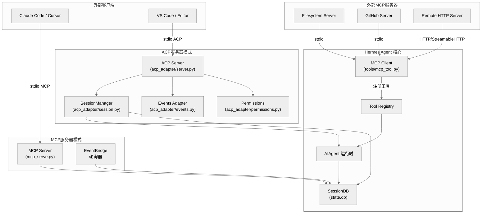
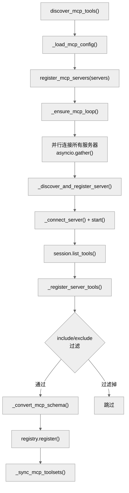
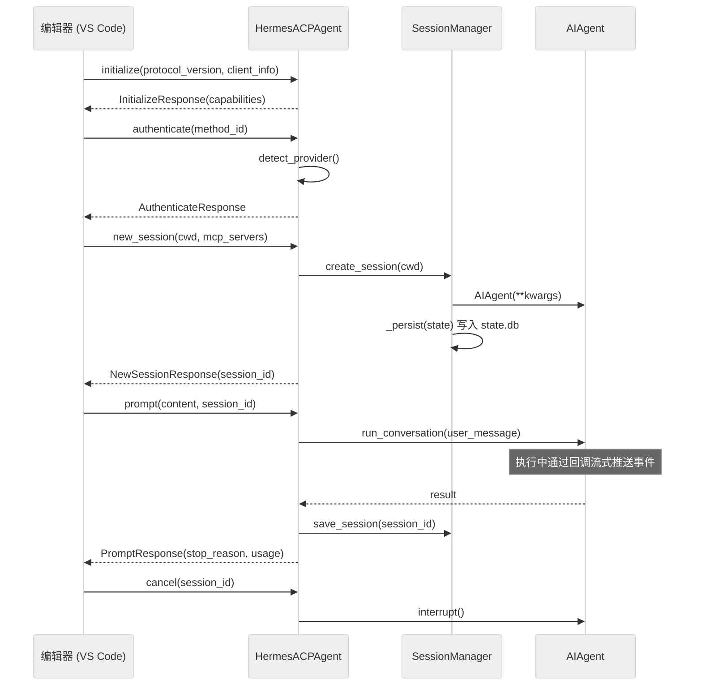
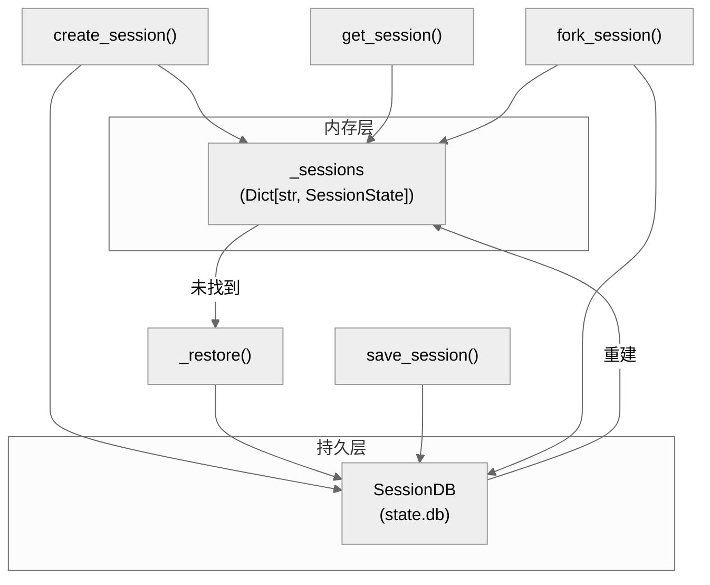

# 第十六章：MCP 与 ACP 协议集成

## 一句话概括

Hermes Agent 同时扮演 **MCP 客户端**（连接外部 MCP 服务器、动态注册远程工具）、**MCP 服务器**（将自身会话能力暴露为 MCP 工具供 Claude Code 等客户端调用）以及 **ACP 服务器**（通过 Agent Client Protocol 为编辑器提供完整的对话代理后端），三种角色共享同一套运行时、工具注册表和会话持久层。

---

## 架构总览



该架构体现了 Hermes 的三重协议角色：

1. **MCP 客户端**（左侧）：连接外部 MCP 服务器，将发现的远程工具注册到本地工具注册表
2. **MCP 服务器**（右上方）：将 Hermes 的会话管理能力包装为 10 个 MCP 工具，供外部 MCP 客户端调用
3. **ACP 服务器**（右下方）：实现完整的 Agent Client Protocol，为编辑器提供会话、提示、取消、模型切换等全套功能

---

## MCP 客户端模式

### 线程模型与连接生命周期

MCP 客户端的核心架构决策是 **专用后台事件循环** (`tools/mcp_tool.py:1125-1138`)。一个守护线程运行独立的 `asyncio.EventLoop`，所有 MCP 服务器连接以长生命周期 `asyncio.Task` 的形式驻留在该循环上。这一设计解决了 anyio cancel-scope 必须在同一 Task 中进入和退出的约束。

```mermaid
%%{init: {'theme': 'neutral'}}%%
sequenceDiagram
    participant Caller as 调用线程 (AIAgent)
    participant Loop as MCP 后台事件循环
    participant Server as MCPServerTask

    Caller->>Loop: _ensure_mcp_loop()
    Note over Loop: 创建新 EventLoop + 守护线程

    Loop->>Server: asyncio.ensure_future(run(config))
    Server->>Server: _run_stdio() 或 _run_http()
    Server->>Server: session.initialize()
    Server->>Server: _discover_tools()
    Server-->>Loop: _ready.set()

    Note over Caller,Server: 工具调用阶段
    Caller->>Loop: run_coroutine_threadsafe(call_tool)
    Loop->>Server: session.call_tool(name, args)
    Server-->>Loop: CallToolResult
    Loop-->>Caller: JSON 结果

    Note over Caller,Server: 关闭阶段
    Caller->>Server: shutdown()
    Server->>Server: _shutdown_event.set()
    Note over Server: async with 上下文正常退出
```

关键的线程安全机制：模块级 `_lock`（`threading.Lock`）保护 `_servers`、`_mcp_loop`、`_mcp_thread` 和 `_stdio_pids` 的所有变更，确保在 Python 3.13+ free-threading 环境下也能安全工作 (`tools/mcp_tool.py:66-69`)。

### 传输层支持

`MCPServerTask` 根据配置中是否存在 `url` 键来选择传输协议 (`tools/mcp_tool.py:751-753`)：

| 传输类型 | 配置键 | 实现方法 | SDK API |
|----------|--------|----------|---------|
| stdio | `command` + `args` | `_run_stdio()` | `stdio_client()` |
| HTTP/StreamableHTTP | `url` + `headers` | `_run_http()` | `streamablehttp_client()` / `streamable_http_client()` |

HTTP 传输同时支持新旧两个 SDK 版本的 API (`tools/mcp_tool.py:906-948`)：`mcp >= 1.24.0` 使用 `streamable_http_client()` + 显式 `httpx.AsyncClient`（调用方管理生命周期），旧版本使用已弃用的 `streamablehttp_client()`。

### 自动重连机制

连接意外断开时，`MCPServerTask.run()` 实现指数退避重连 (`tools/mcp_tool.py:986-1036`)：

- 初始退避 1 秒，每次翻倍，上限 60 秒
- 最多重试 5 次 (`_MAX_RECONNECT_RETRIES`)
- 首次连接失败直接报错（不重试）
- 已请求关闭时不重连

### 安全层

MCP 客户端实施了多层安全控制：

1. **环境变量过滤** (`tools/mcp_tool.py:192-208`)：stdio 子进程仅继承安全基线变量（`PATH`、`HOME`、`LANG` 等）和 `XDG_*` 变量，加上用户在配置中显式指定的变量，防止 API 密钥等敏感信息泄露到 MCP 服务器子进程
2. **凭据剥离** (`tools/mcp_tool.py:173-185`)：错误消息中自动替换 GitHub PAT、OpenAI 密钥、Bearer Token 等凭据模式为 `[REDACTED]`
3. **恶意包检查** (`tools/mcp_tool.py:838-842`)：stdio 命令启动前通过 OSV 数据库检查包是否存在已知恶意软件
4. **命令解析** (`tools/mcp_tool.py:234-267`)：对裸命令（如 `npx`）进行 PATH 解析，优先查找 `~/.hermes/node/bin` 下的可执行文件

---

## 动态工具注册

### 注册流程

工具注册是 MCP 客户端的核心价值——将远程服务器的工具无缝集成为 Hermes 的本地工具。流程如下：



每个 MCP 工具被注册时会获得一个带前缀的名称：`mcp_{server_name}_{tool_name}`（连字符转下划线），由 `_convert_mcp_schema()` (`tools/mcp_tool.py:1513-1531`) 完成转换。例如，`github` 服务器上的 `list_files` 工具注册为 `mcp_github_list_files`。

### 工具集整合

注册后的工具通过 `_sync_mcp_toolsets()` (`tools/mcp_tool.py:1534-1583`) 完成两级整合：

1. **独立工具集**：每个 MCP 服务器创建一个以服务器名命名的工具集（如 `TOOLSETS["github"]`），使其可在 `platform_toolsets` 覆盖中单独引用
2. **伞形工具集注入**：所有 MCP 工具注入到所有 `hermes-*` 伞形工具集中（如 `hermes-acp`、`hermes-cli`），确保默认行为下 MCP 工具可用

碰撞保护：如果 MCP 工具名与内置工具冲突（且内置工具不属于 `mcp-` 前缀工具集），则跳过 MCP 工具以保护内置功能 (`tools/mcp_tool.py:1776-1783`)。

### 动态工具发现（热更新）

当 MCP 服务器发送 `notifications/tools/list_changed` 通知时，`MCPServerTask._refresh_tools()` (`tools/mcp_tool.py:787-821`) 会：

1. 重新从服务器获取工具列表
2. 从 `hermes-*` 伞形工具集中移除旧工具
3. 从中央注册表中注销旧工具
4. 用新工具列表重新注册

该过程通过 `_refresh_lock` (`asyncio.Lock`) 防止快速连续通知导致的竞态条件。通知处理需要 MCP SDK 同时支持 `_MCP_NOTIFICATION_TYPES` 和 `_MCP_MESSAGE_HANDLER_SUPPORTED` 两个功能标记 (`tools/mcp_tool.py:852-853`)。

### 工具调用代理

注册到 Hermes 注册表中的 MCP 工具使用 `_make_tool_handler()` (`tools/mcp_tool.py:1222-1285`) 生成的闭包作为处理器。该闭包是同步的，内部通过 `run_coroutine_threadsafe()` 将异步的 `session.call_tool()` 调度到 MCP 后台事件循环上执行。

返回值处理逻辑：
- `isError` 为真时：提取错误文本并经凭据剥离后返回
- 正常结果：收集所有 `TextContent` 块，合并 `structuredContent`（如存在）
- 异常：捕获后包装为 JSON 错误响应

除工具调用外，MCP 客户端还为每个服务器注册了 4 个辅助工具 (`tools/mcp_tool.py:1585-1653`)：`list_resources`、`read_resource`、`list_prompts`、`get_prompt`，使 agent 能够访问 MCP 服务器的资源和提示模板功能。

---

## MCP OAuth 认证

### 认证流程

当 MCP 服务器配置了 `auth: oauth` 时，`mcp_tool.py` 的 HTTP 传输路径会调用 `mcp_oauth.build_oauth_auth()` (`tools/mcp_oauth.py:378-482`) 构建 `OAuthClientProvider` 实例（`httpx.Auth` 子类），该实例自动处理：

1. **OAuth 2.1 发现**：从服务器 URL 自动发现授权端点
2. **动态客户端注册**：如果未提供 `client_id`，自动向服务器注册客户端
3. **PKCE 流程**：生成 code verifier/challenge，通过浏览器引导用户授权
4. **Token 交换与刷新**：自动交换授权码、刷新过期 token

### 令牌持久化

`HermesTokenStorage` (`tools/mcp_oauth.py:175-235`) 将 token 和客户端信息持久化到磁盘：

```
HERMES_HOME/mcp-tokens/<server_name>.json          -- OAuth tokens
HERMES_HOME/mcp-tokens/<server_name>.client.json    -- 客户端注册信息
```

文件权限设置为 `0o600`，写入使用临时文件 + 原子重命名模式确保安全 (`tools/mcp_oauth.py:157-167`)。

### 非交互环境处理

在 SSH、无头服务器等非交互环境中 (`tools/mcp_oauth.py:119-143`)：
- 如果有缓存 token，直接复用（支持自动刷新）
- 如果无缓存 token，发出警告提示先在交互环境中完成首次授权
- 浏览器检测逻辑考虑了 `SSH_CLIENT`、`DISPLAY`、`WAYLAND_DISPLAY` 等环境变量

---

## Sampling 支持（服务器发起的 LLM 请求）

`SamplingHandler` (`tools/mcp_tool.py:349-713`) 实现了 MCP 规范中的 `sampling/createMessage` 能力——允许 MCP 服务器主动请求 LLM 完成。这是一个重要的安全边界：

| 控制机制 | 配置项 | 默认值 | 作用 |
|----------|--------|--------|------|
| 速率限制 | `max_rpm` | 10 | 滑动窗口每分钟最大请求数 |
| Token 上限 | `max_tokens_cap` | 4096 | 单次请求最大 token 数 |
| 超时 | `timeout` | 30s | LLM 调用超时 |
| 工具循环限制 | `max_tool_rounds` | 5 | 防止无限 tool-use 循环 |
| 模型白名单 | `allowed_models` | 空（允许所有） | 限制可请求的模型 |
| 审计日志 | `log_level` | info | 记录每次 sampling 请求和响应 |

`SamplingHandler` 作为可调用对象直接传递给 `ClientSession` 的 `sampling_callback` 参数 (`tools/mcp_tool.py:577-584`)。LLM 调用通过 `agent.auxiliary_client.call_llm()` 路由到中心化的辅助 LLM 客户端，并通过 `asyncio.to_thread()` 避免阻塞事件循环 (`tools/mcp_tool.py:662-677`)。

---

## MCP 服务器模式

### 设计定位

`mcp_serve.py` 将 Hermes 的多平台会话能力暴露为标准 MCP 工具，匹配 OpenClaw 的 9 工具 MCP 通道桥接接口，外加一个 Hermes 特有的 `channels_list` 工具：

| 工具名 | 功能 | 数据源 |
|--------|------|--------|
| `conversations_list` | 列出跨平台会话 | `sessions.json` |
| `conversation_get` | 获取会话详情 | `sessions.json` |
| `messages_read` | 读取消息历史 | `SessionDB` |
| `attachments_fetch` | 获取消息附件 | `SessionDB` |
| `events_poll` | 轮询新事件 | `EventBridge` |
| `events_wait` | 长轮询等待事件 | `EventBridge` |
| `messages_send` | 发送消息 | `send_message_tool` |
| `channels_list` | 列出可用通道 | `channel_directory.json` |
| `permissions_list_open` | 列出待审批请求 | `EventBridge` |
| `permissions_respond` | 响应审批请求 | `EventBridge` |

### EventBridge 事件桥接

`EventBridge` (`mcp_serve.py:185-425`) 是一个后台轮询器，以 200ms 间隔轮询 `SessionDB` 和 `sessions.json`，维护一个上限 1000 条的内存事件队列。

性能优化：通过 mtime 检查（约 1 微秒开销）跳过文件未变更时的昂贵 DB 查询 (`mcp_serve.py:333-359`)。仅当 `sessions.json` 或 `state.db` 的修改时间变更时才执行实际轮询。

启动方式通过 CLI 命令 `hermes mcp serve`，使用 `FastMCP` 框架在 stdio 上运行 (`mcp_serve.py:836-867`)。

---

## ACP 服务器

### 整体架构

ACP（Agent Client Protocol）是 Hermes 为编辑器集成设计的主要协议通道。`HermesACPAgent` (`acp_adapter/server.py:93`) 继承自 `acp.Agent`，实现完整的 ACP 协议生命周期。



### 入口点

`acp_adapter/entry.py` 是 ACP 服务器的入口，通过以下路径启动：

- `python -m acp_adapter.entry`
- `hermes acp`
- `hermes-acp`

启动流程：加载 `.env` -> 配置日志（stderr，保持 stdout 用于 ACP JSON-RPC）-> 创建 `HermesACPAgent` -> `acp.run_agent()` (`acp_adapter/entry.py:58-85`)。

ACP 注册表元数据定义在 `acp_registry/agent.json`：

```json
{
  "name": "hermes-agent",
  "display_name": "Hermes Agent",
  "distribution": {
    "type": "command",
    "command": "hermes",
    "args": ["acp"]
  }
}
```

---

## ACP 会话管理

### SessionManager 架构

`SessionManager` (`acp_adapter/session.py:70`) 是 ACP 会话的核心管理器，实现双层存储：

1. **内存层**：`_sessions: Dict[str, SessionState]` 提供快速访问（`_lock` 保护线程安全）
2. **持久层**：`SessionDB`（`~/.hermes/state.db`）确保进程重启后会话可恢复



### 会话状态

`SessionState` (`acp_adapter/session.py:58-68`) 包含：

| 字段 | 类型 | 用途 |
|------|------|------|
| `session_id` | `str` | UUID v4 唯一标识 |
| `agent` | `AIAgent` | 绑定的 AI 代理实例 |
| `cwd` | `str` | 编辑器工作目录 |
| `model` | `str` | 当前使用的模型 |
| `history` | `List[Dict]` | 完整对话历史 |
| `cancel_event` | `threading.Event` | 取消信号 |

### 会话恢复

当 `get_session()` 在内存中未找到会话时，`_restore()` (`acp_adapter/session.py:333-405`) 从数据库透明恢复：

1. 查询 `SessionDB`，验证 `source == "acp"`
2. 从 `model_config` JSON 中提取 `cwd`、`provider`、`base_url`、`api_mode`
3. 重新创建 `AIAgent` 实例
4. 加载完整对话历史
5. 注册到内存层

### AIAgent 创建

`_make_agent()` (`acp_adapter/session.py:420-475`) 创建 AIAgent 时的关键配置：

- `platform="acp"`：标识为 ACP 来源
- `enabled_toolsets=["hermes-acp"]`：使用 ACP 专用工具集
- `quiet_mode=True`：抑制交互式输出
- `_print_fn = _acp_stderr_print`：重定向打印到 stderr，保持 stdout 为纯 JSON-RPC
- 运行时 provider 通过 `resolve_runtime_provider()` 解析

### 工作目录绑定

每个会话的 `cwd` 通过 `_register_task_cwd()` (`acp_adapter/session.py:36-44`) 绑定到 `terminal_tool` 的 task 级环境覆盖，确保工具执行在正确的工作目录下运行。

---

## ACP 事件处理

`acp_adapter/events.py` 提供四个回调工厂函数，将 AIAgent 的同步回调桥接到 ACP 的异步会话更新：

| 工厂函数 | AIAgent 回调 | ACP 更新类型 |
|----------|-------------|-------------|
| `make_tool_progress_cb()` | `tool_progress_callback` | `ToolCallStart` |
| `make_thinking_cb()` | `thinking_callback` | `update_agent_thought_text` |
| `make_step_cb()` | `step_callback` | `ToolCallProgress` (completed) |
| `make_message_cb()` | `message_callback` | `update_agent_message_text` |

核心桥接机制 (`acp_adapter/events.py:27-40`)：由于 AIAgent 在工作线程（`ThreadPoolExecutor`）中运行，而 ACP 连接的事件循环在主线程，所有更新通过 `asyncio.run_coroutine_threadsafe()` 调度，超时 5 秒的 fire-and-forget 模式。

### 工具调用 ID 追踪

`tool_call_ids: Dict[str, Deque[str]]` 以工具名为键、FIFO 队列为值追踪活跃的工具调用 (`acp_adapter/events.py:51-52`)。`tool.started` 事件入队一个新 ID，`step_callback` 中工具完成时出队匹配的 ID。这支持同名工具的并行调用正确关联开始和结束事件。

---

## ACP 工具映射

`acp_adapter/tools.py` 负责将 Hermes 内部工具名映射到 ACP 的 `ToolKind` 类型体系 (`acp_adapter/tools.py:20-50`)：

| Hermes 工具 | ACP ToolKind | 语义 |
|-------------|-------------|------|
| `read_file` | `read` | 读取操作 |
| `write_file`, `patch` | `edit` | 编辑操作 |
| `terminal`, `execute_code` | `execute` | 执行操作 |
| `web_search`, `web_extract` | `fetch` | 网络获取 |
| `search_files` | `search` | 搜索操作 |
| `_thinking` | `think` | 思考/推理 |
| 其他 | `other` | 默认分类 |

此外，`build_tool_start()` (`acp_adapter/tools.py:104-174`) 为不同工具类型构建专用的富内容：
- `patch`：生成 diff 内容（`acp.tool_diff_content`）
- `write_file`：生成新文件 diff 内容
- `terminal`：显示命令文本
- `read_file`：显示读取路径
- 通用回退：JSON 格式化的参数

`build_tool_complete()` (`acp_adapter/tools.py:177-197`) 截断超过 5000 字符的大结果，避免 UI 过载。

文件位置提取 (`acp_adapter/tools.py:205-214`) 从工具参数中提取 `path` 和行号信息，使编辑器能在侧边栏中显示文件关联。

---

## ACP 权限系统

`acp_adapter/permissions.py` 桥接编辑器的权限审批 UI 与 Hermes 的工具执行审批机制 (`acp_adapter/permissions.py:26-77`)。

```mermaid
%%{init: {'theme': 'neutral'}}%%
sequenceDiagram
    participant Agent as AIAgent (工作线程)
    participant Bridge as approval_callback
    participant Loop as ACP 事件循环 (主线程)
    participant Editor as 编辑器

    Agent->>Bridge: approval_callback(command, description)
    Bridge->>Loop: run_coroutine_threadsafe(request_permission)
    Loop->>Editor: 权限请求 (ToolCallStart + options)
    Editor-->>Loop: PermissionResponse(outcome)
    Loop-->>Bridge: response
    Bridge-->>Agent: "once" / "always" / "deny"
```

权限选项映射 (`acp_adapter/permissions.py:18-23`)：

| ACP PermissionOptionKind | Hermes 审批结果 |
|--------------------------|----------------|
| `allow_once` | `"once"` |
| `allow_always` | `"always"` |
| `reject_once` | `"deny"` |
| `reject_always` | `"deny"` |

超时处理：等待编辑器响应最多 60 秒，超时自动拒绝 (`acp_adapter/permissions.py:31`)。审批回调在 `prompt()` 执行期间注入到 `terminal_tool`，执行完毕后恢复原始回调 (`acp_adapter/server.py:414-438`)。

---

## ACP 认证

`acp_adapter/auth.py` (`acp_adapter/auth.py:1-25`) 提供极简的认证检测：

- `detect_provider()`：通过 `resolve_runtime_provider()` 检测是否有可用的 API 密钥和 provider
- `has_provider()`：布尔封装

在 `initialize()` 响应中 (`acp_adapter/server.py:227-257`)，如果检测到有效 provider，向客户端广告一个认证方法。`authenticate()` 方法本身只验证 provider 存在即返回成功——实际的 API 密钥验证延迟到首次 LLM 调用。

---

## MCP/ACP 配置

### MCP 配置

MCP 服务器配置存储在 `~/.hermes/config.yaml` 的 `mcp_servers` 键下 (`tools/mcp_tool.py:1169-1195`)，支持环境变量插值（`${VAR}` 语法）。

CLI 管理命令通过 `hermes_cli/mcp_config.py` 提供完整的生命周期管理：

| 命令 | 功能 | 实现 |
|------|------|------|
| `hermes mcp add` | 添加服务器（含连接发现和工具选择） | `cmd_mcp_add()` (`hermes_cli/mcp_config.py:219`) |
| `hermes mcp remove` | 移除服务器及 OAuth token | `cmd_mcp_remove()` (`hermes_cli/mcp_config.py:412`) |
| `hermes mcp list` | 列出所有配置的服务器 | `cmd_mcp_list()` (`hermes_cli/mcp_config.py:442`) |
| `hermes mcp test` | 测试服务器连接 | `cmd_mcp_test()` (`hermes_cli/mcp_config.py:511`) |
| `hermes mcp configure` | 交互式切换工具启用状态 | `cmd_mcp_configure()` (`hermes_cli/mcp_config.py:582`) |
| `hermes mcp serve` | 启动 MCP 服务器模式 | 转发到 `mcp_serve.run_mcp_server()` |

`hermes mcp add` 的发现优先流程 (`hermes_cli/mcp_config.py:219-407`)：
1. 确定传输类型（URL / 命令 / 预设）
2. 处理认证（OAuth / Bearer token / 无）
3. **连接并发现工具列表**
4. 交互式工具选择（全选 / curses 复选框选择）
5. 保存配置

### ACP 配置

ACP 的配置更为隐式：通过 `acp_registry/agent.json` 声明启动命令，编辑器自动发现并调用。运行时 provider 配置复用 Hermes 的标准 `config.yaml` 中的 `model` 段。

### 工具过滤

MCP 工具支持两级过滤 (`tools/mcp_tool.py:1751-1767`)：

```yaml
mcp_servers:
  github:
    command: "npx"
    args: ["-y", "@modelcontextprotocol/server-github"]
    tools:
      include: ["list_repos", "get_file"]  # 白名单模式
      # exclude: ["delete_repo"]           # 黑名单模式
      resources: true                       # 启用资源辅助工具
      prompts: false                        # 禁用提示辅助工具
```

规则：`include` 优先于 `exclude`；两者都不设则注册全部工具。

---

## ACP 会话中的 MCP 服务器注册

ACP 模式下，编辑器可在创建/加载/恢复/分支会话时传递额外的 MCP 服务器配置。`_register_session_mcp_servers()` (`acp_adapter/server.py:150-213`) 处理此场景：

1. 将 ACP 格式的 `McpServerStdio` / `McpServerHttp` / `McpServerSse` 转换为 Hermes 格式的配置字典
2. 调用 `tools.mcp_tool.register_mcp_servers()` 连接并注册工具
3. 通过 `get_tool_definitions()` 刷新 agent 的工具面，包含新注册的 MCP 工具
4. 调用 `_invalidate_system_prompt()` 使系统提示重新生成（包含新工具描述）

这实现了编辑器动态向 Hermes 会话注入外部 MCP 服务器的能力。

---

## 斜杠命令系统

`HermesACPAgent` 实现了 7 个本地斜杠命令 (`acp_adapter/server.py:96-104`)，在不调用 LLM 的情况下快速响应：

| 命令 | 功能 | 数据来源 |
|------|------|----------|
| `/help` | 列出可用命令 | 静态定义 |
| `/model [name]` | 查看/切换模型 | `SessionState` + `_make_agent()` |
| `/tools` | 列出可用工具 | `get_tool_definitions()` |
| `/context` | 显示对话统计 | `SessionState.history` |
| `/reset` | 清空对话历史 | `SessionState.history` |
| `/compact` | 压缩上下文 | `AIAgent._compress_context()` |
| `/version` | 显示版本 | `hermes_cli.__version__` |

命令通过 `AvailableCommandsUpdate` 在会话创建后主动推送给客户端 (`acp_adapter/server.py:487-514`)。未识别的 `/xxx` 命令透传给 LLM 处理 (`acp_adapter/server.py:536-537`)。

---

## 关键文件索引

| 文件 | 行数 | 核心职责 |
|------|------|----------|
| `tools/mcp_tool.py` | ~2195 | MCP 客户端：连接管理、工具发现、动态注册、Sampling、安全层 |
| `tools/mcp_oauth.py` | ~483 | MCP OAuth 2.1 PKCE 认证：令牌持久化、浏览器流程、回调服务器 |
| `mcp_serve.py` | ~867 | MCP 服务器：10 个会话桥接工具、EventBridge 事件轮询 |
| `acp_adapter/server.py` | ~729 | ACP 服务器主体：协议生命周期、Prompt 执行、斜杠命令、MCP 服务器注册 |
| `acp_adapter/entry.py` | ~86 | ACP 入口点：环境加载、日志配置、服务器启动 |
| `acp_adapter/session.py` | ~476 | ACP 会话管理器：内存+DB 双层存储、会话恢复、AIAgent 创建 |
| `acp_adapter/events.py` | ~176 | ACP 事件桥接：4 个回调工厂、跨线程更新调度 |
| `acp_adapter/tools.py` | ~215 | ACP 工具映射：ToolKind 分类、富内容构建、位置提取 |
| `acp_adapter/auth.py` | ~25 | ACP 认证检测：provider 解析 |
| `acp_adapter/permissions.py` | ~78 | ACP 权限桥接：审批回调、超时拒绝 |
| `acp_registry/agent.json` | ~12 | ACP 注册表元数据：名称、描述、启动命令 |
| `hermes_cli/mcp_config.py` | ~717 | MCP CLI 管理：add/remove/list/test/configure 子命令 |

---

## 设计要点总结

**MCP 客户端的工程亮点**：专用后台事件循环解决了 anyio 上下文约束；并行连接 + 120 秒外层超时保证启动不被慢服务器阻塞；多层安全控制（环境变量过滤、凭据剥离、恶意包检查）在开放协议环境中建立信任边界。

**ACP 的会话韧性**：双层存储（内存 + SQLite）使会话能透明地跨进程重启恢复；stderr 重定向保持 stdout 纯净的 JSON-RPC 通道；工作线程池 (`ThreadPoolExecutor(max_workers=4)`) 允许多会话并行执行 LLM 调用。

**三协议角色的统一**：MCP 客户端注册的远程工具、MCP 服务器暴露的会话工具、ACP 服务器管理的 agent 会话，三者共享同一个 `Tool Registry` 和 `SessionDB`，避免了数据孤岛和重复实现。
