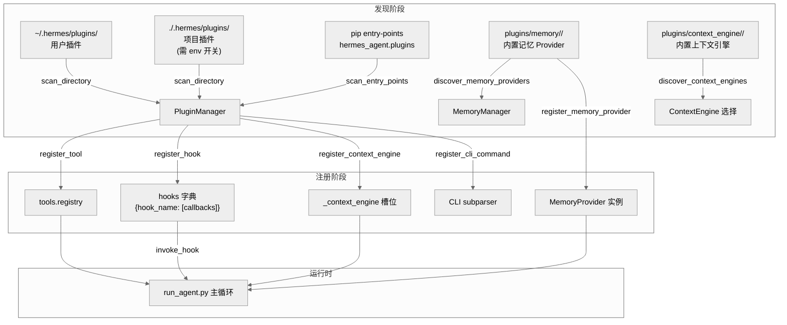
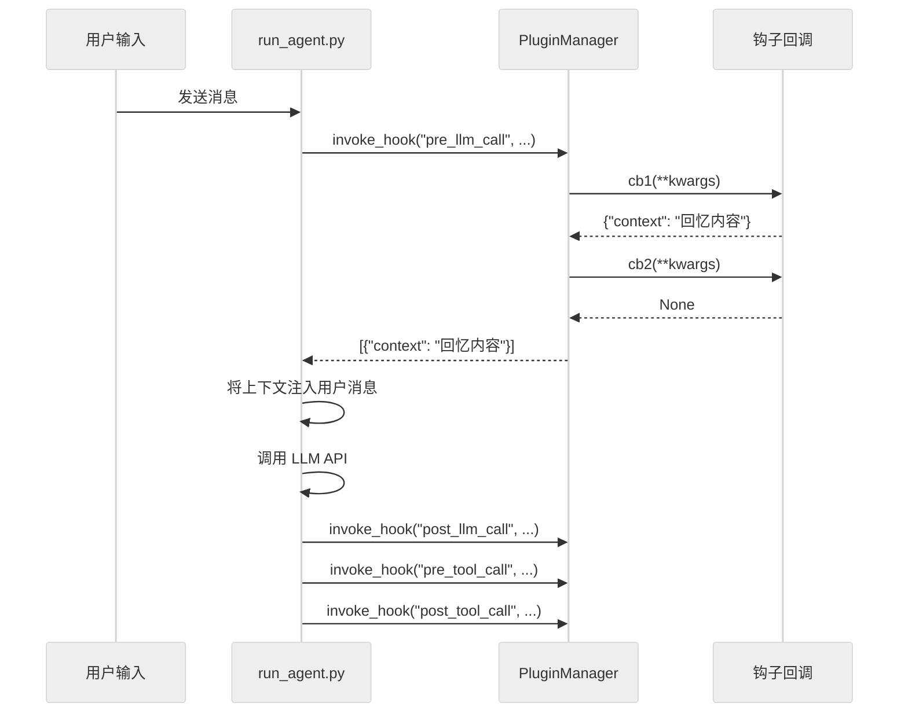
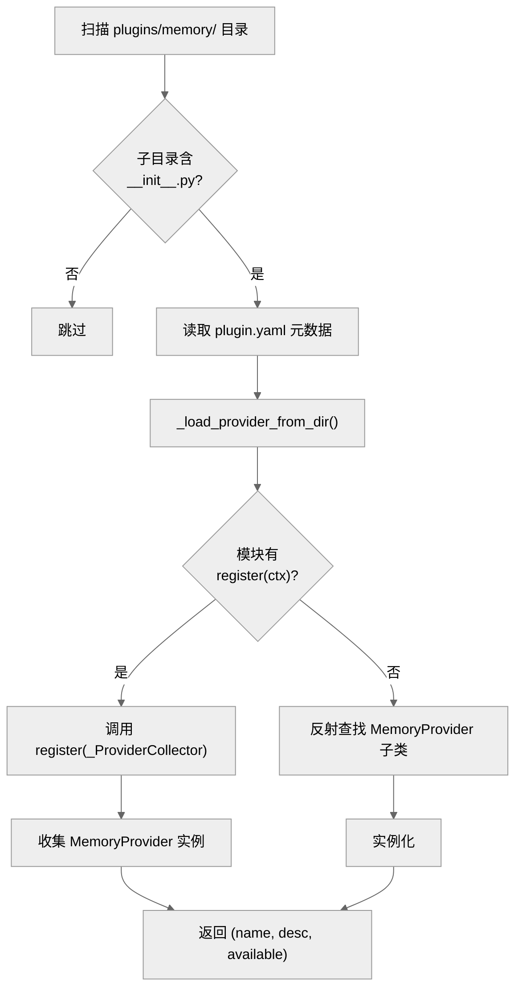

# 第十七章: 插件与上下文引擎

> **一句话总结:** Hermes 通过一套三源发现机制（用户目录、项目目录、pip entry-point）加载通用插件，并通过独立的 provider 插件体系管理可热切换的记忆后端和上下文压缩引擎，实现了对 agent 核心循环零侵入的功能扩展。

---

## 17.1 架构总览

Hermes 的插件体系分为两个层面:

1. **通用插件系统** (`hermes_cli/plugins.py`) -- 支持工具注册、生命周期钩子、CLI 命令注入和上下文引擎替换。
2. **Provider 插件** (`plugins/memory/`, `plugins/context_engine/`) -- 仓库内置的专用后端，通过配置选择，同时只激活一个。

两者通过 `PluginContext` 统一暴露注册接口，但发现和加载路径完全独立。



---

## 17.2 通用插件架构

### 17.2.1 插件发现: 三源模型

`PluginManager.discover_and_load()` (`hermes_cli/plugins.py:287`) 按优先级依次扫描三个来源:

| 序号 | 来源 | 路径 / 标识 | 启用条件 |
|------|------|------------|---------|
| 1 | 用户插件 | `~/.hermes/plugins/<name>/` | 始终扫描 |
| 2 | 项目插件 | `./.hermes/plugins/<name>/` | `HERMES_ENABLE_PROJECT_PLUGINS` 环境变量为 truthy |
| 3 | pip 包 | `hermes_agent.plugins` entry-point group | 始终扫描 |

目录插件必须包含 `plugin.yaml` 清单文件和带有 `register(ctx)` 函数的 `__init__.py`。pip 插件通过 `importlib.metadata.entry_points()` 发现 (`hermes_cli/plugins.py:371`)。

**禁用机制:** `config.yaml` 中 `plugins.disabled` 列表中的插件名将被跳过 (`hermes_cli/plugins.py:308`)。

### 17.2.2 插件清单 (PluginManifest)

```python
# hermes_cli/plugins.py:94
@dataclass
class PluginManifest:
    name: str
    version: str = ""
    description: str = ""
    author: str = ""
    requires_env: List[Union[str, Dict[str, Any]]] = ...
    provides_tools: List[str] = ...
    provides_hooks: List[str] = ...
    source: str = ""        # "user", "project", "entrypoint"
    path: Optional[str] = None
```

`requires_env` 支持两种格式: 简单字符串列表（向后兼容）和带有 `name/description/url/secret` 字段的富格式列表。安装插件时 (`hermes_cli/plugins_cmd.py:151`) 会自动提示用户填写缺失的环境变量。

### 17.2.3 PluginContext: 注册门面

每个插件的 `register(ctx)` 函数接收一个 `PluginContext` 实例 (`hermes_cli/plugins.py:124`)，它暴露四类注册方法:

| 方法 | 用途 | 约束 |
|------|------|------|
| `register_tool()` | 向全局 `tools.registry` 注册工具 | 工具名全局唯一 |
| `register_hook()` | 注册生命周期回调 | 未知钩子名产生警告但仍存储（前向兼容） |
| `register_context_engine()` | 替换内置上下文压缩器 | 全局仅允许一个；必须继承 `ContextEngine` ABC |
| `register_cli_command()` | 注册 CLI 子命令 | 通过 argparse subparser 集成 |
| `inject_message()` | 向活跃会话注入消息 | 仅 CLI 模式可用，gateway 模式返回 False |

### 17.2.4 生命周期钩子

`VALID_HOOKS` 定义了 10 个钩子点 (`hermes_cli/plugins.py:55`):

```python
VALID_HOOKS = {
    "pre_tool_call",    "post_tool_call",
    "pre_llm_call",     "post_llm_call",
    "pre_api_request",  "post_api_request",
    "on_session_start", "on_session_end",
    "on_session_finalize", "on_session_reset",
}
```

**调用机制:** `invoke_hook()` (`hermes_cli/plugins.py:500`) 遍历同名钩子下所有回调，每个回调独立 try/except 隔离，确保单个插件崩溃不会中断 agent 主循环。

**上下文注入:** `pre_llm_call` 钩子的返回值可以是字符串或 `{"context": "..."}` 字典，agent 会将其注入到当前轮次的用户消息中 (`run_agent.py:7796`)。这些注入的上下文是临时性的（ephemeral），不会持久化到会话数据库。



---

## 17.3 上下文引擎插件

### 17.3.1 ContextEngine ABC

`agent/context_engine.py` 定义了上下文引擎的抽象基类:

| 抽象方法 | 职责 |
|---------|------|
| `name` (property) | 引擎标识符（如 `"compressor"`, `"lcm"`） |
| `update_from_response(usage)` | 从 API 响应更新 token 计数 |
| `should_compress(prompt_tokens)` | 判断是否需要压缩 |
| `compress(messages, current_tokens)` | 执行消息列表压缩 |

可选方法包括 `on_session_start()`, `on_session_end()`, `get_tool_schemas()`, `handle_tool_call()` 等。引擎可以在压缩之外额外暴露工具供 agent 调用（例如 LCM 引擎的 `lcm_grep`）。

### 17.3.2 发现与加载

`plugins/context_engine/__init__.py` 镜像了记忆 Provider 的发现逻辑:

1. 扫描 `plugins/context_engine/` 下的子目录
2. 读取可选的 `plugin.yaml` 获取元数据
3. 尝试加载并调用 `is_available()` 检查可用性
4. 加载时支持两种模式: `register(ctx)` 插件风格，或直接查找 `ContextEngine` 子类

**配置选择:** `config.yaml` 中 `context.engine` 字段控制激活哪个引擎，默认为 `"compressor"`（内置的 `ContextCompressor`）。通过 `hermes plugins` 交互式 TUI 或命令行可切换 (`hermes_cli/plugins_cmd.py:698`)。

---

## 17.4 记忆 Provider 插件

### 17.4.1 MemoryProvider ABC

`agent/memory_provider.py:42` 定义了记忆 Provider 的完整接口:

**核心生命周期:**

| 方法 | 调用时机 | 职责 |
|------|---------|------|
| `is_available()` | agent 初始化时 | 轻量级可用性检查（无网络调用） |
| `initialize(session_id, **kwargs)` | 会话启动 | 建立连接、创建资源、启动后台线程 |
| `system_prompt_block()` | 系统提示词组装时 | 返回静态指令文本 |
| `prefetch(query)` | 每轮 API 调用前 | 返回预取的上下文（应快速，使用缓存结果） |
| `queue_prefetch(query)` | 每轮完成后 | 启动后台预取，结果供下轮 `prefetch()` 消费 |
| `sync_turn(user, assistant)` | 每轮完成后 | 异步持久化对话轮次 |
| `get_tool_schemas()` | 工具列表构建时 | 返回此 Provider 暴露的工具 schema |
| `handle_tool_call(name, args)` | 工具调用分发时 | 处理具体的工具调用 |
| `shutdown()` | 关闭时 | 刷新队列、关闭连接 |

**可选钩子:**

| 钩子 | 用途 |
|------|------|
| `on_turn_start(turn, message)` | 轮次计数、范围管理 |
| `on_session_end(messages)` | 会话结束时的事实提取 |
| `on_pre_compress(messages)` | 压缩前提取洞察 |
| `on_memory_write(action, target, content)` | 镜像内置记忆写入 |
| `on_delegation(task, result)` | 父 agent 观察子 agent 工作结果 |

### 17.4.2 发现与加载

`plugins/memory/__init__.py` 实现了 Provider 的发现逻辑 (`discover_memory_providers()` 在第 32 行):



关键设计: `_ProviderCollector` 是一个伪 `PluginContext`，仅捕获 `register_memory_provider()` 调用，其余注册方法为 no-op (`plugins/memory/__init__.py:199`)。这使得记忆插件可以使用与通用插件相同的 `register(ctx)` 编写模式。

**加载细节:** 为支持插件内的相对导入（如 `from .store import MemoryStore`），加载器会预注册父包和子模块到 `sys.modules` (`plugins/memory/__init__.py:118-166`)。

### 17.4.3 内置记忆 Provider 一览

仓库内置 7 个记忆 Provider:

| Provider | 目录 | 特性 | 外部依赖 |
|----------|------|------|---------|
| **Honcho** | `plugins/memory/honcho/` | 跨会话用户建模、辩证 Q&A、peer card、结论持久化 | `honcho-ai` SDK |
| **Holographic** | `plugins/memory/holographic/` | 结构化事实存储、实体解析、HRR 向量检索、信任评分 | SQLite（内置），numpy（可选） |
| **Mem0** | `plugins/memory/mem0/` | 服务端 LLM 事实提取、语义搜索、自动去重、断路器保护 | `mem0ai` SDK |
| **Supermemory** | `plugins/memory/supermemory/` | 语义长期记忆、Profile 召回、多容器支持、会话摘要 | `supermemory` SDK |
| **OpenViking** | `plugins/memory/openviking/` | 文件系统层级知识组织、分层上下文加载、自动记忆提取 | OpenViking server |
| **Hindsight** | `plugins/memory/hindsight/` | （占位/社区贡献） | -- |
| **ByteRover** | `plugins/memory/byterover/` | （占位/社区贡献） | -- |
| **RetainDB** | `plugins/memory/retaindb/` | （占位/社区贡献） | -- |

**配置选择:** `config.yaml` 中 `memory.provider` 字段指定激活的外部 Provider。内置记忆 (`MEMORY.md / USER.md`) 始终作为第一 Provider 运行，外部 Provider 是附加而非替代。

### 17.4.4 深入: Honcho 记忆 Provider

Honcho 是最完整的记忆 Provider 实现，展现了 Provider 接口的全部能力:

**三种召回模式** (`recall_mode`, `plugins/memory/honcho/__init__.py:133`):

| 模式 | 行为 |
|------|------|
| `hybrid` (默认) | 自动上下文注入 + Honcho 工具均可用 |
| `context` | 仅自动注入，隐藏所有 Honcho 工具 |
| `tools` | 仅暴露工具，无自动注入；支持延迟会话初始化 |

**四个 Honcho 工具:**

| 工具 | 成本 | 描述 |
|------|------|------|
| `honcho_profile` | 无 LLM | 快速获取用户 peer card（结构化事实列表） |
| `honcho_search` | 无 LLM | 语义搜索已存储上下文 |
| `honcho_context` | 有 LLM | 辩证推理合成回答（最高延迟和成本） |
| `honcho_conclude` | 无 LLM | 将事实写回 Honcho 记忆 |

**成本控制机制** (`plugins/memory/honcho/__init__.py:138-145`):
- `injection_frequency`: `"every-turn"` 或 `"first-turn"`
- `context_cadence`: 上下文 API 调用的最小间隔轮次
- `dialectic_cadence`: 辩证查询的最小间隔轮次
- `reasoning_level_cap`: 限制自动推理级别上限

**会话架构:** `HonchoSessionManager` (`plugins/memory/honcho/session.py:68`) 管理双向 peer 模型:
- **用户 peer:** 累积用户事实和偏好
- **AI peer:** 累积 agent 身份和行为模式
- **观察模式:** `directional`（各 peer 独立观察）和 `unified`（共享池）
- **写入策略:** `async`（后台线程）、`turn`（同步）、`session`（批量）、或 N 轮间隔

### 17.4.5 深入: Holographic 记忆 Provider

Holographic Memory (`plugins/memory/holographic/__init__.py:114`) 提供完全本地化的结构化记忆:

- **存储:** SQLite 数据库，支持实体解析和分类标签
- **检索:** 基于 HRR (Holographic Reduced Representation) 的组合向量检索
- **信任系统:** 每个事实有信任评分，通过 `fact_feedback` 工具的 helpful/unhelpful 反馈动态调整
- **操作:** `add`, `search`, `probe`（实体召回）, `related`（关联查找）, `reason`（多实体推理）, `contradict`（矛盾检测）
- **自动提取:** 会话结束时可选地通过正则模式匹配用户偏好和项目决策

---

## 17.5 插件管理 CLI

### 17.5.1 命令结构

`hermes plugins` 命令 (`hermes_cli/plugins_cmd.py:1106`) 支持以下操作:

| 命令 | 功能 |
|------|------|
| `hermes plugins` (无参数) | 交互式 TUI，含通用插件开关和 Provider 选择 |
| `hermes plugins install <url/owner/repo>` | 从 Git 仓库安装插件 |
| `hermes plugins update <name>` | git pull 更新已安装插件 |
| `hermes plugins remove <name>` | 删除插件 |
| `hermes plugins enable <name>` | 启用已禁用的插件 |
| `hermes plugins disable <name>` | 禁用插件（不删除） |
| `hermes plugins list` | 列出已安装插件状态 |

### 17.5.2 安装流程

`cmd_install()` (`hermes_cli/plugins_cmd.py:284`) 执行以下步骤:

1. **URL 解析:** 支持完整 Git URL 和 `owner/repo` 简写（自动解析为 GitHub）
2. **浅克隆:** `git clone --depth 1` 到临时目录
3. **清单读取:** 从 `plugin.yaml` 提取插件名和元数据
4. **名称安全检查:** 防止路径穿越攻击 (`_sanitize_plugin_name()`, 第 36 行)
5. **版本兼容检查:** `manifest_version` 不能超过安装器支持的版本
6. **移动安装:** 从临时目录移到 `~/.hermes/plugins/<name>/`
7. **示例文件复制:** `.example` 后缀的文件自动复制为正式配置
8. **环境变量提示:** 根据 `requires_env` 自动提示用户填写
9. **安装后展示:** 渲染 `after-install.md`（如果存在）

### 17.5.3 交互式 TUI

`cmd_toggle()` (`hermes_cli/plugins_cmd.py:741`) 启动一个 curses 复合界面，包含:

- **通用插件区:** 复选框列表，空格键切换启用/禁用
- **Provider 区:** Memory Provider 和 Context Engine 的单选列表
- **键盘导航:** j/k 或方向键移动，Space/Enter 操作，ESC 保存退出

Provider 选择通过 `curses_radiolist` 实现 (`_configure_memory_provider()`, `_configure_context_engine()`)，选中后立即写入 `config.yaml`。

---

## 17.6 CLI 命令注册 (记忆 Provider)

记忆 Provider 可以注册自己的 CLI 子命令。`discover_plugin_cli_commands()` (`plugins/memory/__init__.py:234`) 仅加载当前活跃 Provider 的 `cli.py` 模块:

```python
# 只加载活跃 Provider 的 CLI
active_provider = _get_active_memory_provider()  # 从 config.yaml 读取
cli_file = plugin_dir / "cli.py"                 # 查找 cli.py
register_cli = getattr(cli_mod, "register_cli")  # 获取注册函数
```

Honcho 的 CLI (`plugins/memory/honcho/cli.py:1217`) 是最完整的示例，注册了 `hermes honcho` 子命令树: `setup`, `status`, `peers`, `sessions`, `map`, `peer`, `mode`, `tokens`, `identity`, `migrate`, `enable`, `disable`, `sync`。

---

## 17.7 扩展点

### 17.7.1 创建新的通用插件

在 `~/.hermes/plugins/<name>/` 下创建:

```
my-plugin/
  plugin.yaml       # 清单: name, version, description, requires_env 等
  __init__.py        # 必须包含 register(ctx) 函数
  after-install.md   # 可选: 安装后显示的说明
  config.yaml.example  # 可选: 配置模板
```

`register(ctx)` 中可调用:
- `ctx.register_tool(...)` -- 注册工具
- `ctx.register_hook("pre_llm_call", callback)` -- 注册钩子
- `ctx.register_context_engine(engine)` -- 替换上下文引擎
- `ctx.register_cli_command(...)` -- 注册 CLI 命令
- `ctx.inject_message(content)` -- 向会话注入消息

### 17.7.2 创建新的记忆 Provider

在 `plugins/memory/<name>/` 下创建 `__init__.py`:

```python
from agent.memory_provider import MemoryProvider

class MyProvider(MemoryProvider):
    @property
    def name(self): return "myprovider"
    def is_available(self): return True
    def initialize(self, session_id, **kwargs): ...
    def get_tool_schemas(self): return [...]
    # ... 其余方法

def register(ctx):
    ctx.register_memory_provider(MyProvider())
```

通过 `config.yaml` 中 `memory.provider: myprovider` 激活。

### 17.7.3 创建新的上下文引擎

在 `plugins/context_engine/<name>/` 下创建 `__init__.py`:

```python
from agent.context_engine import ContextEngine

class MyEngine(ContextEngine):
    @property
    def name(self): return "myengine"
    def update_from_response(self, usage): ...
    def should_compress(self, prompt_tokens=None): ...
    def compress(self, messages, current_tokens=None): ...

def register(ctx):
    ctx.register_context_engine(MyEngine())
```

通过 `config.yaml` 中 `context.engine: myengine` 激活。

---

## 17.8 关键文件索引

| 文件 | 行数 | 职责 |
|------|------|------|
| `hermes_cli/plugins.py` | 649 | 通用插件系统核心: PluginManager, PluginContext, 钩子调用, 单例管理 |
| `hermes_cli/plugins_cmd.py` | 1128 | CLI 命令实现: install/update/remove/enable/disable/list, TUI |
| `plugins/__init__.py` | 2 | 包标记（空） |
| `plugins/context_engine/__init__.py` | 220 | 上下文引擎发现与加载 |
| `plugins/memory/__init__.py` | 318 | 记忆 Provider 发现、加载、CLI 命令扫描 |
| `agent/memory_provider.py` | 232 | MemoryProvider ABC: 定义完整的 Provider 接口契约 |
| `agent/context_engine.py` | 185 | ContextEngine ABC: 定义上下文引擎接口契约 |
| `plugins/memory/honcho/__init__.py` | 723 | Honcho Provider: 最完整的记忆实现 |
| `plugins/memory/honcho/client.py` | 566 | Honcho 客户端配置解析与连接管理 |
| `plugins/memory/honcho/session.py` | 1084 | Honcho 会话管理: 异步写入、辩证查询、peer 观察 |
| `plugins/memory/honcho/cli.py` | 1306 | Honcho CLI: setup 向导、状态查看、迁移指南 |
| `plugins/memory/holographic/__init__.py` | 408 | Holographic Provider: 本地 SQLite + HRR 检索 |
| `plugins/memory/mem0/__init__.py` | 374 | Mem0 Provider: 云端事实提取 + 断路器 |
| `plugins/memory/supermemory/__init__.py` | 792 | Supermemory Provider: 多容器语义记忆 |
| `plugins/memory/openviking/__init__.py` | ~500 | OpenViking Provider: 文件系统层级知识管理 |

---

## 17.9 设计观察

**单一激活约束:** 无论是记忆 Provider 还是上下文引擎，同时只允许一个外部实例激活。这避免了工具 schema 膨胀和后端冲突，同时通过内置记忆始终运行保证了基线功能。

**双层隔离:** 通用插件的 `invoke_hook()` 对每个回调独立异常捕获 (`hermes_cli/plugins.py:520`)，记忆 Provider 的加载也独立于通用插件系统。一个 Provider 崩溃不影响通用插件，反之亦然。

**前向兼容:** 未知钩子名会产生警告但仍被存储 (`hermes_cli/plugins.py:255`)，允许面向未来版本编写的插件在旧版 Hermes 上部分工作。

**延迟加载:** `_ProviderCollector` 和 `_EngineCollector` 模式使得 Provider/引擎的发现和加载可以与 agent 核心解耦，按需初始化。Honcho 的 `tools` 模式更进一步，将会话创建推迟到首次工具调用时 (`_ensure_session()`, `plugins/memory/honcho/__init__.py:320`)。

**Prompt 缓存友好:** 插件注入的上下文始终进入用户消息而非系统提示词 (`hermes_cli/plugins.py:515-518` 注释)。这保持了系统提示词的稳定性，使 LLM 的 prompt cache 命中率最大化。
