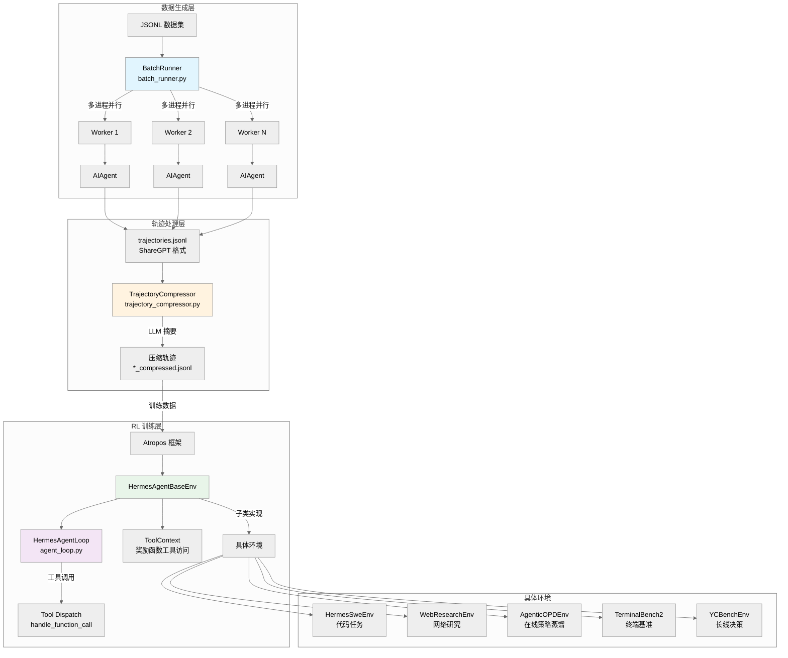
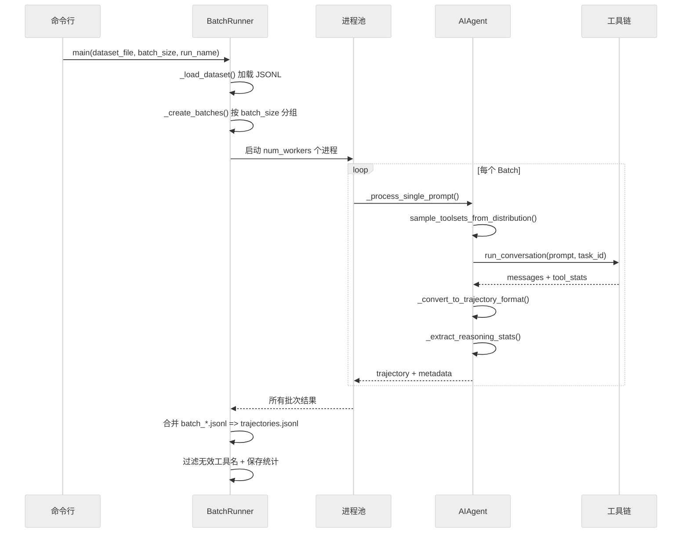
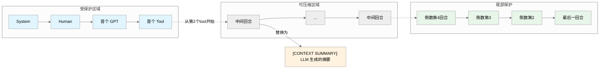
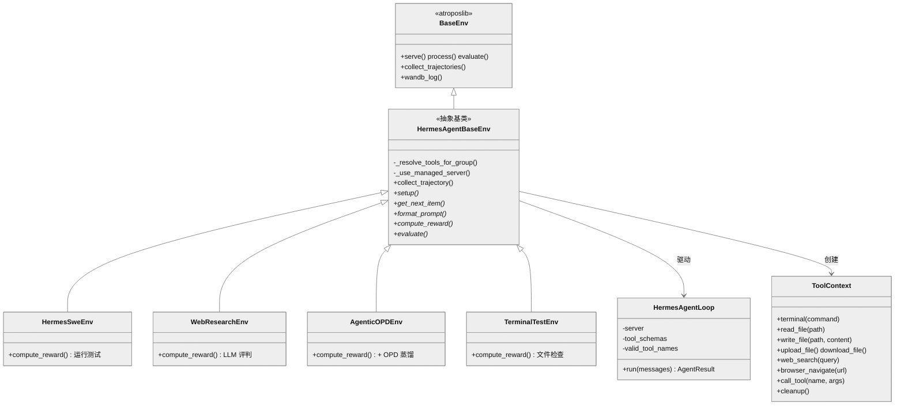
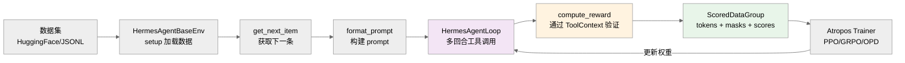

# 第18章：RL 训练与批量运行器

## 一句话概要

hermes-agent 的研究训练基础设施提供了一条完整的管线：从大规模批量轨迹（trajectory）生成，经压缩处理转化为高效训练数据，再通过 Atropos RL 框架对接各类训练环境，实现端到端的强化学习闭环。

---

## 架构全景



---

## 批量运行器 (Batch Runner)

### 核心职责

`batch_runner.py` (1,287 行) 负责大规模并行生成 agent 轨迹。它接受一个 JSONL 数据集，将每条 prompt 分发给独立的 `AIAgent` 实例执行，收集完整的工具调用对话历史，最终合并为训练可用的轨迹文件。

### 运行流程



### 关键设计决策

**工具集分布采样** (`batch_runner.py:307`)：每个 prompt 不会使用固定的工具集，而是通过 `sample_toolsets_from_distribution(config["distribution"])` 从分布中随机采样。这确保了训练数据覆盖多种工具组合场景。

**推理过滤** (`batch_runner.py:443-447`)：若某条轨迹的所有 assistant 回合均未包含推理内容（既无 `<REASONING_SCRATCHPAD>` 标签，也无 native reasoning token），则被丢弃，不进入训练集。

**容器镜像覆盖** (`batch_runner.py:256-303`)：数据集中的每条记录可指定 `image` 或 `docker_image` 字段，为该 prompt 的沙箱设定独立的容器环境。支持 Docker、Modal、Singularity、Daytona 四种后端。

**基于内容的断点恢复** (`batch_runner.py:714-756`)：恢复运行时不依赖索引号，而是扫描所有 batch 输出文件中已完成的 prompt 文本进行匹配。这比传统的索引检查点更鲁棒，即使数据集排列改变也能正确恢复。

**检查点原子写入** (`batch_runner.py:707-712`)：使用 `atomic_json_write` 防止进程崩溃导致检查点文件损坏。每完成一个 batch 即增量更新检查点。

### 输出结构

```
data/<run_name>/
├── batch_0.jsonl          # 第一个 batch 的原始轨迹
├── batch_1.jsonl          # 第二个 batch
├── ...
├── trajectories.jsonl     # 合并后的最终文件（经过过滤）
├── checkpoint.json        # 断点恢复信息
└── statistics.json        # 工具使用统计 + 推理覆盖率
```

---

## 轨迹格式

### ShareGPT 格式

batch_runner 输出的轨迹遵循 **ShareGPT** 对话格式，每条记录的 `conversations` 字段为一个 `from/value` 对的列表：

```json
{
  "conversations": [
    {"from": "system", "value": "You are a function calling AI model..."},
    {"from": "human", "value": "Write a Python script that..."},
    {"from": "gpt", "value": "<think>Let me analyze...</think>\n<tool_call>{\"name\": \"terminal\", \"arguments\": {\"command\": \"python3 -c ...\"}} </tool_call>"},
    {"from": "tool", "value": "<tool_response>Output: Hello World</tool_response>"},
    {"from": "gpt", "value": "The script has been successfully created..."}
  ],
  "completed": true,
  "partial": false,
  "toolsets_used": ["terminal", "file"],
  "tool_stats": {"terminal": {"count": 3, "success": 3, "failure": 0}, ...},
  "tool_error_counts": {"terminal": 0, ...},
  "metadata": {"batch_num": 0, "timestamp": "...", "model": "..."}
}
```

### 角色映射

| 原始 role | ShareGPT from | 说明 |
|-----------|---------------|------|
| `system` | `system` | 系统提示 + 工具定义（`<tools>` 标签） |
| `user` | `human` | 用户的原始 prompt |
| `assistant` | `gpt` | 模型回复，含 `<think>` 推理标签和 `<tool_call>` 调用 |
| `tool` | `tool` | 工具执行结果，用 `<tool_response>` 包裹 |

### 推理标签转换

轨迹保存时，`<REASONING_SCRATCHPAD>` 标签会被统一转换为 `<think>` 标签 (`agent/trajectory.py:16-20`)；原生 thinking token（`msg.reasoning` 字段）也会以 `<think>` 标签形式嵌入 content 中。

### 工具统计归一化

`_normalize_tool_stats()` (`batch_runner.py:60-87`) 确保每条记录都包含所有可能工具的统计字段（从 `TOOL_TO_TOOLSET_MAP` 自动派生），未使用的工具填充零值。这是为了在 HuggingFace Datasets 加载时避免 Arrow/Parquet 的 schema 不一致错误。

---

## 轨迹压缩器 (Trajectory Compressor)

### 设计动机

原始 agent 轨迹可能包含数十个工具调用回合，导致 token 数远超训练模型的上下文窗口。`trajectory_compressor.py` (1,457 行) 的目标是在保留训练信号质量的前提下，将轨迹压缩到目标 token 预算内。

### 压缩策略



核心算法 (`trajectory_compressor.py:658-776`)：

1. **计量**：使用 HuggingFace tokenizer（默认 `moonshotai/Kimi-K2-Thinking`）统计每个回合的 token 数
2. **判断**：若总 token 数 <= 目标值（默认 15,250），跳过
3. **定位**：找出受保护的头部回合（system、human、首个 gpt、首个 tool）和尾部回合（最后 N=4 个），其余为可压缩区域
4. **贪心累积**：从可压缩区域起始位置开始，逐回合累积 token 数，直到满足 `累积 >= 需节省 + 摘要预算`
5. **LLM 摘要**：将累积的回合内容发送给摘要模型（默认 `google/gemini-3-flash-preview`），生成以 `[CONTEXT SUMMARY]:` 为前缀的摘要
6. **替换**：用一条 `{"from": "human", "value": summary}` 消息替换被压缩的所有回合

### 异步批量处理

压缩器支持高并发异步处理 (`_process_directory_async`, `batch_runner.py:935-1096`)：
- 使用 `asyncio.Semaphore`（默认 50）控制并发 API 请求数
- 每条轨迹有独立的超时保护（默认 300 秒）
- 超时的轨迹会被跳过而非阻塞整个管线

### 配置与指标

压缩配置通过 YAML 文件 (`configs/trajectory_compression.yaml`) 或 `CompressionConfig` dataclass 管理。关键参数：

| 参数 | 默认值 | 说明 |
|------|--------|------|
| `target_max_tokens` | 15,250 | 目标 token 上限 |
| `summary_target_tokens` | 750 | 摘要的 token 预算 |
| `protect_last_n_turns` | 4 | 尾部保护回合数 |
| `max_concurrent_requests` | 50 | 最大并发摘要请求 |
| `per_trajectory_timeout` | 300s | 单条轨迹处理超时 |

完成后输出详细的 `compression_metrics.json`，包含总体压缩率、token 节省量分布、API 调用成功率等聚合指标。

---

## RL 环境体系

### 分层架构



### 双阶段服务器模式

`HermesAgentBaseEnv` 支持两种运行模式 (`hermes_base_env.py:328-344`)：

| 模式 | 服务器类型 | 特性 | 适用场景 |
|------|-----------|------|----------|
| **Phase 1** | OpenAI 兼容 | 原生 `tool_calls` 解析，占位 token | SFT 数据生成、评估、快速迭代 |
| **Phase 2** | VLLM ManagedServer | 精确 token ID + logprobs，客户端解析 | 完整 RL 训练 |

Phase 2 通过 `ManagedServer` 的 `/generate` 端点获取原始输出，再由客户端的 `ToolCallTranslator`（依赖 `tool_call_parsers` 注册表）完成 raw text 到 OpenAI `tool_calls` 的双向翻译。

### HermesAgentLoop：核心代理循环

`agent_loop.py` (535 行) 实现了与 `run_agent.py` 相同的工具调用循环模式：

1. 发送 `messages + tools` 给 server
2. 检查 `response.choices[0].message.tool_calls`
3. 若有 tool_calls：逐一通过 `handle_function_call()` 分派执行
4. 将工具结果追加到 messages，回到步骤 1
5. 若无 tool_calls：agent 自然结束

关键实现细节：

- **线程池执行** (`agent_loop.py:33`)：工具调用在独立线程池（默认 128 线程）中执行，避免 Modal/Docker/Daytona 后端的 `asyncio.run()` 与 Atropos 事件循环发生死锁
- **推理内容提取** (`agent_loop.py:81-116`)：统一处理三种推理格式 -- `reasoning_content`、`reasoning` 字段、`reasoning_details` 列表（OpenRouter 风格）
- **回退解析** (`agent_loop.py:268-289`)：当 ManagedServer 未安装 VLLM 无法解析 tool_calls 时，回退到 Hermes parser 从原始 `<tool_call>` 标签中提取

### ToolContext：奖励函数的万能钥匙

`tool_context.py` (475 行) 提供了一个与 rollout 沙箱共享状态的工具访问句柄。奖励函数可以通过它：

- **在模型的沙箱中执行命令**：`ctx.terminal("pytest -v")` -- 同一个 task_id 意味着同一个终端会话，模型创建的所有文件和进程状态均被保留
- **读写文件**：`ctx.read_file()`、`ctx.write_file()`
- **上传/下载文件**：`ctx.upload_file()` / `ctx.download_file()` -- 通过 base64 编码实现二进制安全传输
- **网络搜索与浏览器**：`ctx.web_search()`、`ctx.browser_navigate()`
- **通用逃生舱**：`ctx.call_tool(name, args)` -- 调用任意已注册的 hermes-agent 工具

资源清理由 `cleanup()` 自动处理，包括终端 VM、浏览器会话、后台进程的回收。

---

## 具体环境详解

### 训练环境

| 环境 | 文件 | 训练目标 | 奖励信号 |
|------|------|----------|----------|
| **HermesSweEnv** | `hermes_swe_env/hermes_swe_env.py` | 软件工程代码任务 | 测试通过率 (binary) |
| **WebResearchEnv** | `web_research_env.py` | 多步网络研究 | 答案正确性 60% + 工具使用 20% + 效率 20% + 来源多样性 bonus |
| **AgenticOPDEnv** | `agentic_opd_env.py` | 在线策略蒸馏（OPD） | 标量奖励 + token 级蒸馏信号 |
| **TerminalTestEnv** | `terminal_test_env/terminal_test_env.py` | 栈测试 / 集成验证 | 文件创建检查 |

**AgenticOPDEnv** (1,214 行) 是该体系中最先进的环境，实现了 OpenClaw-RL (Princeton, 2026) 的思想：从工具结果中提取事后（hindsight）信息，构建增强 prompt 并通过 VLLM 的 prompt_logprobs 获取 teacher 分布，生成 `distill_token_ids` / `distill_logprobs` 字段实现逐 token 的密集训练信号。

**WebResearchEnv** (719 行) 基于 FRAMES 基准测试（Google, 2024），训练多跳事实查询能力。奖励函数综合考虑答案正确性（LLM 评判）、工具使用频率、效率惩罚和来源多样性。

### 评估环境（Benchmarks）

| 基准 | 文件 | 评估内容 | 指标 |
|------|------|----------|------|
| **Terminal-Bench 2.0** | `benchmarks/terminalbench_2/` | 89 个终端任务（预构建 Docker 镜像） | 二元通过率 (per-task, per-category) |
| **TBLite** | `benchmarks/tblite/` | 100 个难度标定终端任务 | 分层通过率 (easy/medium/hard/extreme) |
| **YC-Bench** | `benchmarks/yc_bench/` | 长线 CEO 模拟（SQLite 驱动） | 存活率 + 归一化资金得分 |

**TBLite** (`tblite_env.py`) 继承自 `TerminalBench2EvalEnv`，使用 `NousResearch/openthoughts-tblite` 数据集（100 个任务），按通过率分为 Easy (40) / Medium (26) / Hard (26) / Extreme (8) 四级，专为快速迭代设计。

**YC-Bench** (`yc_bench_env.py`, 848 行) 是目前最复杂的评估环境：agent 以 AI 创业公司 CEO 身份运营 1-3 年的离散事件模拟，通过 CLI 命令管理现金流、员工、任务和声望。它衡量的不是单步正确性，而是持续数百回合的多维度策略一致性。

---

## Atropos 集成

### 概述

hermes-agent 通过 `atroposlib` 与 Atropos RL 框架对接。`tinker-atropos/` 目录作为 git submodule 存在（当前为空目录），用于挂载 Atropos 代码。

### RL CLI

`rl_cli.py` (446 行) 提供专用于 RL 训练工作流的命令行界面：

- **扩展超时**：`RL_MAX_ITERATIONS = 200`（常规 agent 为 10-30）
- **专用系统提示**：`RL_SYSTEM_PROMPT` 指导 agent 遵循 "发现 -> 检查 -> 配置 -> 测试 -> 训练 -> 评估" 工作流
- **工具集**：启用 `["terminal", "web", "rl"]` 三组工具
- **交互模式**：支持 `--interactive` 进行多轮对话式训练管理
- **环境发现**：`--list-environments` 列出所有可用的 Atropos 环境

RL CLI 从 `~/.hermes/config.yaml` 读取模型和 API 配置，工作目录自动切换到 `tinker-atropos/` 子模块。

### 训练流水线



---

## 工具调用解析器

### 注册表架构

`tool_call_parsers/` 目录实现了一个可扩展的解析器注册表 (`__init__.py:61-101`)：

```python
# 注册
@register_parser("hermes")
class HermesToolCallParser(ToolCallParser):
    def parse(self, text: str) -> ParseResult: ...

# 使用
parser = get_parser("hermes")
content, tool_calls = parser.parse(raw_model_output)
```

### 支持的解析器

| 解析器 | 文件 | 模型族 | 格式特征 |
|--------|------|--------|----------|
| `hermes` | `hermes_parser.py` | NousResearch Hermes 系列 | `<tool_call>{...}</tool_call>` |
| `mistral` | `mistral_parser.py` | Mistral | `[TOOL_CALLS][{...}]` |
| `llama` | `llama_parser.py` | Meta Llama 3 | JSON 函数调用 |
| `qwen` | `qwen_parser.py` | Qwen | 类 OpenAI 格式 |
| `qwen3_coder` | `qwen3_coder_parser.py` | Qwen3-Coder | 扩展 Qwen 格式 |
| `deepseek_v3` | `deepseek_v3_parser.py` | DeepSeek V3 | 自定义标签 |
| `deepseek_v3_1` | `deepseek_v3_1_parser.py` | DeepSeek V3.1 | 更新格式 |
| `kimi_k2` | `kimi_k2_parser.py` | Moonshot Kimi K2 | 带 thinking 的工具调用 |
| `glm45` | `glm45_parser.py` | GLM-4.5 | 自定义格式 |
| `glm47` | `glm47_parser.py` | GLM-4.7 | 更新格式 |
| `longcat` | `longcat_parser.py` | Longcat | 自定义格式 |

每个解析器都是 VLLM 对应解析器 `extract_tool_calls()` 逻辑的独立重实现，不依赖 VLLM，仅使用标准库（`re`、`json`、`uuid`）和 `openai` 类型。这使得 Phase 2 模式下的客户端解析完全独立于推理服务端。

### Hermes 解析器示例

以 `hermes_parser.py` 为例 (`hermes_parser.py:31-33`)：

```python
PATTERN = re.compile(
    r"<tool_call>\s*(.*?)\s*</tool_call>|<tool_call>\s*(.*)", re.DOTALL
)
```

正则匹配两种情况：闭合的 `<tool_call>...</tool_call>` 标签和截断生成时的未闭合标签。提取到的 JSON 被解析为 `ChatCompletionMessageToolCall` 对象，`content` 字段为首个 `<tool_call>` 之前的文本。

---

## 基准测试系统

### 评估模式

所有基准环境通过 Atropos 的 `evaluate` 子命令运行：

```bash
python environments/benchmarks/terminalbench_2/terminalbench2_env.py evaluate \
    --config environments/benchmarks/terminalbench_2/default.yaml
```

评估流程：
1. `setup()` -- 从 HuggingFace 加载数据集
2. `evaluate()` -- 遍历所有任务，每个通过 `rollout_and_score_eval()` 执行
3. 聚合 per-task、per-category、overall 指标
4. 通过 `evaluate_log()` 和 wandb 记录结果

### 沙箱隔离

Terminal-Bench 2.0 和 TBLite 使用 per-task 的 Docker Hub 预构建镜像，通过 `register_task_env_overrides()` 注册。每个 rollout 获得独立的 Modal 沙箱，确保任务间零状态泄露。

YC-Bench 使用独立的 SQLite 数据库文件实现 per-run 隔离，通过 SHA256 种子确保确定性。

---

## 关键文件索引

| 文件 | 行数 | 职责 |
|------|------|------|
| `batch_runner.py` | 1,287 | 多进程批量轨迹生成 + 检查点 + 统计 |
| `trajectory_compressor.py` | 1,457 | LLM 摘要驱动的轨迹压缩 + 异步批量处理 |
| `rl_cli.py` | 446 | RL 训练专用 CLI |
| `environments/__init__.py` | 37 | 导出核心类 + 优雅降级（无 atroposlib 时） |
| `environments/agent_loop.py` | 535 | 可复用多回合 agent 循环引擎 |
| `environments/hermes_base_env.py` | 715 | Atropos 抽象基类 + 双阶段服务器 + 工具解析 |
| `environments/tool_context.py` | 475 | 奖励函数的全工具访问句柄 |
| `environments/tool_call_parsers/__init__.py` | 121 | 解析器注册表 (11 种模型格式) |
| `environments/agentic_opd_env.py` | 1,214 | 在线策略蒸馏环境 (OpenClaw-RL) |
| `environments/web_research_env.py` | 719 | 多步网络研究训练环境 |
| `environments/hermes_swe_env/hermes_swe_env.py` | ~200 | SWE-Bench 风格代码任务环境 |
| `environments/terminal_test_env/terminal_test_env.py` | ~280 | 栈测试 / 集成验证环境 |
| `environments/patches.py` | 35 | 异步兼容补丁（现为 no-op） |
| `environments/benchmarks/terminalbench_2/terminalbench2_env.py` | 1,016 | Terminal-Bench 2.0 评估环境 |
| `environments/benchmarks/tblite/tblite_env.py` | ~100 | TBLite 轻量评估环境 |
| `environments/benchmarks/yc_bench/yc_bench_env.py` | 848 | YC-Bench 长线 CEO 模拟评估 |
| `agent/trajectory.py` | 57 | 轨迹保存工具函数 + `<think>` 标签转换 |

---

## 设计亮点与工程洞察

**1. 单一分发入口**：无论是 batch_runner 的 SFT 数据生成、Atropos 环境的 RL 训练，还是独立评估，所有工具调用都通过同一个 `handle_function_call()` 函数分派。这确保了训练数据与推理时的行为一致性。

**2. 事后信息利用 (AgenticOPDEnv)**：OPD 环境巧妙地利用了 agent 对话中的自然信号 -- 每次工具返回结果都隐含了 "如果提前知道这个结果，之前的回复应该怎样更好" 的信息。这将稀疏的轨迹末端奖励转化为密集的逐 token 训练信号。

**3. 同沙箱验证**：ToolContext 共享 agent rollout 的 task_id，意味着奖励函数可以在模型使用过的同一个沙箱中运行验证命令，而不需要复制环境状态。这极大简化了基于执行的奖励函数的实现。

**4. 渐进式工具集控制**：从固定工具集（`enabled_toolsets`）到概率分布采样（`distribution`），再到黑名单过滤（`disabled_toolsets`），提供了三级粒度的工具集管理。分布采样确保训练数据覆盖多种工具组合。

**5. 解析器注册表解耦**：tool_call_parsers 注册表使得添加新模型支持只需编写一个 `parse()` 方法并用 `@register_parser` 装饰。无需修改任何框架代码，完全开闭原则。
