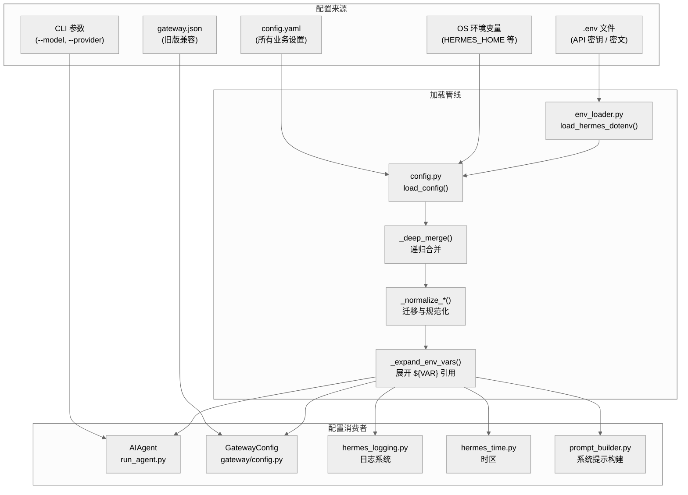
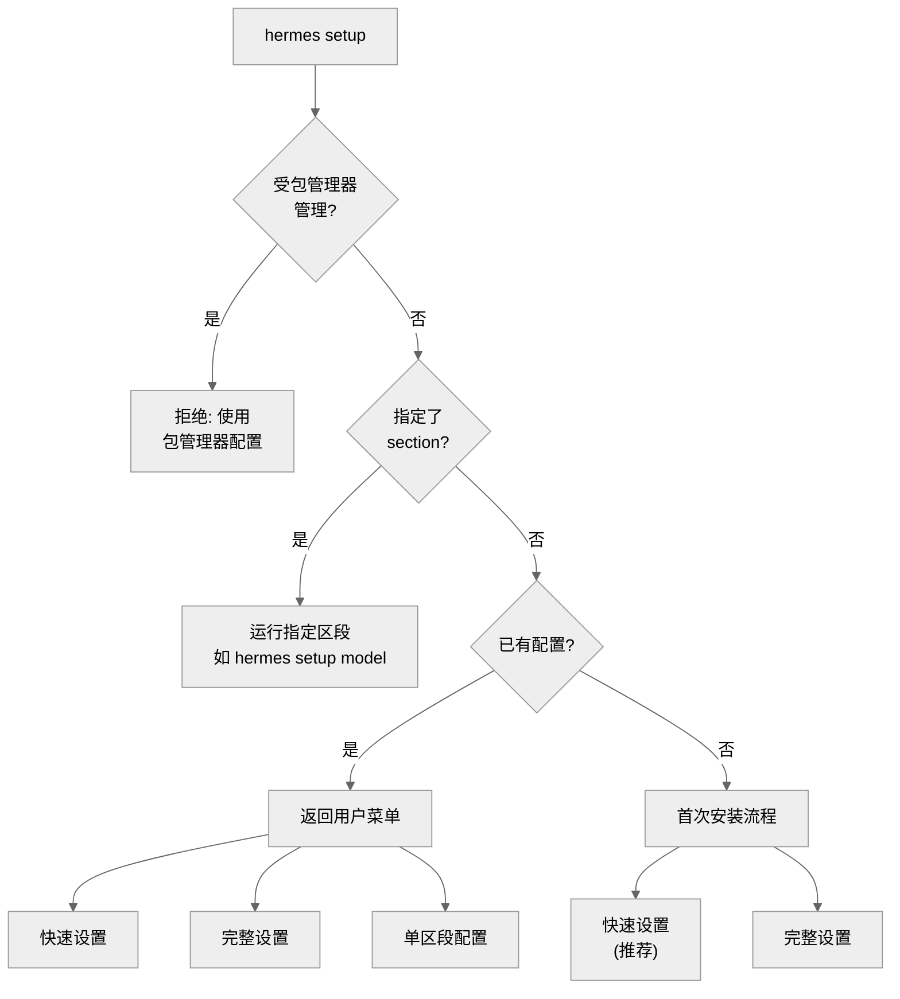
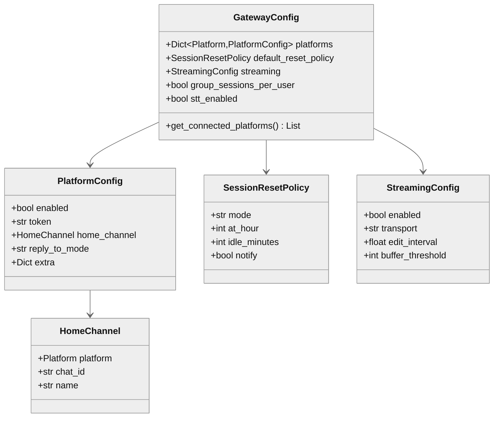

# 第十九章：配置与初始化系统

> **一句话概要：** Hermes Agent 通过多层配置源（`.env` → `config.yaml` → CLI 参数 → 环境变量）实现灵活的配置管理，以 `HERMES_HOME` 为核心数据根目录，配合交互式 Setup Wizard 提供零门槛的首次运行体验。

---

## 1. 架构总览

配置系统是 Hermes Agent 的"神经中枢"——它将分散在文件系统、环境变量和命令行参数中的设置汇聚为一个统一的配置字典，供 Agent 运行时、Gateway、定时任务等所有子系统消费。



---

## 2. 配置层级与优先级

Hermes 的配置来源遵循一个清晰的优先级栈。越靠后的来源优先级越高，可以覆盖前一层的同名设置：

| 优先级 | 来源 | 典型内容 | 文件位置 |
|--------|------|----------|----------|
| 1 (最低) | `DEFAULT_CONFIG` 字典 | 所有配置键的编程默认值 | `hermes_cli/config.py:329` |
| 2 | `config.yaml` | 用户持久化业务配置 | `~/.hermes/config.yaml` |
| 3 | `.env` 文件 | API 密钥和敏感凭据 | `~/.hermes/.env` |
| 4 | 项目级 `.env` | 项目特定开发覆盖 | 当前工作目录 `.env` |
| 5 (最高) | OS 环境变量 / CLI 参数 | 运行时临时覆盖 | shell 环境 / 命令行 |

### 2.1 `.env` 加载逻辑

`env_loader.py` 中的 `load_hermes_dotenv()` 是 `.env` 的统一加载入口（`hermes_cli/env_loader.py:18`）。其行为有一个重要的微妙之处：

```python
# 用户级 .env 存在时：override=True，覆盖已有的陈旧 shell 变量
if user_env.exists():
    _load_dotenv_with_fallback(user_env, override=True)

# 项目级 .env 仅作为补充（不覆盖），除非没有用户级 .env
if project_env_path and project_env_path.exists():
    _load_dotenv_with_fallback(project_env_path, override=not loaded)
```

这意味着：当 `~/.hermes/.env` 存在时，它的值总是会覆盖 shell 中同名的陈旧变量，而项目 `.env` 只填充缺失值。当 `~/.hermes/.env` 不存在时，项目 `.env` 也获得覆盖权力。

### 2.2 config.yaml 加载与合并

`load_config()`（`hermes_cli/config.py:2249`）的核心流程：

1. **确保 `HERMES_HOME` 目录结构**：调用 `ensure_hermes_home()`
2. **深拷贝默认配置**：`copy.deepcopy(DEFAULT_CONFIG)`
3. **读取用户 YAML**：`yaml.safe_load(config_path)`
4. **递归深合并**：`_deep_merge(config, user_config)` — 关键在于只有当两端都是 `dict` 时才递归合并，否则用户值直接替换默认值
5. **规范化迁移**：处理旧版 `max_turns`（从根级迁移到 `agent.max_turns`）、根级 `provider/base_url` 迁移到 `model` 区段
6. **环境变量展开**：递归处理字符串值中的 `${VAR}` 引用

`_deep_merge` 的设计确保了一个关键特性：用户只需覆盖自己关心的设置，未覆盖的嵌套键会保留默认值。例如用户只设置了 `tts.elevenlabs.voice_id`，默认的 `tts.elevenlabs.model_id` 仍然生效（`hermes_cli/config.py:2144`）。

---

## 3. config.yaml 结构详解

`DEFAULT_CONFIG` 定义了所有合法的配置键及其默认值，版本号为 `_config_version: 16`（`hermes_cli/config.py:719`）。以下是主要区段：

### 3.1 模型配置 (`model`)

```yaml
model:
  default: "anthropic/claude-opus-4.6"  # 默认模型
  provider: "auto"                       # 推理提供商
  base_url: "https://openrouter.ai/api/v1"
  # context_length: 131072              # 总上下文窗口（留空自动检测）
  # max_tokens: 8192                    # 单次输出上限（留空用模型默认值）
```

支持的提供商包括：`auto`, `openrouter`, `nous`, `nous-api`, `anthropic`, `openai-codex`, `copilot`, `gemini`, `zai`, `kimi-coding`, `minimax`, `minimax-cn`, `huggingface`, `xiaomi`, `kilocode`, `ai-gateway`, `custom`（以及本地服务器别名 `lmstudio`, `ollama`, `vllm`, `llamacpp`）。

### 3.2 终端后端 (`terminal`)

| 键 | 默认值 | 说明 |
|----|--------|------|
| `backend` | `"local"` | `local` / `ssh` / `docker` / `singularity` / `modal` / `daytona` |
| `cwd` | `"."` | 工作目录 |
| `timeout` | `180` | 命令执行超时（秒） |
| `container_cpu` | `1` | 容器 CPU 核数 |
| `container_memory` | `5120` | 容器内存（MB） |
| `container_disk` | `51200` | 容器磁盘（MB） |
| `container_persistent` | `true` | 容器文件系统是否持久化 |
| `docker_mount_cwd_to_workspace` | `false` | 安全默认关闭 |

### 3.3 压缩系统 (`compression`)

```yaml
compression:
  enabled: true
  threshold: 0.50      # 上下文使用率达 50% 时触发压缩
  target_ratio: 0.20   # 保留最近对话的比例
  protect_last_n: 20   # 始终保护最近 20 条消息
  summary_model: ""    # 留空使用配置的主模型
```

### 3.4 持久记忆 (`memory`)

```yaml
memory:
  memory_enabled: true        # Agent 笔记
  user_profile_enabled: true  # 用户画像
  memory_char_limit: 2200     # ~800 token
  user_char_limit: 1375       # ~500 token
  nudge_interval: 10          # 每 10 轮用户对话提醒保存
  flush_min_turns: 6          # 退出前最少 6 轮才触发记忆刷新
```

### 3.5 辅助模型 (`auxiliary`)

为侧任务（视觉分析、网页提取、压缩、会话搜索等）配置独立的 provider+model 对。每个任务都可以使用不同的提供商：

```yaml
auxiliary:
  vision:
    provider: "auto"
    model: ""
    timeout: 120
  web_extract:
    provider: "auto"
    timeout: 360
  compression: { ... }
  session_search: { ... }
  approval: { ... }
  mcp: { ... }
  flush_memories: { ... }
```

### 3.6 其他重要区段

| 区段 | 功能 | 默认值要点 |
|------|------|-----------|
| `agent` | 运行时行为 | `max_turns: 90`, `reasoning_effort: "medium"` |
| `display` | CLI 视觉 | `streaming: false`, `skin: "default"` |
| `delegation` | 子代理 | `max_iterations: 50` |
| `skills` | 技能系统 | `external_dirs: []` |
| `security` | 安全扫描 | `redact_secrets: true`, `tirith_enabled: true` |
| `logging` | 日志 | `level: "INFO"`, `max_size_mb: 5`, `backup_count: 3` |
| `session_reset` | 会话重置策略 | `mode: "both"`, `idle_minutes: 1440`, `at_hour: 4` |
| `network` | 网络 | `force_ipv4: false` |
| `approvals` | 命令审批 | `mode: "manual"`, `timeout: 60` |

---

## 4. Setup Wizard 流程

### 4.1 入口与分支

`run_setup_wizard(args)` 是 `hermes setup` 的入口（`hermes_cli/setup.py:2718`）。它首先执行几个前置判断：



### 4.2 Setup 区段定义

Setup Wizard 由六个独立可运行的区段组成（`hermes_cli/setup.py:2697`）：

| 区段键 | 标题 | 处理函数 | 命令 |
|--------|------|----------|------|
| `model` | Model & Provider | `setup_model_provider()` | `hermes setup model` |
| `tts` | Text-to-Speech | `setup_tts()` | `hermes setup tts` |
| `terminal` | Terminal Backend | `setup_terminal_backend()` | `hermes setup terminal` |
| `gateway` | Messaging Platforms | `setup_gateway()` | `hermes setup gateway` |
| `tools` | Tools | `setup_tools()` | `hermes setup tools` |
| `agent` | Agent Settings | `setup_agent_settings()` | `hermes setup agent` |

### 4.3 模型与提供商配置

`setup_model_provider()`（`hermes_cli/setup.py:669`）委托给 `hermes model` 共享流程处理：

1. 显示提供商选择菜单（Nous Portal、OpenRouter、Anthropic、自定义等）
2. 根据所选提供商提示输入凭据（API key / OAuth 登录）
3. 从 `/models` 端点或内置列表获取可用模型
4. 用户选择默认模型
5. 可选配置推理努力等级（reasoning effort）
6. 可选配置同提供商凭据池轮换
7. 可选配置视觉后端
8. 可选配置 TTS 提供商

关键设计：`setup_model_provider` 在 `cmd_model()` 写入磁盘后会重新 `load_config()` 同步状态，防止 wizard 的最终 `save_config(config)` 覆盖了 `cmd_model` 刚保存的值（修复 #4172）。

### 4.4 非交互式环境

当检测到非交互式终端（如无头 SSH、Docker 构建、CI/CD）时，wizard 会输出指引信息并退出，指导用户使用 `hermes config set` 命令或环境变量进行配置（`hermes_cli/setup.py:219`）。

---

## 5. HERMES_HOME 目录结构

### 5.1 路径解析

`HERMES_HOME` 的确定是整个配置系统的基石，由 `hermes_constants.py:11` 的 `get_hermes_home()` 负责：

```python
def get_hermes_home() -> Path:
    return Path(os.getenv("HERMES_HOME", Path.home() / ".hermes"))
```

### 5.2 标准目录布局

`ensure_hermes_home()`（`hermes_cli/config.py:283`）在首次运行时创建以下结构：

```
~/.hermes/                    # HERMES_HOME 根目录 (权限 0700)
  config.yaml                 # 主配置文件 (权限 0600)
  .env                        # API 密钥 / 密文 (权限 0600)
  SOUL.md                     # 人格定义 (权限 0600)
  MEMORY.md                   # Agent 持久记忆
  USER.md                     # 用户画像
  cron/                       # 定时任务数据
  sessions/                   # 会话存储 (Gateway)
  logs/                       # 日志文件
    agent.log                 # 主活动日志 (INFO+)
    errors.log                # 错误日志 (WARNING+)
    gateway.log               # 网关日志 (仅 gateway 模式)
  memories/                   # 记忆系统存储
  skills/                     # 用户创建的技能
  skins/                      # 自定义 CLI 皮肤
  home/                       # 可选: 子进程 HOME 目录 (Docker 持久化)
```

### 5.3 Profile 多配置支持

Hermes 支持通过将 `HERMES_HOME` 指向 `~/.hermes/profiles/<name>` 来实现多配置隔离。`get_default_hermes_root()`（`hermes_constants.py:20`）能智能识别 profile 路径：

```
~/.hermes/                    # 根目录
  profiles/
    coder/                    # HERMES_HOME 指向这里
      config.yaml
      .env
      SOUL.md
      ...
    writer/                   # 另一个 profile
      ...
```

对于 Docker 部署，profile 检测同样生效：如果 `HERMES_HOME` 的父目录名为 `profiles`，则祖父目录被识别为根目录。

### 5.4 子进程 HOME 隔离

`get_subprocess_home()`（`hermes_constants.py:114`）检查 `{HERMES_HOME}/home/` 目录是否存在。如存在，则子进程（git、ssh、gh 等）将使用此目录作为 `HOME`，实现：

- **Docker 持久化**：工具配置落在持久卷中
- **Profile 隔离**：每个 profile 有独立的 git 身份、SSH 密钥、gh token

Python 进程自身的 `HOME` 不会被修改——仅注入到子进程环境中。

### 5.5 向后兼容目录迁移

`get_hermes_dir()`（`hermes_constants.py:73`）提供了新旧目录路径的兼容机制：新安装使用整合后的路径（如 `cache/images`），已有安装如果老路径（如 `image_cache`）已存在则继续使用，无需迁移。

---

## 6. SOUL.md 人格系统

### 6.1 默认人格

`DEFAULT_SOUL_MD`（`hermes_cli/default_soul.py:4`）定义了 Hermes 的出厂人格：

> "You are Hermes Agent, an intelligent AI assistant created by Nous Research. You are helpful, knowledgeable, and direct..."

该默认文本在 `ensure_hermes_home()` 中被种子写入 `SOUL.md`（`hermes_cli/config.py:274`），仅在文件不存在时创建。

### 6.2 加载与注入

SOUL.md 的加载由 `load_soul_md()`（`agent/prompt_builder.py:873`）负责：

1. 从 `HERMES_HOME/SOUL.md` 读取内容
2. 执行安全扫描 `_scan_context_content()`
3. 应用截断策略 `_truncate_content()`（默认上限 20,000 字符）
4. 返回处理后的内容

在系统提示的构建过程中（`run_agent.py:3050`），SOUL.md 占据最高优先级的"身份槽位"（Slot #1）：

```
系统提示构建顺序：
  1. Agent 身份 — SOUL.md（若存在），否则 DEFAULT_AGENT_IDENTITY
  2. 用户/Gateway 系统提示（如有）
  3. 持久记忆快照
  4. 技能指导
  5. 上下文文件（AGENTS.md, .cursorrules — 此处排除 SOUL.md 防止重复注入）
  6. 当前日期时间
  7. 平台特定格式提示
```

### 6.3 预设人格

`config.yaml` 的 `agent.personalities` 区段提供了丰富的预设人格（`cli-config.yaml.example:499`），用户可通过 `/personality` 命令切换：

`helpful` | `concise` | `technical` | `creative` | `teacher` | `kawaii` | `catgirl` | `pirate` | `shakespeare` | `surfer` | `noir` | `uwu` | `philosopher` | `hype`

---

## 7. 上下文文件系统

`build_context_files_prompt()`（`agent/prompt_builder.py:986`）实现了项目级上下文文件的自动发现与加载。采用**优先级互斥**策略——只加载第一个匹配的类型：

| 优先级 | 文件名 | 搜索策略 |
|--------|--------|----------|
| 1 | `.hermes.md` / `HERMES.md` | 向上遍历到 git 根目录 |
| 2 | `AGENTS.md` / `agents.md` | 仅当前目录 |
| 3 | `CLAUDE.md` / `claude.md` | 仅当前目录 |
| 4 | `.cursorrules` / `.cursor/rules/*.mdc` | 仅当前目录 |

SOUL.md 独立于上述项目上下文，始终从 `HERMES_HOME` 加载。每个上下文源的内容都有 20,000 字符的硬上限，超出部分按头尾截断策略处理（保留头部 60%，尾部 30%，中间插入截断标记）。

---

## 8. Gateway 配置

### 8.1 GatewayConfig 数据模型

`gateway/config.py` 定义了一套完整的 dataclass 层级：



### 8.2 多源加载优先级

`load_gateway_config()`（`gateway/config.py:431`）从多个来源合并配置：

1. **内置默认值**（dataclass 字段默认值）
2. **`gateway.json`**（旧版兼容，提供基础层）
3. **`config.yaml`**（主要用户配置，覆盖 gateway.json）
4. **环境变量**（最高优先级）

环境变量映射规则：`TELEGRAM_BOT_TOKEN` → Telegram 的 token，`DISCORD_BOT_TOKEN` → Discord 的 token，等。

### 8.3 支持的平台

Gateway 支持 18 个消息平台（`gateway/config.py:48`）：Telegram、Discord、WhatsApp、Slack、Signal、Mattermost、Matrix、Home Assistant、Email、SMS、DingTalk、API Server、Webhook、Feishu、WeCom、WeCom Callback、Weixin、BlueBubbles。

---

## 9. 日志配置

### 9.1 日志文件

`hermes_logging.py` 提供了统一的 `setup_logging()` 入口（第 161 行），产出三个日志文件：

| 文件 | 级别 | 最大大小 | 备份数 | 说明 |
|------|------|----------|--------|------|
| `agent.log` | INFO+ | 5 MB | 3 | 主活动日志 |
| `errors.log` | WARNING+ | 2 MB | 2 | 快速故障排查 |
| `gateway.log` | INFO+ | 5 MB | 3 | 仅 gateway 模式，通过 `_ComponentFilter` 过滤 |

### 9.2 配置来源

日志参数从 `config.yaml` 的 `logging` 区段读取（`hermes_logging.py:374`）：

```yaml
logging:
  level: "INFO"        # DEBUG / INFO / WARNING
  max_size_mb: 5       # 每个日志文件最大 MB
  backup_count: 3      # 保留的轮转备份数
```

### 9.3 安全与上下文

- **RedactingFormatter**：所有日志行通过 `agent.redact.RedactingFormatter` 格式化，确保 API 密钥等敏感信息永远不会写入磁盘
- **Session Context**：通过 `set_session_context(session_id)` 注入线程局部的会话标识，所有日志行自动包含 `[session_id]` 标签用于关联
- **Managed Mode**：NixOS 管理模式下使用 `_ManagedRotatingFileHandler`，确保日志文件权限为 0660（组可写），方便 gateway 服务与交互用户共享

### 9.4 噪音抑制

以下第三方 logger 被强制设为 WARNING 级别（`hermes_logging.py:50`）：`openai`, `httpx`, `httpcore`, `asyncio`, `hpack`, `grpc`, `modal`, `urllib3`, `websockets`, `charset_normalizer`, `markdown_it`。

---

## 10. 时间工具

`hermes_time.py` 提供了时区感知的时间工具，解析顺序为：

1. **`HERMES_TIMEZONE` 环境变量**（最高优先级）
2. **`config.yaml` 的 `timezone` 键**
3. **服务器本地时间**（回退方案）

`now()` 函数（`hermes_time.py:91`）返回的总是时区感知的 `datetime` 对象。时区解析结果会被缓存，避免每次调用都做文件 I/O。无效的时区字符串只记录警告，不会导致崩溃。

---

## 11. 环境变量参考

### 11.1 核心系统变量

| 变量 | 用途 | 默认值 |
|------|------|--------|
| `HERMES_HOME` | 数据根目录 | `~/.hermes` |
| `HERMES_TIMEZONE` | IANA 时区名 | (服务器本地) |
| `HERMES_MANAGED` | 包管理器模式 | (未设置) |
| `HERMES_HOME_MODE` | 目录权限覆盖 | `0700` |
| `HERMES_OPTIONAL_SKILLS` | 可选技能目录 | `{HERMES_HOME}/optional-skills` |
| `HERMES_DEV` | 开发者模式（跳过容器检测） | (未设置) |
| `HERMES_INFERENCE_PROVIDER` | 覆盖推理提供商 | (使用 config.yaml) |

### 11.2 提供商 API 密钥

| 变量 | 提供商 |
|------|--------|
| `OPENROUTER_API_KEY` | OpenRouter |
| `ANTHROPIC_API_KEY` | Anthropic 直连 |
| `GOOGLE_API_KEY` / `GEMINI_API_KEY` | Google AI Studio |
| `GLM_API_KEY` / `ZAI_API_KEY` | Z.AI / ZhipuAI |
| `KIMI_API_KEY` | Kimi / Moonshot |
| `MINIMAX_API_KEY` / `MINIMAX_CN_API_KEY` | MiniMax (国际/中国) |
| `DEEPSEEK_API_KEY` | DeepSeek |
| `DASHSCOPE_API_KEY` | 阿里云 DashScope |
| `HF_TOKEN` | Hugging Face |
| `XIAOMI_API_KEY` | 小米 MiMo |
| `OPENAI_API_KEY` / `OPENAI_BASE_URL` | OpenAI / 自定义端点 |
| `GITHUB_TOKEN` | GitHub Copilot / Skills Hub |
| `NOUS_API_KEY` | Nous Portal API |

### 11.3 工具 API 密钥

| 变量 | 工具能力 |
|------|----------|
| `EXA_API_KEY` | Exa 网络搜索 |
| `PARALLEL_API_KEY` | Parallel 网络搜索 |
| `FIRECRAWL_API_KEY` | Firecrawl 网页抓取 |
| `TAVILY_API_KEY` | Tavily 搜索 |
| `BROWSERBASE_API_KEY` | Browserbase 浏览器自动化 |
| `FAL_KEY` | 图片生成 (FLUX) |
| `ELEVENLABS_API_KEY` | ElevenLabs TTS |
| `GROQ_API_KEY` | Groq STT |
| `TINKER_API_KEY` | RL 训练 (Tinker) |
| `WANDB_API_KEY` | W&B 实验追踪 |
| `HASS_TOKEN` | Home Assistant |

### 11.4 平台 Token

| 变量 | 平台 |
|------|------|
| `TELEGRAM_BOT_TOKEN` | Telegram |
| `DISCORD_BOT_TOKEN` | Discord |
| `SLACK_BOT_TOKEN` / `SLACK_APP_TOKEN` | Slack |
| `SIGNAL_ACCOUNT` / `SIGNAL_HTTP_URL` | Signal |
| `MATTERMOST_URL` / `MATTERMOST_TOKEN` | Mattermost |
| `MATRIX_HOMESERVER` / `MATRIX_USER` | Matrix |
| `TWILIO_ACCOUNT_SID` | SMS (Twilio) |

---

## 12. 包管理器管理模式

Hermes 支持 NixOS 和 Homebrew 管理模式（`hermes_cli/config.py:62`）。当检测到管理模式时：

- **`save_config()` 被阻止**：不允许直接修改配置，引导用户使用包管理器
- **`run_setup_wizard()` 被阻止**：wizard 直接返回错误信息
- **目录权限由包管理器控制**：`_secure_dir` / `_secure_file` 跳过 chmod
- **NixOS 专用**：`ensure_hermes_home` 不创建目录（由 activation script 创建），只验证其存在

管理模式的检测来自两个信号：
- `HERMES_MANAGED` 环境变量（`true`/`1`/`yes`/`brew`/`nix`）
- `{HERMES_HOME}/.managed` 标记文件（NixOS activation script 创建）

---

## 13. 配置迁移系统

`DEFAULT_CONFIG` 中的 `_config_version: 16` 追踪配置架构版本。`ENV_VARS_BY_VERSION`（`hermes_cli/config.py:728`）记录了每个版本引入的新环境变量，使迁移系统只提示用户设置自上次配置版本以来新增的变量。

`_normalize_root_model_keys()`（`hermes_cli/config.py:2184`）和 `_normalize_max_turns_config()`（第 2214 行）负责将旧版根级别键迁移到正确的嵌套位置，确保向后兼容。

---

## 14. 安全设计

配置系统在安全方面做了多层防护：

1. **文件权限**：`HERMES_HOME` 为 `0700`，配置文件为 `0600`，防止其他用户读取
2. **密文分离**：API 密钥仅存放在 `.env`，从不写入 `config.yaml`
3. **日志脱敏**：`RedactingFormatter` 确保日志中不泄露密文
4. **输入校验**：`save_env_value()` 使用正则表达式 `^[A-Za-z_][A-Za-z0-9_]*$` 验证环境变量名
5. **.env 腐蚀修复**：`_sanitize_env_lines()`（`hermes_cli/config.py:2419`）检测并修复两种已知的 `.env` 文件腐蚀模式——键值对连接（缺少换行符）和陈旧占位符
6. **容器挂载默认关闭**：`docker_mount_cwd_to_workspace` 默认为 `false`

---

## 15. 关键文件索引

| 文件 | 行数 | 核心职责 |
|------|------|----------|
| `hermes_cli/config.py` | ~3,095 | 配置加载/保存/验证/默认值、环境变量管理、管理模式 |
| `hermes_cli/setup.py` | ~3,168 | 交互式设置向导（6 个区段）、首次运行体验 |
| `hermes_constants.py` | 269 | 共享常量、路径解析、`HERMES_HOME`（零依赖模块） |
| `hermes_cli/env_loader.py` | 46 | `.env` 文件加载（用户级 + 项目级优先级） |
| `hermes_cli/default_soul.py` | 12 | 默认 SOUL.md 模板 |
| `cli-config.yaml.example` | 886 | 示例配置文件（全部区段注释说明） |
| `gateway/config.py` | ~500+ | Gateway 专用配置（平台、会话策略、流式传输） |
| `hermes_logging.py` | 394 | 日志初始化（轮转、脱敏、会话上下文） |
| `hermes_time.py` | 104 | 时区感知时间工具 |
| `hermes_cli/nous_subscription.py` | ~200+ | Nous 订阅功能检测与默认值应用 |
| `agent/prompt_builder.py` | ~1,026+ | 上下文文件发现与加载（SOUL.md, AGENTS.md 等） |

---

## 16. 设计洞察

**零依赖常量模块**。`hermes_constants.py` 的文件头注释明确声明"Import-safe module with no dependencies"。这使得 `get_hermes_home()` 可以被任何模块安全导入，不会触发循环依赖——这是 Hermes 配置系统的"地基"。

**深合并 vs 浅替换**。`_deep_merge` 的递归策略意味着用户可以只覆盖一个嵌套键而保留同级别的其他默认值。但这也有一个副作用：如果用户想完全替换一个 dict 值（例如清空 `auxiliary.vision`），必须显式地将所有子键设为空值，因为深合并不会删除默认键。

**配置写入的原子性**。`save_config()` 委托给 `utils.atomic_yaml_write()`，确保 YAML 写入是原子的——先写临时文件再重命名，避免在写入中途崩溃时损坏配置。

**Gateway 的双源兼容**。`load_gateway_config()` 同时支持旧版 `gateway.json` 和新版 `config.yaml`，前者作为基础层，后者的同名键总是覆盖前者，实现了无痛迁移。

**SOUL.md 的身份优先级**。SOUL.md 不仅是"个性化文本"，它在系统提示中占据了最高优先级的身份槽位。当 SOUL.md 存在时，它完全替代内置的 `DEFAULT_AGENT_IDENTITY`——用户通过编辑一个 Markdown 文件就能彻底重定义 Agent 的行为基线。这种设计将"人格可配置性"提升到了架构层面的一等公民。
