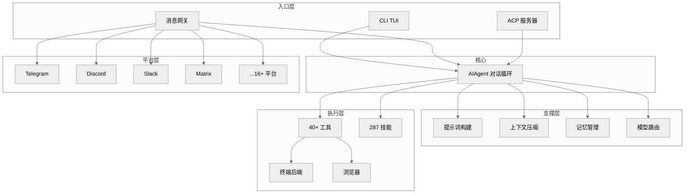

# Hermes Agent 深度架构剖析

> 基于 [hermes-agent v0.8.0](https://github.com/NousResearch/hermes-agent) 源代码的逐层深度分析。
> 生成时间：2026-04-12

---

## 项目简介

Hermes Agent 是 Nous Research 开发的自我改进型 AI 代理。它围绕"对话循环 + 工具调用"核心架构，通过技能学习、持久记忆、多平台网关和可插拔终端后端，实现跨会话的持续进化能力。

**代码规模**：282 个 Python 源文件，193,682 行源代码，176,179 行测试代码。

---

## 目录

| 章节 | 标题 | 核心内容 |
|------|------|---------|
| [第 1 章](01-global-overview.md) | 全局概览与架构 | 系统定位、规模、架构图、十大子系统、数据流 |
| [第 2 章](02-core-agent-loop.md) | 核心代理循环 | AIAgent 类、对话循环、工具调用流程、迭代预算 |
| [第 3 章](03-agent-internals.md) | 代理内部组件 | 提示词构建、上下文压缩、记忆管理、模型元数据 |
| [第 4 章](04-interactive-cli.md) | 交互式 CLI | TUI 架构、slash 命令、会话管理、设置向导 |
| [第 5 章](05-tool-system.md) | 工具系统 | 工具注册、工具集、调度流程、40+ 工具清单 |
| [第 6 章](06-skills-system.md) | 技能系统 | 技能加载、技能中心、自动创建、自我改进 |
| [第 7 章](07-memory-learning.md) | 记忆与学习闭环 | 持久记忆、用户建模、会话搜索、nudge 机制 |
| [第 8 章](08-gateway-messaging.md) | 网关与消息平台 | 平台抽象、16+ 平台适配器、会话管理 |
| [第 9 章](09-terminal-backends.md) | 终端后端与执行环境 | 6 种后端、命令执行流程、文件同步 |
| [第 10 章](10-browser-automation.md) | 浏览器自动化 | CamoFox、Playwright、视觉分析 |
| [第 11 章](11-delegation-subagents.md) | 委托与子代理 | delegate_task、execute_code、混合代理 |
| [第 12 章](12-cron-scheduling.md) | Cron 调度与自动化 | 定时任务、结果投递、自然语言定义 |
| [第 13 章](13-context-management.md) | 上下文管理与压缩 | token 估算、压缩策略、提示词缓存 |
| [第 14 章](14-model-routing.md) | 模型路由与 Provider 抽象 | 多 provider 支持、智能路由、密钥池 |
| [第 15 章](15-security-approval.md) | 安全、审批与沙箱 | 工具审批、路径安全、凭证保护 |
| [第 16 章](16-mcp-acp.md) | MCP & ACP 集成 | MCP 客户端/服务器、ACP 编辑器集成 |
| [第 17 章](17-plugins-context-engine.md) | 插件与上下文引擎 | 插件架构、上下文引擎、记忆插件 |
| [第 18 章](18-rl-training.md) | RL 训练与批量运行 | 轨迹生成、环境定义、Atropos 集成 |
| [第 19 章](19-configuration-setup.md) | 配置与设置 | config.yaml、HERMES_HOME、profile 系统 |
| [第 20 章](20-design-philosophy.md) | 设计哲学与扩展指南 | 架构决策、扩展模式、贡献指南 |
| [附录](appendix.md) | 附录 | 关键文件索引、术语表、环境变量速查 |

---

## 阅读路径

### 路径 A：初学者（理解系统做什么）
1 → 2 → 5 → 6 → 7

### 路径 B：开发者（理解系统怎么做）
1 → 2 → 3 → 5 → 14 → 15

### 路径 C：运维（理解系统怎么部署）
1 → 4 → 8 → 9 → 12 → 19

### 路径 D：研究者（理解训练基础设施）
1 → 2 → 18 → 13

### 路径 E：快速查阅
直接跳到目标章节，每章开头有"一句话概括"和架构图。

---

## 系统架构鸟瞰图

---

## 约定

- 代码引用格式：`file_path:line_number`
- Mermaid 图使用 `%%{init: {'theme': 'neutral'}}%%` 主题
- 所有数字（行数、文件数、常量值）均通过代码验证
- 中文术语对照见附录术语表
