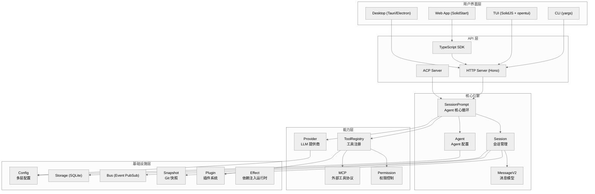
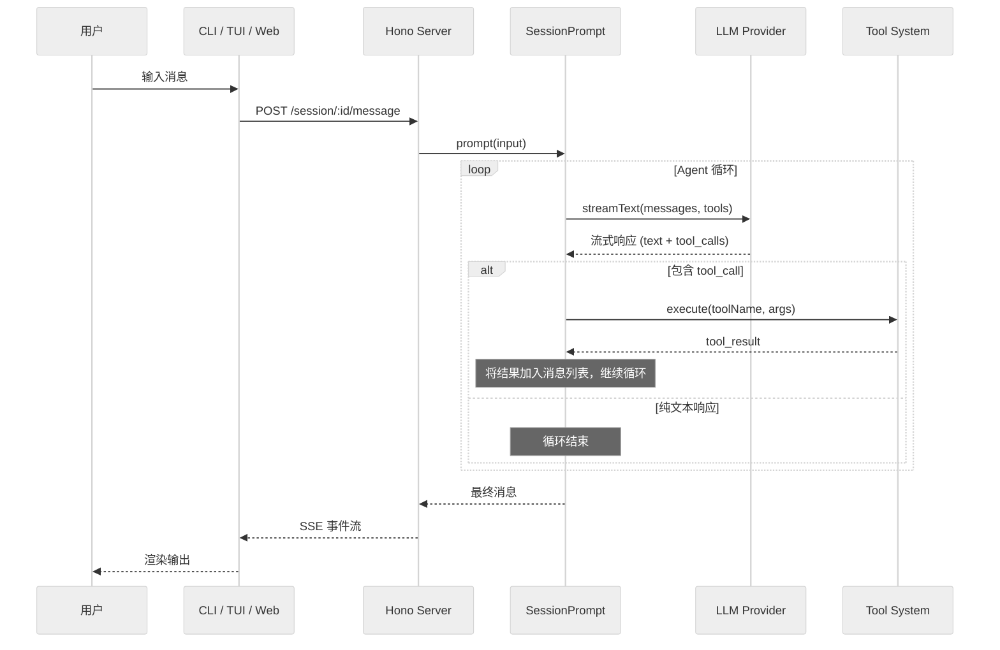
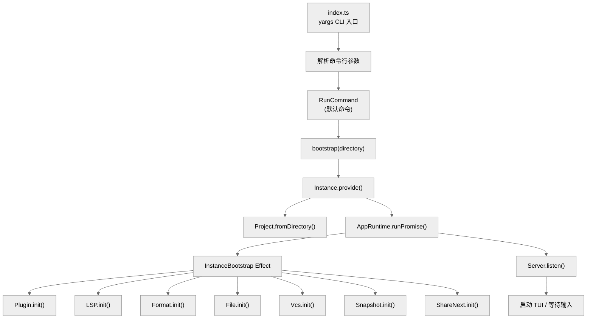

# 第一章：全局概览

> **一句话概括**: OpenCode 是一个基于 TypeScript 的开源 AI 编码 Agent，采用 monorepo 架构，通过 Vercel AI SDK 对接 20+ LLM 提供商，以 Effect 库实现依赖注入，提供 CLI/TUI/Web/桌面多种交互界面。

## 1.1 系统架构图



## 1.2 Monorepo 包结构

OpenCode 采用 Bun workspaces + Turborepo 的 monorepo 结构，共包含约 20 个包：

| 包名 | npm 名 | 角色 | 核心文件数 |
|------|--------|------|-----------|
| `packages/opencode` | `opencode` | **核心引擎** — CLI、Agent 循环、Provider、Tool、Session | ~350 个 .ts/.tsx |
| `packages/app` | `@opencode-ai/app` | Web 前端应用 (SolidStart) | ~50 |
| `packages/ui` | `@opencode-ai/ui` | 共享 UI 组件库 (SolidJS) | ~40 |
| `packages/web` | `@opencode-ai/web` | 营销/文档网站 | ~30 |
| `packages/sdk` | `@opencode-ai/sdk` | TypeScript SDK (API 客户端) | ~20 |
| `packages/server` | `@opencode-ai/server` | 共享服务器工具库 | ~10 |
| `packages/util` | `@opencode-ai/util` | 共享工具函数 | ~10 |
| `packages/plugin` | `@opencode-ai/plugin` | 插件接口定义 | ~5 |
| `packages/desktop` | `@opencode-ai/desktop` | Tauri 桌面应用 | ~10 |
| `packages/desktop-electron` | `@opencode-ai/desktop-electron` | Electron 桌面应用 | ~15 |
| `packages/console` | — | 控制台/管理后台 | ~30 |
| `packages/enterprise` | `@opencode-ai/enterprise` | 企业版功能 | ~10 |
| `packages/function` | `@opencode-ai/function` | 云函数 (SST) | ~5 |
| `packages/identity` | — | 身份认证服务 | ~5 |
| `packages/slack` | `@opencode-ai/slack` | Slack 集成 | ~10 |
| `packages/storybook` | — | UI 组件故事书 | ~10 |
| `packages/extensions` | — | IDE 扩展 | ~10 |

## 1.3 核心包模块地图

`packages/opencode/src/` 是整个系统的心脏，包含约 40 个子目录：

```
packages/opencode/src/
├── cli/          # (136 files) CLI 入口、yargs 命令、TUI 界面
│   ├── cmd/      #   子命令实现 (run, serve, github, mcp, etc.)
│   └── cmd/tui/  #   SolidJS 终端 UI (routes, components, contexts)
├── provider/     # (31 files) LLM 提供商抽象层
│   └── sdk/copilot/  # GitHub Copilot 特殊实现
├── tool/         # (26 files) 19 个内置工具 + 注册表
├── session/      # (19 files) 会话管理、消息模型、Agent 循环
├── server/       # (30 files) Hono HTTP API、WebSocket 事件流
├── config/       # (7 files) 多层配置系统
├── effect/       # (10 files) Effect 依赖注入基础设施
├── plugin/       # (9 files) 插件加载与生命周期
├── control-plane/# (8 files) 多工作区管理
├── mcp/          # (4 files) MCP 客户端集成
├── permission/   # (4 files) 权限规则求值
├── storage/      # (7 files) SQLite 数据库、JSON 迁移
├── acp/          # (3 files) ACP (Agent Client Protocol)
├── lsp/          # (5 files) LSP 语言服务器
├── project/      # (6 files) 项目实例管理
├── bus/          # (3 files) 事件发布/订阅
├── snapshot/     # (1 file)  Git 快照
├── file/         # (7 files) 文件操作、时间追踪、ripgrep
├── util/         # (34 files) 工具函数
├── skill/        # (2 files) Skill (SKILL.md) 发现与执行
├── command/      # (1+ files) 命令系统 (内置 + MCP + Skill)
├── agent/        # (1+ files) Agent 配置与生成
├── share/        # (3 files) 会话分享
├── sync/         # (3 files) 数据同步
├── format/       # (2 files) 代码格式化
├── auth/         # (1 file)  认证
├── pty/          # (5 files) 伪终端
├── git/          # (1 file)  Git 操作
├── shell/        # (1 file)  Shell 检测
├── flag/         # (1 file)  Feature flags
├── env/          # (1 file)  环境变量
├── worktree/     # (1 file)  Git worktree
├── v2/           # (4 files) v2 API 适配
└── index.ts      # CLI 入口
```

## 1.4 数据流概览

OpenCode 的核心数据流遵循 **Agent 循环模式**：



## 1.5 核心循环

OpenCode 作为 Agent 系统，其核心循环是：

1. **接收用户输入** — 通过 CLI/TUI/Web/ACP 接口
2. **组装系统提示** — 根据模型选择对应的 system prompt + 环境信息 + 指令文件
3. **注册工具** — 从 ToolRegistry 获取当前 Agent 可用的工具列表
4. **调用 LLM** — 通过 Vercel AI SDK 的 `streamText` 发送消息
5. **处理响应** — 流式接收文本和 tool_call
6. **执行工具** — 如果 LLM 返回了 tool_call，执行对应工具
7. **循环** — 将工具结果加入消息历史，回到步骤 4
8. **完成** — LLM 返回纯文本（无 tool_call），循环结束

## 1.6 技术选型解析

### 为什么选 Effect？
Effect 是一个 TypeScript 函数式编程库，OpenCode 用它实现：
- **依赖注入**: 通过 `Context.Service` + `Layer` 模式管理服务依赖
- **资源生命周期**: `Scope` + `addFinalizer` 自动清理
- **并发控制**: `Semaphore`、`PubSub`、`Stream`
- **错误处理**: 类型安全的 `Effect.Effect<Success, Error, Requirements>`

### 为什么选 Vercel AI SDK？
AI SDK 提供了统一的 LLM 调用接口：
- 标准化的 `streamText`/`generateText` API
- 内置工具调用支持（`tool()` 函数）
- 20+ 提供商的 SDK 适配器
- 流式响应处理

### 为什么选 Hono？
Hono 作为 HTTP 框架的优势：
- 极小体积，适合 CLI 内嵌服务器
- 支持 Bun/Node/Deno 多运行时
- 中间件生态系统
- OpenAPI 文档生成 (`hono-openapi`)

### 为什么选 SolidJS 做 TUI？
- 通过 `@opentui/solid` 将 SolidJS 的响应式渲染引擎适配到终端
- 组件化开发模式
- 同一套 SolidJS 技能同时适用于 TUI 和 Web 前端

## 1.7 依赖关系热力图

按被 import 次数排序（在 `packages/opencode/src/` 内部）：

| 排名 | 模块 | 被 import 次数 | 角色 |
|------|------|---------------|------|
| 1 | config | 48 | 配置系统 — 几乎所有模块都依赖 |
| 2 | session | 35 | 会话管理 — 核心数据模型 |
| 3 | provider | 32 | LLM 提供商 — Agent 循环核心依赖 |
| 4 | plugin | 16 | 插件系统 — 扩展点 |
| 5 | cli | 11 | CLI 层 — 主要是自身子模块引用 |
| 6 | tool | 10 | 工具系统 |
| 7 | server | 8 | HTTP 服务器 |
| 8 | permission | 5 | 权限系统 |
| 9 | lsp | 3 | 语言服务器 |
| 10 | mcp | 2 | MCP 协议客户端 |

## 1.8 启动流程



启动过程的关键步骤（`packages/opencode/src/cli/bootstrap.ts`）：

1. `Instance.provide(directory)` — 解析项目目录，创建实例上下文
2. `AppRuntime.runPromise(InstanceBootstrap)` — 运行 Effect 启动序列
3. `InstanceBootstrap` 并行初始化所有子系统：Plugin → LSP → Format → File → FileWatcher → Vcs → Snapshot

## 1.9 本章关键文件

| 文件 | 行数 | 职责 |
|------|------|------|
| `packages/opencode/src/index.ts` | ~180 | CLI 入口，yargs 命令注册 |
| `packages/opencode/src/cli/bootstrap.ts` | 18 | 实例启动引导 |
| `packages/opencode/src/project/bootstrap.ts` | 38 | Effect 启动序列，并行初始化子系统 |
| `packages/opencode/src/project/instance.ts` | ~120 | 实例上下文管理（per-directory 单例） |
| `packages/opencode/src/server/server.ts` | ~100 | Hono HTTP 服务器创建与启动 |
| `package.json` (root) | 126 | Monorepo 配置，workspace 定义 |
| `turbo.json` | 31 | Turborepo 任务配置 |
