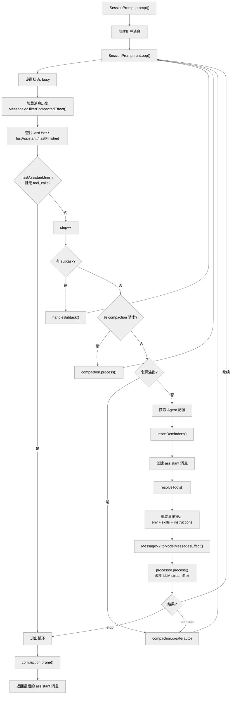
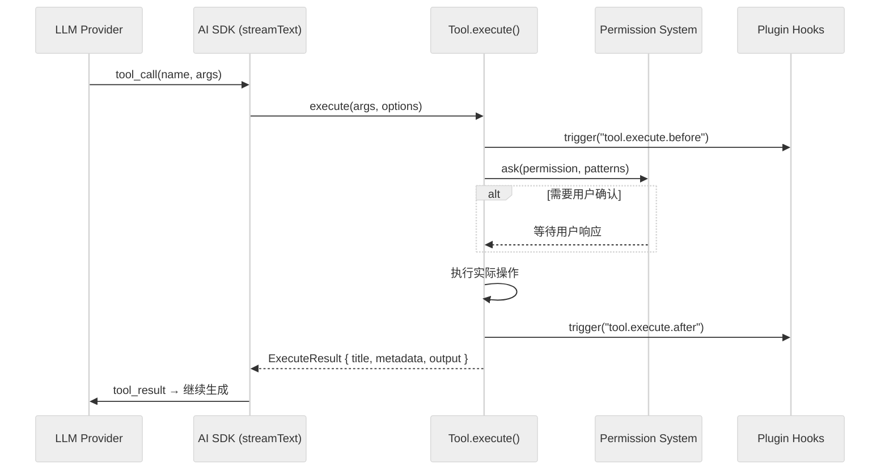

# 第二章：核心循环 — 从用户输入到 Agent 响应

> **一句话概括**: OpenCode 的核心循环位于 `SessionPrompt.runLoop`，它在一个 `while(true)` 循环中反复调用 LLM、执行工具、处理压缩，直到 LLM 返回无工具调用的终止响应。

## 2.1 核心循环架构图



## 2.2 入口函数链

从用户输入到核心循环，调用链为：

```
用户操作
  → HTTP POST /session/:id/message  (server/instance/session.ts)
    → SessionPrompt.prompt(input)   (session/prompt.ts:1286)
      → createUserMessage(input)    — 创建用户消息并持久化
      → SessionPrompt.runLoop(sessionID) (session/prompt.ts:1315)
        → while(true) { ... }       — Agent 核心循环
```

### `SessionPrompt.prompt()` (session/prompt.ts:1286)

```typescript
const prompt = Effect.fn("SessionPrompt.prompt")(function* (input: PromptInput) {
  const session = yield* sessions.get(input.sessionID)
  yield* revert.cleanup(session)
  const message = yield* createUserMessage(input)
  yield* sessions.touch(input.sessionID)
  // 处理工具权限覆盖
  if (permissions.length > 0) {
    yield* sessions.setPermission({ sessionID, permission: permissions })
  }
  if (input.noReply === true) return message  // noReply 模式：不调用 LLM
  return yield* loop({ sessionID: input.sessionID })
})
```

### `SessionPrompt.runLoop()` (session/prompt.ts:1315)

这是整个系统的**心脏**，约 230 行。主循环的每次迭代执行以下步骤：

## 2.3 循环步骤详解

### Step 1: 加载消息历史

```typescript
let msgs = yield* MessageV2.filterCompactedEffect(sessionID)
```

从数据库加载当前会话的所有消息，过滤掉已压缩的消息（被压缩摘要替代的消息不会发送给 LLM）。

### Step 2: 寻找关键消息锚点

```typescript
let lastUser: MessageV2.User | undefined
let lastAssistant: MessageV2.Assistant | undefined
let lastFinished: MessageV2.Assistant | undefined
let tasks: (MessageV2.CompactionPart | MessageV2.SubtaskPart)[] = []
```

从消息列表末尾向前扫描，找到：
- `lastUser` — 最后一条用户消息
- `lastAssistant` — 最后一条 assistant 消息
- `lastFinished` — 最后一条有 `finish` 标记的 assistant 消息
- `tasks` — 未处理完成的 compaction/subtask 任务

### Step 3: 检查退出条件

```typescript
if (lastAssistant?.finish && !["tool-calls"].includes(lastAssistant.finish) 
    && !hasToolCalls && lastUser.id < lastAssistant.id) {
  break  // LLM 已完成，退出循环
}
```

退出条件：
1. 最后一条 assistant 消息有 `finish` 标记
2. finish 原因不是 `"tool-calls"`
3. 消息中没有未执行的工具调用
4. 用户消息在 assistant 消息之前（说明不是新的用户输入）

### Step 4: 处理特殊任务

在进入 LLM 调用之前，先处理队列中的特殊任务：

**Subtask 处理**（子 Agent 任务）：
```typescript
if (task?.type === "subtask") {
  yield* handleSubtask({ task, model, lastUser, sessionID, session, msgs })
  continue
}
```

**Compaction 处理**（上下文压缩）：
```typescript
if (task?.type === "compaction") {
  const result = yield* compaction.process({ messages: msgs, ... })
  if (result === "stop") break
  continue
}
```

**自动溢出检测**：
```typescript
if (lastFinished && !lastFinished.summary && 
    (yield* compaction.isOverflow({ tokens: lastFinished.tokens, model }))) {
  yield* compaction.create({ sessionID, auto: true })
  continue
}
```

### Step 5: 组装工具列表

```typescript
const tools = yield* resolveTools({ agent, session, model, ... })
```

`resolveTools()` (prompt.ts:360) 的工作：
1. 从 `ToolRegistry` 获取当前 Agent 配置允许的内置工具
2. 通过 `ProviderTransform.schema()` 适配工具参数格式（不同 LLM 对 JSON Schema 有不同限制）
3. 为每个工具创建 AI SDK 的 `tool()` 包装
4. 从 MCP 获取外部工具并同样包装
5. 如果需要结构化输出，添加 `StructuredOutput` 工具

### Step 6: 组装系统提示

```typescript
const [skills, env, instructions, modelMsgs] = yield* Effect.all([
  sys.skills(agent),           // 可用 Skills 列表
  sys.environment(model),      // 环境信息（模型名、工作目录、平台...）
  instruction.system(),        // AGENTS.md / .opencode 文件中的指令
  MessageV2.toModelMessagesEffect(msgs, model),  // 转换消息为 AI SDK 格式
])
const system = [...env, ...(skills ? [skills] : []), ...instructions]
```

系统提示的组装分为多层：
1. **模型特定提示** — `SystemPrompt.provider(model)` 根据模型选择对应的 prompt 文件（anthropic.txt / gpt.txt / gemini.txt 等）
2. **环境信息** — 工作目录、平台、日期等
3. **Skills 列表** — 当前可用的 Skill 命令
4. **指令文件** — AGENTS.md + .opencode 配置中的自定义指令

### Step 7: 调用 LLM

```typescript
const result = yield* handle.process({
  user: lastUser,
  agent,
  system,
  messages: modelMsgs,
  tools,
  model,
  ...
})
```

`processor.process()` 是 `SessionProcessor` 的核心方法，它：
1. 调用 `LLM.stream()` 发起流式请求
2. 处理流式事件（text-delta、tool-call-delta、finish 等）
3. 实时持久化 assistant 消息和 tool 调用
4. 触发工具执行
5. 返回 `"stop"` / `"compact"` / 继续循环

### Step 8: 处理结果

```typescript
if (result === "stop") return "break"
if (result === "compact") {
  yield* compaction.create({ sessionID, auto: true, overflow: !handle.message.finish })
}
return "continue"
```

## 2.4 工具执行流程

当 LLM 返回 tool_call 时，AI SDK 自动调用工具的 `execute` 函数：



### 工具执行上下文 (Tool.Context)

每个工具执行时都会收到一个上下文对象 (prompt.ts:374)：

```typescript
const context: Tool.Context = {
  sessionID,           // 当前会话 ID
  messageID,           // 当前 assistant 消息 ID
  callID,             // 工具调用 ID
  abort: AbortSignal,  // 取消信号
  agent: string,       // 当前 Agent 名称
  messages: [],        // 完整消息历史
  metadata(val),       // 更新工具调用元数据
  ask(req),           // 请求用户权限
}
```

## 2.5 系统提示选择策略

`SystemPrompt.provider()` (session/system.ts:20) 根据模型 ID 选择不同的系统提示模板：

| 模型匹配规则 | 模板文件 |
|-------------|---------|
| `gpt-4*`, `o1*`, `o3*` | `prompt/beast.txt` |
| `gpt*codex*` | `prompt/codex.txt` |
| `gpt*` (其他) | `prompt/gpt.txt` |
| `gemini-*` | `prompt/gemini.txt` |
| `claude*` | `prompt/anthropic.txt` |
| `trinity` (不区分大小写) | `prompt/trinity.txt` |
| `kimi` (不区分大小写) | `prompt/kimi.txt` |
| 默认 | `prompt/default.txt` |

可用的提示模板文件：
- `anthropic.txt`, `beast.txt`, `build-switch.txt`, `codex.txt`
- `copilot-gpt-5.txt`, `default.txt`, `gemini.txt`, `gpt.txt`
- `kimi.txt`, `max-steps.txt`, `plan.txt`, `plan-reminder-anthropic.txt`, `trinity.txt`

## 2.6 消息转换管道

用户和 assistant 的消息在发送给 LLM 之前需要经过格式转换：

```
Session 消息 (MessageV2.WithParts[])
  → MessageV2.toModelMessagesEffect()
    → 过滤已压缩消息
    → 转换 Part 为 AI SDK Content 格式
    → 处理图片/文件附件
    → 应用 ProviderTransform
  → ModelMessage[] (AI SDK 格式)
```

## 2.7 Plan 模式

OpenCode 支持 **Plan 模式**，在该模式下 Agent 只能读取代码和编写计划文件，不能执行修改操作：

1. 用户切换到 `plan` Agent
2. `insertReminders()` (prompt.ts:224) 在用户消息中注入计划模式指令
3. 指令明确禁止 Agent 执行编辑/写入等操作
4. 计划工作流分为 5 个阶段：Initial Understanding → Design → Review → Final Plan → plan_exit

## 2.8 标题生成

首次用户消息时，系统会异步生成会话标题 (prompt.ts:162)：

1. 使用 `title` Agent（通常使用小模型）
2. 将第一条用户消息传入
3. 去除 `<think>` 标签
4. 截断至 100 字符
5. 通过 `sessions.setTitle()` 持久化

## 2.9 本章关键文件

| 文件 | 行数 | 职责 |
|------|------|------|
| `session/prompt.ts` | 1859 | **核心文件** — Agent 循环、工具解析、消息组装 |
| `session/system.ts` | ~100 | 系统提示选择与环境信息生成 |
| `session/processor.ts` | 617 | LLM 流式调用处理、消息持久化 |
| `session/llm.ts` | 452 | LLM 抽象层，AI SDK streamText 封装 |
| `session/instruction.ts` | ~200 | 指令文件（AGENTS.md）解析 |
| `session/compaction.ts` | 409 | 上下文压缩逻辑 |
| `session/message-v2.ts` | 1057 | 消息模型、格式转换 |
| `tool/registry.ts` | 345 | 工具注册与过滤 |
| `provider/transform.ts` | 1067 | 提供商特定的请求/响应转换 |
