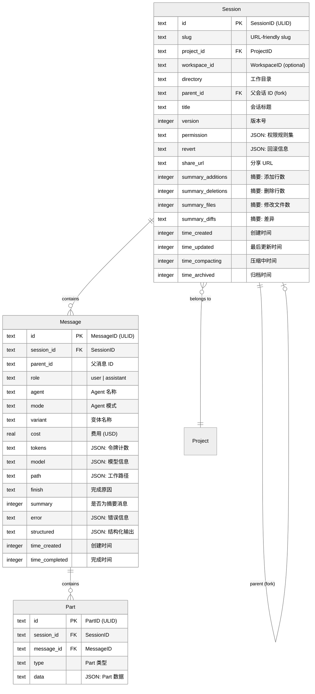
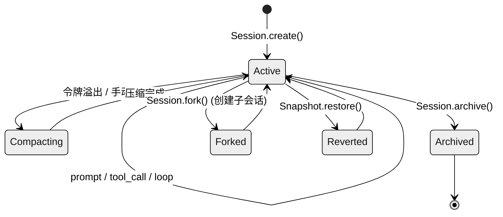
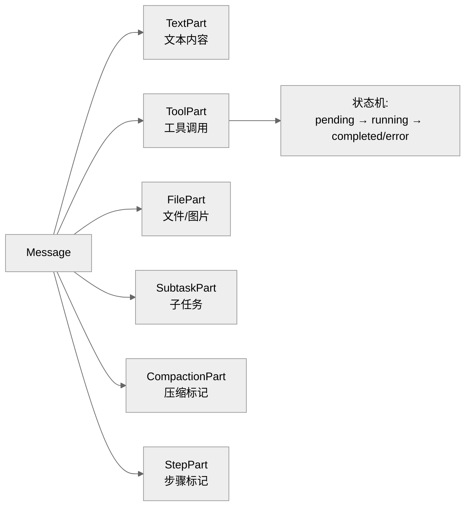
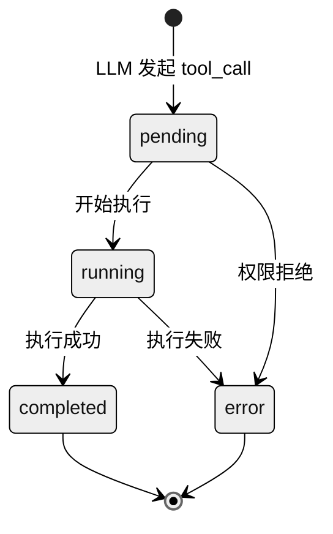

# 第三章：会话与消息模型

> **一句话概括**: OpenCode 采用 Session → Message → Part 三层数据模型，通过 SQLite (Drizzle ORM) 持久化，支持消息压缩、分支会话和快照回滚。

## 3.1 数据模型架构图



## 3.2 ID 系统

OpenCode 使用 ULID (Universally Unique Lexicographically Sortable Identifier) 作为所有实体的 ID：

| ID 类型 | 品牌类型 | 定义位置 |
|---------|---------|---------|
| `SessionID` | `Brand<string, "SessionID">` | `session/schema.ts` |
| `MessageID` | `Brand<string, "MessageID">` | `session/schema.ts` |
| `PartID` | `Brand<string, "PartID">` | `session/schema.ts` |
| `ProjectID` | `Brand<string, "ProjectID">` | `project/schema.ts` |
| `WorkspaceID` | `Brand<string, "WorkspaceID">` | `control-plane/schema.ts` |
| `PermissionID` | `Brand<string, "PermissionID">` | `permission/schema.ts` |

ULID 的关键优势：**按时间排序** — `ascending()` 方法生成单调递增的 ID，保证消息按创建顺序排列。

## 3.3 Session 数据模型

### Session.Info

```typescript
// session/index.ts - 由 fromRow() 从数据库行转换
interface Session.Info {
  id: SessionID
  slug: string                    // URL-friendly 短标识
  projectID: ProjectID
  workspaceID?: WorkspaceID
  directory: string               // 项目工作目录
  parentID?: SessionID            // 分支会话的父 ID
  title: string                   // 会话标题
  version: number                 // 版本号
  summary?: {
    additions: number             // 代码添加行数
    deletions: number             // 代码删除行数
    files: number                 // 修改文件数
    diffs?: string                // 差异信息
  }
  share?: { url: string }         // 分享链接
  revert?: unknown                // 回滚信息
  permission?: Permission.Ruleset // 会话级权限覆盖
  time: {
    created: number               // 创建时间戳
    updated: number               // 最后更新时间戳
    compacting?: number           // 压缩进行中的时间戳
    archived?: number             // 归档时间戳
  }
}
```

### Session 生命周期



### Session 关键操作

| 操作 | 函数 | 描述 |
|------|------|------|
| 创建 | `Session.create()` | 创建新会话，生成 slug |
| 列表 | `Session.list()` | 异步迭代器，按更新时间排序 |
| 获取 | `Session.get()` | 按 ID 获取 |
| 更新标题 | `Session.setTitle()` | 设置会话标题 |
| 触摸 | `Session.touch()` | 更新 `time_updated` |
| 归档 | `Session.archive()` | 设置 `time_archived` |
| 分支 | `Session.fork()` | 创建子会话 |
| 设置权限 | `Session.setPermission()` | 会话级权限覆盖 |

## 3.4 消息数据模型

### MessageV2

`session/message-v2.ts` (1057 行) 是消息系统的核心，定义了两种消息角色和多种 Part 类型。

#### 用户消息 (MessageV2.User)

```typescript
interface User {
  id: MessageID
  sessionID: SessionID
  parentID?: MessageID
  role: "user"
  agent: string                 // 目标 Agent 名称
  model: {
    providerID: ProviderID
    modelID: ModelID
    variant?: string
  }
  format?: Format               // 输出格式要求
  tools?: Record<string, boolean>  // 工具启用/禁用覆盖
  time: { created: number }
}
```

#### 助手消息 (MessageV2.Assistant)

```typescript
interface Assistant {
  id: MessageID
  sessionID: SessionID
  parentID?: MessageID
  role: "assistant"
  agent: string                 // 执行的 Agent 名称
  mode: string                  // Agent 模式
  variant?: string
  path: { cwd: string; root: string }
  cost: number                  // LLM 调用费用
  tokens: {
    input: number
    output: number
    reasoning: number
    cache: { read: number; write: number }
  }
  modelID: ModelID
  providerID: ProviderID
  finish?: string               // 完成原因: "stop" | "tool-calls" | "length" | ...
  summary?: boolean             // 是否为压缩摘要消息
  error?: object                // 错误信息
  structured?: unknown          // 结构化输出结果
  time: {
    created: number
    completed?: number
  }
}
```

## 3.5 Part 类型系统

Part 是消息的内容单元。一条消息可以包含多个不同类型的 Part。



### Part 类型详表 (12 种)

| 类型 | 字段 | 用途 |
|------|------|------|
| `text` | `text`, `synthetic?`, `ignored?` | 文本内容（synthetic = 系统注入的提示） |
| `reasoning` | `text`, `signature?` | LLM 推理/思考内容 |
| `tool` | `tool`, `callID`, `state` | 工具调用及其执行状态 |
| `file` | `url`, `mime`, `filename?` | 文件附件（图片、代码文件等） |
| `subtask` | `prompt`, `description`, `agent`, `model?`, `command?` | 子 Agent 任务 |
| `compaction` | `auto`, `overflow?` | 上下文压缩请求标记 |
| `step-start` | (标记) | Agent 循环步骤开始 |
| `step-finish` | (标记) | Agent 循环步骤结束 |
| `snapshot` | `hash` | Git 快照标记 |
| `patch` | `hash`, `files` | 变更补丁 |
| `agent` | `name` | Agent 引用 |
| `retry` | (标记) | 重试标记 |

### 工具调用状态机



ToolPart 的 `state` 是一个联合类型，包含不同阶段的数据：

```typescript
// pending 状态
{ status: "pending" }

// running 状态
{ status: "running", input: any, title?: string, metadata?: any, time: { start: number } }

// completed 状态
{ status: "completed", input: any, output: string, title: string, metadata?: any,
  time: { start: number, end: number } }

// error 状态
{ status: "error", input: any, error: string, time: { start: number, end: number } }
```

## 3.6 消息格式转换

`MessageV2.toModelMessagesEffect()` 将内部消息格式转换为 AI SDK 需要的 `ModelMessage[]` 格式：

```
MessageV2.WithParts[]
  → 过滤 compaction/subtask Part
  → TextPart → { type: "text", text: string }
  → FilePart (图片) → { type: "image", image: URL }
  → FilePart (文件) → { type: "file", data: URL }
  → ToolPart (completed) → tool_call + tool_result 配对
  → ToolPart (error) → tool_call + error_result
  → ModelMessage[]
```

## 3.7 数据库表定义

定义在 `session/session.sql.ts` (124 行)：

### SessionTable

```typescript
const SessionTable = sqliteTable("session", {
  id: text().primaryKey(),
  slug: text().notNull(),
  project_id: text().notNull(),
  workspace_id: text(),
  directory: text().notNull(),
  parent_id: text(),
  title: text().notNull(),
  version: text().notNull(),
  // ... 摘要、权限、时间戳等字段
})
```

### MessageTable

```typescript
const MessageTable = sqliteTable("message", {
  id: text().primaryKey(),
  session_id: text().notNull(),
  time_created: integer().notNull(),
  data: text().notNull(),  // JSON: 除 id/sessionID 外的所有消息字段
})
```

### PartTable

所有 Part 数据序列化为 JSON 存储在 `data` 列：

```typescript
const PartTable = sqliteTable("part", {
  id: text().primaryKey(),
  message_id: text().notNull(),
  session_id: text().notNull(),   // 反范式化，便于查询
  time_created: integer().notNull(),
  data: text().notNull(),         // JSON: 除 id/sessionID/messageID 外的 Part 数据
})
```

### TodoTable

```typescript
const TodoTable = sqliteTable("todo", {
  session_id: text().notNull(),
  content: text().notNull(),
  status: text().notNull(),       // "pending" | "in_progress" | "completed" | "cancelled"
  priority: text().notNull(),     // "high" | "medium" | "low"
  position: integer().notNull(),
  // 复合主键: (session_id, position)
})
```

### PermissionTable

```typescript
const PermissionTable = sqliteTable("permission", {
  project_id: text().primaryKey(),
  data: text(),  // JSON: Permission.Ruleset
})
```

### SessionEntryTable

```typescript
const SessionEntryTable = sqliteTable("session_entry", {
  id: text().primaryKey(),
  session_id: text().notNull(),
  type: text().notNull(),
  data: text().notNull(),
})
```

## 3.8 Slug 系统

每个 Session 都有一个 URL-friendly 的 slug（`@opencode-ai/util/slug`）：

- 用于 API 路由和 CLI 引用
- 格式类似 `adjective-noun` (如 `happy-tiger`)
- 保证在项目范围内唯一

## 3.9 本章关键文件

| 文件 | 行数 | 职责 |
|------|------|------|
| `session/index.ts` | 818 | Session CRUD 操作、列表查询 |
| `session/message-v2.ts` | 1057 | 消息模型、Part 类型、格式转换 |
| `session/schema.ts` | ~50 | SessionID、MessageID、PartID 品牌类型 |
| `session/session.sql.ts` | ~100 | Drizzle ORM 表定义 |
| `session/run-state.ts` | ~150 | 会话运行状态管理 |
| `session/status.ts` | ~50 | 会话状态（busy/idle） |
| `session/todo.ts` | ~150 | Todo 列表管理 |
| `session/summary.ts` | ~100 | 会话变更摘要 |
