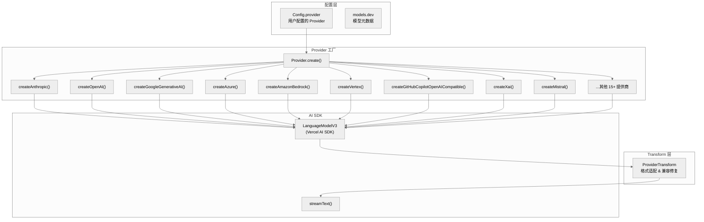
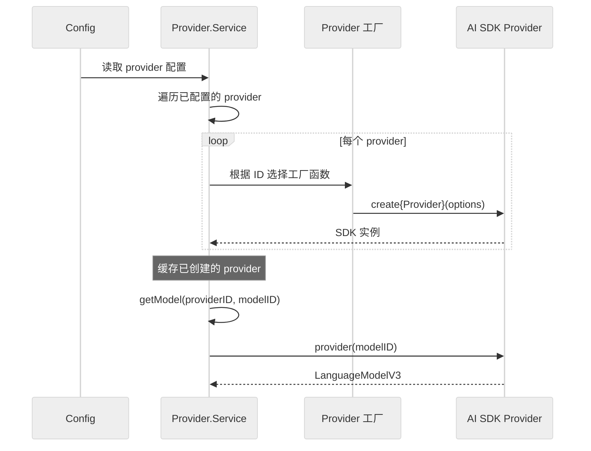

# 第四章：Provider 与模型系统

> **一句话概括**: OpenCode 通过 Vercel AI SDK 的 provider 适配器统一对接 20+ LLM 提供商，使用 `ProviderTransform` 层处理各提供商的格式差异，支持动态模型发现和运行时切换。

## 4.1 Provider 架构图



## 4.2 支持的 Provider 列表

| Provider ID | SDK 包 | 说明 |
|-------------|--------|------|
| `anthropic` | `@ai-sdk/anthropic` | Claude 系列 |
| `openai` | `@ai-sdk/openai` | GPT 系列 |
| `google` | `@ai-sdk/google` | Gemini 系列 |
| `azure` | `@ai-sdk/azure` | Azure OpenAI |
| `bedrock` | `@ai-sdk/amazon-bedrock` | AWS Bedrock |
| `vertex` | `@ai-sdk/google-vertex` | Google Vertex AI |
| `vertex-anthropic` | `@ai-sdk/google-vertex/anthropic` | Vertex 上的 Claude |
| `copilot` | 自定义 SDK | GitHub Copilot |
| `xai` | `@ai-sdk/xai` | xAI (Grok) |
| `mistral` | `@ai-sdk/mistral` | Mistral AI |
| `groq` | `@ai-sdk/groq` | Groq |
| `deepinfra` | `@ai-sdk/deepinfra` | DeepInfra |
| `cerebras` | `@ai-sdk/cerebras` | Cerebras |
| `cohere` | `@ai-sdk/cohere` | Cohere |
| `togetherai` | `@ai-sdk/togetherai` | Together AI |
| `perplexity` | `@ai-sdk/perplexity` | Perplexity |
| `vercel` | `@ai-sdk/vercel` | Vercel AI Gateway |
| `venice` | `venice-ai-sdk-provider` | Venice AI |
| `alibaba` | `@ai-sdk/alibaba` | 阿里云百炼 |
| `openrouter` | `@openrouter/ai-sdk-provider` | OpenRouter |
| `gitlab` | `gitlab-ai-provider` | GitLab Duo |
| `gateway` | `@ai-sdk/gateway` | AI Gateway |
| `openai-compatible` | `@ai-sdk/openai-compatible` | 通用 OpenAI 兼容 |

加上通过 `npm:` 前缀的 npm 包和插件提供的自定义 Provider。

## 4.3 Provider.Model

```typescript
interface Provider.Model {
  id: ModelID                  // 模型 ID (品牌类型)
  providerID: ProviderID       // 提供商 ID
  api: {
    id: string                 // 原始模型标识 (如 "claude-3.5-sonnet")
    provider: SDK              // AI SDK provider 实例
  }
  info?: ModelInfo             // 来自 models.dev 的元数据
}
```

## 4.4 Transform 层

`ProviderTransform` (`provider/transform.ts`, 1067 行) 是提供商兼容性的核心层，处理各提供商在工具调用格式上的差异：

### Schema 转换

不同 LLM 对 JSON Schema 的支持程度不同：

```typescript
ProviderTransform.schema(model, jsonSchema) → 转换后的 schema
```

可能的转换：
- 移除不支持的关键字（如 `$ref`、`allOf`）
- 展平嵌套的 `oneOf`/`anyOf`
- 调整 `enum` 格式
- 处理 `additionalProperties`

### 消息转换

```typescript
ProviderTransform.messages(model, messages) → 转换后的消息
```

处理消息格式差异：
- 图片格式转换
- 工具调用格式适配
- 系统提示位置调整

## 4.5 Copilot 特殊处理

`provider/sdk/copilot/` 目录包含完整的 GitHub Copilot 自定义 SDK（~5000 行），因为 Copilot 有特殊需求：

- **Chat API** (`chat/`) — OpenAI 兼容的聊天 API
- **Responses API** (`responses/`) — OpenAI Responses API（新版）
- GPT-5 及更高版本自动使用 Responses API

```typescript
function shouldUseCopilotResponsesApi(modelID: string): boolean {
  const match = /^gpt-(\d+)/.exec(modelID)
  if (!match) return false
  return Number(match[1]) >= 5 && !modelID.startsWith("gpt-5-mini")
}
```

## 4.6 模型发现

`provider/models.ts` 从 models.dev 获取模型元数据：

- 模型上下文窗口大小
- 支持的特性（vision、tool_use 等）
- 定价信息

## 4.7 Provider 初始化流程



## 4.8 SSE 超时处理

`Provider` 包含 SSE 流超时保护 (`provider/provider.ts:71`)：

```typescript
function wrapSSE(res: Response, ms: number, ctl: AbortController) {
  // 包装 SSE 响应流，添加超时检测
  // 如果 ms 毫秒内没有收到新的 SSE 事件，触发 abort
}
```

这防止了 LLM 提供商的挂起连接导致 Agent 循环无限等待。

## 4.9 本章关键文件

| 文件 | 行数 | 职责 |
|------|------|------|
| `provider/provider.ts` | 1709 | Provider 核心 — 工厂、模型解析、初始化 |
| `provider/transform.ts` | 1067 | 格式转换层 — schema & 消息适配 |
| `provider/models.ts` | ~200 | models.dev 模型元数据 |
| `provider/schema.ts` | ~30 | ProviderID、ModelID 品牌类型 |
| `provider/auth.ts` | ~100 | Provider 认证 |
| `provider/error.ts` | ~50 | Provider 错误类型 |
| `provider/sdk/copilot/` | ~5000 | GitHub Copilot 完整 SDK |
