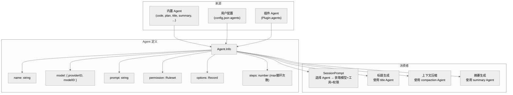

# 第五章：Agent 配置系统

> **一句话概括**: Agent 是 Provider + Tool + Permission 的组合配置，定义了一个 AI 助手的行为模式，支持内置 Agent、用户自定义和插件扩展。

## 5.1 Agent 架构图



## 5.2 Agent.Info Schema

```typescript
// agent/agent.ts:28
export const Info = z.object({
  name: z.string(),                          // Agent 标识
  description: z.string().optional(),         // 描述
  mode: z.enum(["subagent", "primary", "all"]), // 可用模式
  native: z.boolean().optional(),             // 是否为内置
  hidden: z.boolean().optional(),             // 是否在 UI 中隐藏
  topP: z.number().optional(),                // 采样参数
  temperature: z.number().optional(),         // 温度参数
  color: z.string().optional(),               // UI 显示颜色
  permission: Permission.Ruleset,             // 权限规则集
  model: z.object({
    modelID: ModelID.zod,
    providerID: ProviderID.zod,
  }).optional(),                              // 绑定模型（可选）
  variant: z.string().optional(),             // 变体名称
  prompt: z.string().optional(),              // 自定义系统提示
  options: z.record(z.string(), z.any()),     // 扩展选项
  steps: z.number().int().positive().optional(), // 最大循环步数
})
```

## 5.3 内置 Agent

OpenCode 包含 7 个内置 Agent，用于不同用途：

| Agent | mode | 描述 | 特殊配置 |
|-------|------|------|---------|
| `build` | primary | 主 coding Agent（默认） | 完全工具访问 |
| `plan` | primary | 计划模式 Agent | 限制编辑操作 |
| `general` | subagent | 通用子 Agent | 多步骤任务 |
| `explore` | subagent | 代码探索 | 只读工具子集 |
| `compaction` | subagent | 上下文压缩 | hidden，有专用 prompt |
| `title` | subagent | 标题生成 | hidden，使用小模型 |
| `summary` | subagent | 摘要生成 | hidden |

### mode 含义

- `primary` — 可由用户直接选择
- `subagent` — 只能由其他 Agent 通过 Task 工具调用
- `all` — 两者皆可

## 5.4 Agent.Service 接口

```typescript
interface Agent.Interface {
  get(agent: string): Effect.Effect<Agent.Info>
  list(): Effect.Effect<Agent.Info[]>
  defaultAgent(): Effect.Effect<string>
  generate(input: {
    description: string
    model?: { providerID: ProviderID; modelID: ModelID }
  }): Effect.Effect<{
    identifier: string
    whenToUse: string
    systemPrompt: string
  }>
}
```

### generate() — Agent 自动生成

`generate()` 方法可以根据描述自动生成一个新的 Agent 配置（包括标识符、使用场景和系统提示），使用 LLM 来生成这些内容。

## 5.5 Agent 配置合并

Agent 配置来自多个源，按优先级合并：


用户可以在 `config.json` 中覆盖任何 Agent 的属性：

```json
{
  "agents": {
    "code": {
      "model": { "providerID": "anthropic", "modelID": "claude-3.5-sonnet" },
      "temperature": 0.5
    },
    "myagent": {
      "description": "Custom agent",
      "prompt": "You are a specialized assistant..."
    }
  }
}
```

## 5.6 Agent 与 Variant

Agent 支持 **variant**（变体），允许同一个 Agent 在不同上下文中使用不同配置。variant 名称存储在用户消息中，用于跟踪使用了哪个变体。

## 5.7 Agent 提示模板

Agent 自带的 prompt 模板存储在 `agent/prompt/` 目录：

| 模板 | 用途 |
|------|------|
| `compaction.txt` | 上下文压缩指令 |
| `explore.txt` | 代码探索指令 |
| `summary.txt` | 摘要生成指令 |
| `title.txt` | 标题生成指令 |
| `generate.txt` | Agent 自动生成指令 |

## 5.8 本章关键文件

| 文件 | 行数 | 职责 |
|------|------|------|
| `agent/agent.ts` | 412 | Agent Service — 定义、合并、生成 |
| `agent/prompt/compaction.txt` | ~100 | 压缩 Agent 提示 |
| `agent/prompt/explore.txt` | ~100 | 探索 Agent 提示 |
| `agent/prompt/summary.txt` | ~50 | 摘要 Agent 提示 |
| `agent/prompt/title.txt` | ~30 | 标题 Agent 提示 |
| `agent/prompt/generate.txt` | ~100 | Agent 生成提示 |
