# 第六章：工具系统

> **一句话概括**: OpenCode 定义了 19 个内置工具和一个 ToolRegistry 注册表，每个工具通过 `Tool.define()` 声明参数 schema 和执行函数，并通过 MCP 协议支持外部工具扩展。

## 6.1 工具系统架构图

```mermaid
%%{init: {'theme': 'neutral'}}%%
graph TB
    subgraph "ToolRegistry"
        Registry["ToolRegistry.Service<br/>tools() → Tool.Def[]"]
    end
    
    subgraph "内置工具"
        Bash["BashTool"]
        Read["ReadTool"]
        Write["WriteTool"]
        Edit["EditTool"]
        MultiEdit["MultiEditTool"]
        Glob["GlobTool"]
        Grep["GrepTool"]
        List["ListTool"]
        WebFetch["WebFetchTool"]
        WebSearch["WebSearchTool"]
        CodeSearch["CodeSearchTool"]
        Task["TaskTool"]
        Question["QuestionTool"]
        Skill["SkillTool"]
        Todo["TodoWriteTool"]
        Lsp["LspTool"]
        PlanExit["PlanExitTool"]
        ApplyPatch["ApplyPatchTool"]
        Invalid["InvalidTool"]
    end
    
    subgraph "外部工具"
        MCP["MCP Tools"]
        Plugin["Plugin Tools"]
    end
    
    Registry --> Bash & Read & Write & Edit & MultiEdit
    Registry --> Glob & Grep & List
    Registry --> WebFetch & WebSearch & CodeSearch
    Registry --> Task & Question & Skill & Todo
    Registry --> Lsp & PlanExit & ApplyPatch
    Registry --> MCP
    Registry --> Plugin
```



## 6.2 Tool.Def 接口

每个工具都实现 `Tool.Def` 接口 (`tool/tool.ts:36`)：

```typescript
interface Tool.Def<Parameters extends z.ZodType, M extends Metadata> {
  id: string                    // 工具唯一标识
  description: string           // 描述（发送给 LLM）
  parameters: Parameters        // Zod schema（参数定义）
  execute(
    args: z.infer<Parameters>,  // 解析后的参数
    ctx: Tool.Context           // 执行上下文
  ): Effect.Effect<ExecuteResult<M>>
}
```

### ExecuteResult

```typescript
interface ExecuteResult<M extends Metadata> {
  title: string           // 工具调用标题（显示在 UI）
  metadata: M             // 元数据（存储在 ToolPart.state）
  output: string          // 工具输出（发送给 LLM）
  attachments?: FilePart[] // 文件附件（图片等）
}
```

## 6.3 内置工具清单

| 工具 ID | 文件 | 描述 | 参数 |
|---------|------|------|------|
| `bash` | `tool/bash.ts` (293行起) | 执行 shell 命令 | `command`, `timeout?`, `description?` |
| `read` | `tool/read.ts` | 读取文件内容 | `file_path`, `offset?`, `limit?` |
| `write` | `tool/write.ts` | 写入文件 | `file_path`, `content` |
| `edit` | `tool/edit.ts` (688行) | 精确字符串替换 | `file_path`, `old_string`, `new_string` |
| `multiedit` | `tool/multiedit.ts` | 批量编辑 | `file_path`, `edits[]` |
| `glob` | `tool/glob.ts` | 文件模式搜索 | `pattern`, `path?` |
| `grep` | `tool/grep.ts` | 内容搜索 (ripgrep) | `pattern`, `path?`, `include?` |
| `ls` | `tool/ls.ts` | 列出目录内容 | `path` |
| `webfetch` | `tool/webfetch.ts` | 获取 URL 内容 | `url`, `format?` |
| `websearch` | `tool/websearch.ts` | 网页搜索 | `query`, `count?` |
| `codesearch` | `tool/codesearch.ts` | 代码搜索 | `query` |
| `task` | `tool/task.ts` | 创建子 Agent 任务 | `prompt`, `description?`, `subagent_type?` |
| `question` | `tool/question.ts` | 向用户提问 | `question`, `options?` |
| `skill` | `tool/skill.ts` | 执行 Skill | `name`, `args?` |
| `todowrite` | `tool/todo.ts` | 写入 Todo 列表 | `todos[]` |
| `lsp` | `tool/lsp.ts` | LSP 诊断查询 | `path?` |
| `plan_exit` | `tool/plan.ts` | 退出计划模式 | (无参数) |
| `apply_patch` | `tool/apply_patch.ts` | 应用统一补丁 | `patch` |
| `invalid` | `tool/invalid.ts` | 无效工具占位符 | (内部使用) |

## 6.4 ToolRegistry

`ToolRegistry` (`tool/registry.ts`) 负责：

1. **初始化所有内置工具** — 调用每个 `Tool.Info.init()` 获取 `Tool.Def`
2. **加载插件工具** — 通过 `Plugin.Service` 获取自定义工具
3. **按 Agent 过滤** — `tools(model, agent)` 根据 Agent 配置过滤可用工具
4. **暴露特殊工具** — `named()` 返回 task 和 read 工具的强类型引用

```typescript
interface ToolRegistry.Interface {
  ids(): Effect.Effect<string[]>
  all(): Effect.Effect<Tool.Def[]>
  named(): Effect.Effect<{ task: TaskDef; read: ReadDef }>
  tools(model: { providerID, modelID, agent }): Effect.Effect<Tool.Def[]>
}
```

### 工具过滤逻辑

`tools()` 方法按以下规则过滤：
1. 获取所有内置 + 自定义工具
2. 检查 Agent 的 `options` 配置中是否禁用了某些工具
3. 检查 Provider 是否支持某些工具特性
4. 返回过滤后的工具列表

## 6.5 工具执行上下文 (Tool.Context)

```typescript
interface Tool.Context {
  sessionID: SessionID       // 当前会话
  messageID: MessageID       // 当前消息
  agent: string              // 当前 Agent 名称
  callID?: string            // 工具调用 ID
  abort: AbortSignal         // 取消信号
  messages: MessageV2.WithParts[]  // 完整消息历史
  extra?: Record<string, any>      // 扩展数据（含模型信息）
  metadata(input): Effect.Effect<void>   // 更新工具元数据
  ask(input): Effect.Effect<void>        // 请求权限
}
```

## 6.6 工具输出截断 (Truncate)

`tool/truncate.ts` 负责截断过长的工具输出，防止超出 LLM 上下文窗口：

默认限制：**2000 行** 或 **50KB**（以先到者为准）。

```typescript
interface Truncate.Interface {
  output(
    content: string,
    metadata: Record<string, any>,
    agent: Agent.Info
  ): Effect.Effect<{ content: string; truncated: boolean; outputPath?: string }>
}
```

当输出被截断时：
1. 原始输出写入临时文件
2. 返回截断后的内容 + `outputPath` 指向完整文件
3. LLM 可以通过 `read` 工具读取完整输出

## 6.7 Bash 工具详解

Bash 工具是最复杂的内置工具之一 (`tool/bash.ts`, 293 行起)：

- 通过 PTY (伪终端) 执行命令
- 支持超时控制
- 需要权限确认（除了安全的只读命令）
- 支持 `description` 参数帮助 LLM 解释意图
- 针对不同 shell (bash, zsh, cmd, powershell) 有不同的调用方式

## 6.8 Task 工具 (子 Agent)

Task 工具 (`tool/task.ts`) 允许 LLM 创建子 Agent 任务：

```typescript
parameters: z.object({
  prompt: z.string(),           // 子任务提示
  description: z.string().optional(),  // 任务描述
  subagent_type: z.string().optional(), // Agent 类型
  command: z.string().optional(),      // 要执行的命令
})
```

子任务在独立的 Agent 上下文中执行，可以有不同的模型和权限。

## 6.9 外部目录工具 (external-directory.ts)

`tool/external-directory.ts` 为需要访问项目目录外部文件的工具提供支持：
- 通过 `ExternalDirectoryLock` 跟踪外部目录引用
- Read 和 Glob 工具使用它来安全地访问外部路径

## 6.10 本章关键文件

| 文件 | 行数 | 职责 |
|------|------|------|
| `tool/tool.ts` | 141 | Tool.Def 接口定义、Tool.define() |
| `tool/registry.ts` | 345 | 工具注册表、过滤、初始化 |
| `tool/bash.ts` | ~400 | Bash 工具实现 |
| `tool/edit.ts` | 688 | 编辑工具（精确替换） |
| `tool/task.ts` | ~200 | 子 Agent 任务工具 |
| `tool/read.ts` | ~200 | 文件读取工具 |
| `tool/truncate.ts` | ~150 | 输出截断 |
| `tool/question.ts` | ~100 | 用户提问工具 |
| `tool/write.ts` | ~100 | 文件写入工具 |
