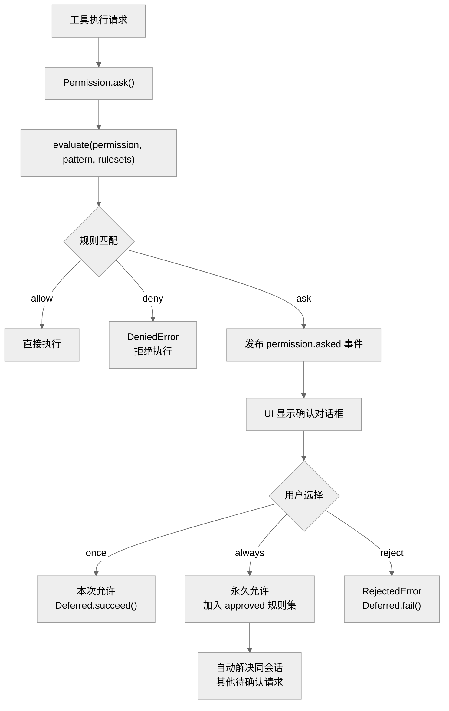
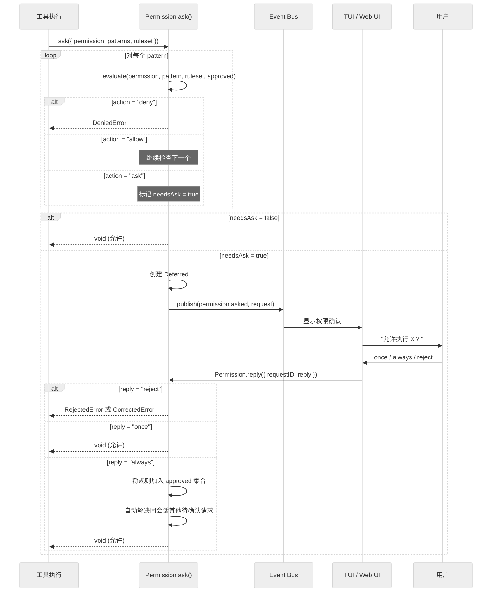

# 第七章：权限系统

> **一句话概括**: OpenCode 的权限系统通过 wildcard 规则匹配控制工具执行权限，支持 allow/deny/ask 三种动作，采用 Effect Deferred 实现异步用户确认流程。

## 7.1 权限模型架构图



## 7.2 核心数据结构

### Permission.Rule

```typescript
interface Rule {
  permission: string  // 权限名称（支持 wildcard）
  pattern: string     // 匹配模式（支持 wildcard）
  action: "allow" | "deny" | "ask"
}
```

### Permission.Ruleset

`Rule[]` — 规则集合，按顺序求值，最后匹配的规则获胜（last-match-wins）。

### Permission.Request

```typescript
interface Request {
  id: PermissionID
  sessionID: SessionID
  permission: string              // 请求的权限名
  patterns: string[]              // 需要匹配的模式列表
  metadata: Record<string, any>   // 额外元数据
  always: string[]                // "always" 回复时要记住的模式
  tool?: {
    messageID: MessageID
    callID: string
  }
}
```

## 7.3 规则求值算法

`evaluate()` 函数（`permission/evaluate.ts`，仅 15 行）是权限系统的核心：

```typescript
export function evaluate(permission: string, pattern: string, ...rulesets: Rule[][]): Rule {
  const rules = rulesets.flat()
  const match = rules.findLast(
    (rule) => Wildcard.match(permission, rule.permission) && 
              Wildcard.match(pattern, rule.pattern),
  )
  return match ?? { action: "ask", permission, pattern: "*" }
}
```

**关键特性**：
1. **Last-match-wins** — 使用 `findLast`，后面的规则覆盖前面的
2. **双重 wildcard 匹配** — 同时匹配 permission 名称和 pattern
3. **默认 ask** — 无匹配规则时默认要求用户确认

### 规则优先级

规则合并来自多个源，从低到高：
1. Agent 配置的默认权限 (`agent.permission`)
2. 会话级权限覆盖 (`session.permission`)
3. 运行时批准的规则 (`approved` 状态)

## 7.4 权限请求流程

### `Permission.ask()` (permission/index.ts:166)



### 异步等待机制

权限系统使用 Effect 的 `Deferred` 实现异步等待：

1. `ask()` 创建一个 `Deferred<void, RejectedError | CorrectedError>`
2. 将请求加入 `pending` Map
3. 发布 `permission.asked` 事件
4. `await(deferred)` — 挂起执行，等待用户响应
5. `reply()` 被调用时 `succeed` 或 `fail` 该 Deferred

### 批量解决

当用户选择 "always" 时，系统会自动解决同会话中其他匹配的待确认请求：

```typescript
// reply() 中的自动解决逻辑
for (const [id, item] of pending.entries()) {
  if (item.info.sessionID !== existing.info.sessionID) continue
  const ok = item.info.patterns.every(
    (pattern) => evaluate(item.info.permission, pattern, approved).action === "allow",
  )
  if (!ok) continue
  pending.delete(id)
  yield* Deferred.succeed(item.deferred, undefined)
}
```

### 拒绝级联

当用户拒绝权限时，同会话中所有待确认请求都会被拒绝：

```typescript
if (input.reply === "reject") {
  yield* Deferred.fail(existing.deferred, new RejectedError())
  for (const [id, item] of pending.entries()) {
    if (item.info.sessionID !== existing.info.sessionID) continue
    pending.delete(id)
    yield* Deferred.fail(item.deferred, new RejectedError())
  }
}
```

## 7.5 错误类型

| 错误类型 | 含义 | 触发条件 |
|---------|------|---------|
| `DeniedError` | 规则明确拒绝 | 规则求值结果为 `deny` |
| `RejectedError` | 用户拒绝 | 用户选择 `reject`（无反馈） |
| `CorrectedError` | 用户拒绝并给出反馈 | 用户选择 `reject` + 输入消息 |

`CorrectedError` 的反馈会传递给 LLM，让它根据用户指示调整行为。

## 7.6 权限持久化

批准的规则持久化在 `PermissionTable` 中（按 project_id），下次启动时恢复：

```typescript
const row = Database.use((db) =>
  db.select().from(PermissionTable)
    .where(eq(PermissionTable.project_id, ctx.project.id))
    .get(),
)
const approved = row?.data ?? []
```

## 7.7 工具权限集成

在 `SessionPrompt.resolveTools()` 中，每个工具执行前都会调用 `ctx.ask()`：

```typescript
const context: Tool.Context = {
  ask: (req) => permission.ask({
    ...req,
    sessionID,
    tool: { messageID, callID },
    ruleset: Permission.merge(agent.permission, session.permission ?? []),
  }),
}
```

对于 MCP 外部工具，默认所有调用都需要权限确认：
```typescript
yield* ctx.ask({ permission: key, metadata: {}, patterns: ["*"], always: ["*"] })
```

## 7.8 本章关键文件

| 文件 | 行数 | 职责 |
|------|------|------|
| `permission/index.ts` | 310 | Permission Service — ask/reply/list |
| `permission/evaluate.ts` | 15 | 核心规则求值算法 |
| `permission/schema.ts` | ~10 | PermissionID 品牌类型 |
| `session/session.sql.ts` | ~100 | PermissionTable 定义 |
