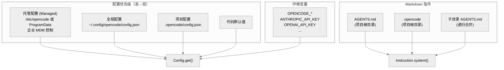

# 第八章：配置系统

> **一句话概括**: OpenCode 采用多层配置合并策略（managed → global → project → env），支持 JSONC 格式的配置文件和 Markdown 格式的指令文件（AGENTS.md、.opencode），配置变更通过事件总线实时通知。

## 8.1 配置层次架构图



## 8.2 配置文件路径

### 平台特定路径

| 平台 | 全局配置目录 | 托管配置目录 |
|------|-------------|-------------|
| macOS | `~/Library/Application Support/opencode/` | `/Library/Application Support/opencode/` |
| Linux | `~/.config/opencode/` (XDG) | `/etc/opencode/` |
| Windows | `%APPDATA%/opencode/` | `%ProgramData%/opencode/` |

路径解析由 `config/paths.ts` 中的 `ConfigPaths` 处理。

### 配置文件

| 文件 | 位置 | 格式 |
|------|------|------|
| `config.json` | 全局/项目 | JSONC (带注释的 JSON) |
| `AGENTS.md` | 项目根/子目录 | Markdown |
| `.opencode` | 项目根 | Markdown |

## 8.3 Config Schema 核心字段

```typescript
// config/config.ts (简化)
const ConfigSchema = z.object({
  provider: z.record(ProviderConfig),     // LLM 提供商配置
  model: z.string(),                       // 默认模型 ID
  agents: z.record(AgentConfig),           // Agent 覆盖
  mcp: z.record(McpConfig),               // MCP 服务器配置
  commands: z.record(CommandConfig),       // 自定义命令
  plugins: z.array(PluginSpec),           // 插件列表
  permission: PermissionConfig,            // 默认权限
  snapshot: z.boolean(),                   // 快照开关
  theme: z.string(),                       // 主题
  // ... 更多字段
})
```

### Provider 配置

```json
{
  "provider": {
    "anthropic": {
      "apiKey": "sk-...",
      "baseURL": "https://api.anthropic.com"
    },
    "openai": {
      "apiKey": "sk-...",
      "organization": "org-..."
    }
  }
}
```

### MCP 服务器配置

```json
{
  "mcp": {
    "my-server": {
      "type": "stdio",
      "command": "node",
      "args": ["server.js"],
      "env": { "KEY": "value" }
    }
  }
}
```

## 8.4 配置合并策略

`Config.get()` 使用 `mergeDeep()` 深度合并所有配置源：

```
defaults → mergeDeep(global) → mergeDeep(project) → mergeDeep(managed)
```

**关键**：后面的层覆盖前面的层，但数组类型的字段（如 plugins）是追加而非替换。

## 8.5 Markdown 指令系统

### AGENTS.md

`AGENTS.md` 文件位于项目根目录，其内容作为系统提示注入给 LLM：

```markdown
# Project Instructions

## Code Style
- Use TypeScript strict mode
- Prefer functional patterns

## Architecture
- Follow the module pattern in src/
```

### 子目录 AGENTS.md

当 Agent 在某个子目录下工作时，该目录中的 `AGENTS.md` 也会被包含。

### ConfigMarkdown

`config/markdown.ts` 负责解析 Markdown 指令文件：
- 检测文件引用（`@./path/to/file`）
- 展开引用为文件内容
- 递归处理嵌套引用

## 8.6 JSONC 解析

配置文件使用 JSONC 格式（允许注释），通过 `jsonc-parser` 解析：

```typescript
import { parse as parseJsonc, modify, applyEdits } from "jsonc-parser"
```

这允许用户在配置文件中添加注释：

```jsonc
{
  // 使用 Claude 作为默认模型
  "model": "anthropic/claude-3.5-sonnet",
  
  /* MCP 服务器配置 */
  "mcp": { }
}
```

## 8.7 配置变更通知

配置变更通过 Event Bus 广播：

```typescript
yield* bus.publish(Config.Changed, { config: newConfig })
```

这允许其他模块（如 Provider、Agent）在配置变更时动态更新。

## 8.8 企业托管配置

`managed` 配置支持企业部署场景：

- macOS: 通过 MDM 推送到 `/Library/Application Support/opencode/`
- Windows: 通过组策略推送到 `C:\ProgramData\opencode\`
- Linux: 管理员手动配置 `/etc/opencode/`

托管配置的优先级最高，无法被用户覆盖。

特殊处理：macOS 支持 plist 格式（`ai.opencode.managed` domain）。

## 8.9 本章关键文件

| 文件 | 行数 | 职责 |
|------|------|------|
| `config/config.ts` | 1661 | 配置核心 — Schema、合并、读写 |
| `config/markdown.ts` | ~200 | Markdown 指令解析 |
| `config/paths.ts` | ~100 | 平台特定路径解析 |
| `config/console-state.ts` | ~50 | 控制台状态 |
| `session/instruction.ts` | ~200 | AGENTS.md / .opencode 指令加载 |
