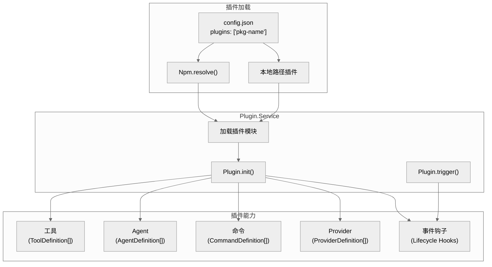

# 第九章：插件系统

> **一句话概括**: OpenCode 的插件系统通过 npm 包或本地路径加载 TypeScript 插件，插件可以提供工具、Agent、命令、Provider 和事件钩子，运行时通过 `@opencode-ai/plugin` 接口交互。

## 9.1 插件架构图



## 9.2 插件配置

### 配置格式

```json
{
  "plugins": [
    "my-opencode-plugin",
    ["my-plugin-with-options", { "key": "value" }],
    "./local-plugin"
  ]
}
```

支持三种格式：
1. **npm 包名** — 通过 `@npmcli/arborist` 解析
2. **[包名, 选项]** — 带选项的 npm 包
3. **相对路径** — 本地插件

### PluginSpec

```typescript
const PluginSpec = z.union([
  z.string(),                              // "plugin-name"
  z.tuple([z.string(), PluginOptions])     // ["plugin-name", { options }]
])
```

## 9.3 插件接口 (@opencode-ai/plugin)

`packages/plugin/` 定义了插件的公开接口：

```typescript
interface PluginDefinition {
  name: string
  tools?: ToolDefinition[]
  agents?: AgentDefinition[]
  commands?: CommandDefinition[]
  providers?: ProviderDefinition[]
  hooks?: {
    "tool.execute.before"?: (context, data) => void
    "tool.execute.after"?: (context, data) => void
    "command.execute.before"?: (context, data) => void
    "experimental.chat.messages.transform"?: (context, data) => void
  }
}
```

## 9.4 事件钩子

插件可以注册以下钩子：

| 钩子 | 触发时机 | 用途 |
|------|---------|------|
| `tool.execute.before` | 工具执行前 | 拦截、修改参数 |
| `tool.execute.after` | 工具执行后 | 记录、修改输出 |
| `command.execute.before` | 命令执行前 | 拦截命令 |
| `experimental.chat.messages.transform` | 消息发送给 LLM 前 | 修改消息列表 |

## 9.5 插件加载流程

1. `Plugin.init()` 在 `InstanceBootstrap` 中最先执行
2. 读取 config 中的 plugins 列表
3. 对每个插件：解析路径 → import() → 调用工厂函数
4. 注册工具、Agent、命令到对应的 Registry
5. 订阅事件钩子

## 9.6 TUI 插件运行时

`cli/cmd/tui/plugin/runtime.ts` (1031 行) 提供了 TUI 层面的插件支持：

- 插件可以注册自定义 TUI 组件
- 通过 `feature-plugins/` 目录加载功能插件
- 提供渲染上下文和事件接口

## 9.7 本章关键文件

| 文件 | 行数 | 职责 |
|------|------|------|
| `plugin/index.ts` | ~300 | Plugin Service — 加载、初始化、触发 |
| `plugin/shared.ts` | ~100 | 插件路径解析 |
| `packages/plugin/` | ~200 | 公开接口定义 (@opencode-ai/plugin) |
| `cli/cmd/tui/plugin/runtime.ts` | 1031 | TUI 插件运行时 |
| `cli/cmd/plug.ts` | ~100 | 插件管理 CLI 命令 |
