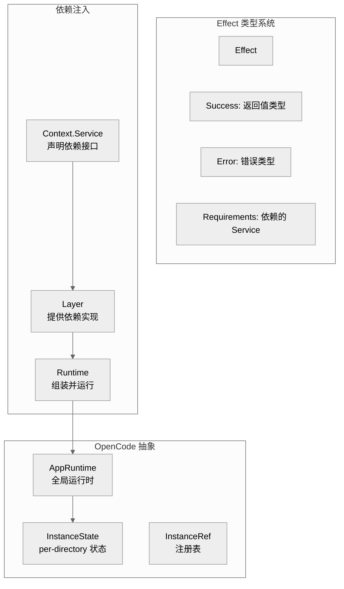

# 第十章：Effect 依赖注入

> **一句话概括**: OpenCode 使用 Effect 4.x 的 Context.Service + Layer 模式实现依赖注入，通过 InstanceState 管理 per-directory 可变状态，在 AppRuntime 中组装完整的依赖图。

## 10.1 Effect 核心概念图



## 10.2 Service 定义模式

OpenCode 中每个模块都遵循统一的 Service 定义模式：

```typescript
// 1. 定义接口
export interface Interface {
  readonly get: (id: string) => Effect.Effect<Info>
  readonly list: () => Effect.Effect<Info[]>
}

// 2. 声明 Service Tag
export class Service extends Context.Service<Service, Interface>()("@opencode/ModuleName") {}

// 3. 实现 Layer
export const layer = Layer.effect(
  Service,
  Effect.gen(function* () {
    // 声明依赖
    const config = yield* Config.Service
    const bus = yield* Bus.Service
    
    // 实现接口
    const get = Effect.fn("Module.get")(function* (id: string) { ... })
    const list = Effect.fn("Module.list")(function* () { ... })
    
    return Service.of({ get, list })
  }),
)
```

### Service Tag 命名约定

所有 Service 使用 `@opencode/` 前缀：
- `@opencode/Config`
- `@opencode/Session`
- `@opencode/Provider`
- `@opencode/Bus`
- `@opencode/Permission`
- ...

## 10.3 InstanceState

`InstanceState` (`effect/instance-state.ts`) 是 OpenCode 最重要的 Effect 抽象，用于管理 per-project-directory 的可变状态：

```typescript
export namespace InstanceState {
  // 创建 per-instance 状态
  export const make = <S>(
    init: Effect.Effect<S>  // 初始化函数，接收 InstanceContext
  ) => Effect.Effect<StateRef<S>>
  
  // 获取当前实例的状态
  export const get = <S>(ref: StateRef<S>) => Effect.Effect<S>
  
  // 获取当前实例上下文
  export const context: Effect.Effect<InstanceContext>
}
```

### 为什么需要 InstanceState？

OpenCode 的 Server 可以同时服务多个项目目录。每个目录需要独立的：
- Config（项目配置）
- Session（会话列表）
- Snapshot（快照仓库）
- Plugin（插件实例）

`InstanceState` 确保：
1. 状态按 directory 隔离
2. 首次访问时懒初始化
3. 实例销毁时自动清理（`addFinalizer`）

## 10.4 AppRuntime

`AppRuntime` (`effect/app-runtime.ts`) 组装所有 Layer 形成完整的依赖图：

```typescript
// 简化的 Layer 组装
const AppLayer = Layer.merge(
  Config.layer,
  Bus.layer,
  Provider.layer,
  Agent.layer,
  Session.layer,
  SessionPrompt.layer,
  ToolRegistry.layer,
  Permission.layer,
  MCP.layer,
  Plugin.layer,
  Snapshot.layer,
  // ... 更多 Layer
)

export const AppRuntime = {
  runPromise: <A, E>(effect: Effect.Effect<A, E>) => 
    Effect.runPromise(effect.pipe(Effect.provide(AppLayer)))
}
```

## 10.5 Effect.fn — 命名函数

OpenCode 大量使用 `Effect.fn` 创建命名的 Effect 函数，这在调试和跟踪时非常有用：

```typescript
const track = Effect.fn("Snapshot.track")(function* () {
  // 函数体
})
```

`Effect.fn("name")` 为函数添加 span 名称，在 OpenTelemetry 跟踪中可见。

## 10.6 Scope 和资源管理

Effect 的 `Scope` 用于管理资源生命周期：

```typescript
// 在 InstanceState 中注册清理函数
yield* Effect.addFinalizer(() =>
  Effect.gen(function* () {
    for (const item of state.pending.values()) {
      yield* Deferred.fail(item.deferred, new RejectedError())
    }
    state.pending.clear()
  }),
)
```

当 Instance 销毁时，所有 finalizer 自动执行。

## 10.7 并发原语

OpenCode 使用 Effect 的并发原语：

| 原语 | 用途 |
|------|------|
| `Deferred` | 异步等待（权限确认） |
| `PubSub` | 事件发布/订阅（Bus） |
| `Stream` | 流式数据处理（LLM 响应） |
| `Semaphore` | 并发控制（快照操作） |
| `Fiber` | 后台任务（标题生成） |

### 示例：PubSub 事件总线

```typescript
const wildcard = yield* PubSub.unbounded<Payload>()
// 发布
yield* PubSub.publish(wildcard, { type: "event", properties: {} })
// 订阅
const stream = Stream.fromPubSub(wildcard)
```

### 示例：Semaphore 快照锁

```typescript
const locks = new Map<string, Semaphore.Semaphore>()
const lock = (key: string) => {
  const hit = locks.get(key)
  if (hit) return hit
  const next = Semaphore.makeUnsafe(1)
  locks.set(key, next)
  return next
}
// 使用
yield* lock(state.gitdir).withPermits(1)(operation)
```

## 10.8 错误处理模式

### NamedError

```typescript
import { NamedError } from "@opencode-ai/util/error"

export const InvalidError = NamedError.create(
  "SkillInvalidError",
  z.object({
    path: z.string(),
    message: z.string().optional(),
  }),
)
```

### Schema.TaggedErrorClass

```typescript
export class RejectedError extends Schema.TaggedErrorClass<RejectedError>()(
  "PermissionRejectedError",
  {},
) {
  override get message() {
    return "The user rejected permission..."
  }
}
```

## 10.9 跟踪 (OpenTelemetry)

OpenCode 集成了 OpenTelemetry 跟踪：

```typescript
import * as OtelTracer from "@effect/opentelemetry/Tracer"

// 在 Agent.layer 中使用
yield* OtelTracer.span("Agent.get", { attributes: { agent: name } })
```

## 10.10 本章关键文件

| 文件 | 行数 | 职责 |
|------|------|------|
| `effect/app-runtime.ts` | ~100 | 全局 Effect 运行时 |
| `effect/instance-state.ts` | ~100 | Per-instance 状态管理 |
| `effect/instance-ref.ts` | ~50 | 实例引用/注册表 |
| `effect/instance-registry.ts` | ~80 | 实例注册和销毁 |
| `effect/logger.ts` | ~50 | Effect 日志集成 |
| `effect/run-service.ts` | ~50 | Service 运行工具 |
| `effect/cross-spawn-spawner.ts` | ~80 | 跨平台进程生成 |
