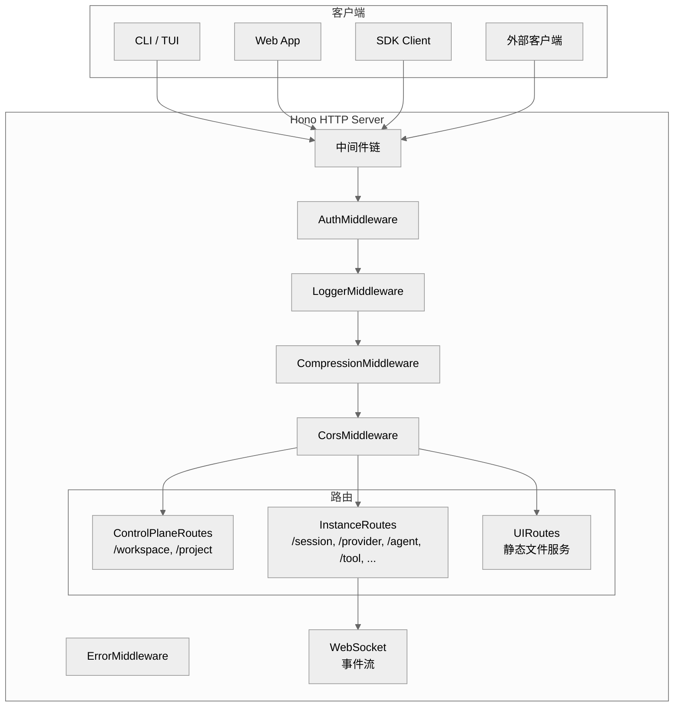

# 第十一章：服务器与 API

> **一句话概括**: OpenCode 内嵌一个 Hono HTTP 服务器，提供 RESTful API + WebSocket 事件流，支持 CLI 内嵌模式和独立 headless 模式，通过 OpenAPI 规范自动生成 SDK。

## 11.1 服务器架构图



## 11.2 服务器创建 (server/server.ts)

```typescript
function create(opts: { cors?: string[] }) {
  const app = new Hono()
  const runtime = adapter.create(app)
  return {
    app: app
      .onError(ErrorMiddleware)
      .use(AuthMiddleware)
      .use(LoggerMiddleware)
      .use(CompressionMiddleware)
      .use(CorsMiddleware(opts))
      .route("/", ControlPlaneRoutes())
      .route("/", InstanceRoutes(runtime.upgradeWebSocket))
      .route("/", UIRoutes()),
    runtime,
  }
}
```

### 运行时适配

通过条件导入 (`#hono`) 支持 Bun 和 Node.js：
- `server/adapter.bun.ts` — Bun 原生 HTTP
- `server/adapter.node.ts` — `@hono/node-server`

## 11.3 API 路由清单

### 控制平面路由 (ControlPlaneRoutes)

| 方法 | 路径 | 描述 |
|------|------|------|
| GET | `/workspace` | 列出工作区 |
| GET | `/workspace/:id/project` | 列出工作区中的项目 |

### 实例路由 (InstanceRoutes)

#### Session

| 方法 | 路径 | 描述 |
|------|------|------|
| GET | `/session` | 列出会话 |
| GET | `/session/status` | 会话状态 |
| POST | `/session` | 创建会话 |
| GET | `/session/:id` | 获取会话 |
| DELETE | `/session/:id` | 删除会话 |
| GET | `/session/:id/message` | 获取消息列表 |
| POST | `/session/:id/message` | 发送消息 (核心 API) |
| POST | `/session/:id/message/cancel` | 取消进行中的消息 |
| POST | `/session/:id/message/retry` | 重试最后一条消息 |
| POST | `/session/:id/message/feedback` | 提交反馈 |
| POST | `/session/:id/share` | 分享会话 |
| POST | `/session/:id/summarize` | 生成摘要 |
| POST | `/session/:id/compact` | 手动压缩 |
| POST | `/session/:id/title` | 设置标题 |
| POST | `/session/:id/archive` | 归档会话 |
| POST | `/session/:id/fork` | 分支会话 |

#### Permission

| 方法 | 路径 | 描述 |
|------|------|------|
| GET | `/session/permission` | 列出待确认权限 |
| POST | `/session/permission/reply` | 回复权限请求 |

#### Provider & Model

| 方法 | 路径 | 描述 |
|------|------|------|
| GET | `/provider` | 列出可用提供商 |
| GET | `/model` | 列出可用模型 |

#### Agent

| 方法 | 路径 | 描述 |
|------|------|------|
| GET | `/agent` | 列出 Agent |
| POST | `/agent/generate` | 自动生成 Agent |

#### Tool & MCP

| 方法 | 路径 | 描述 |
|------|------|------|
| GET | `/tool` | 列出工具 |
| GET | `/mcp` | 列出 MCP 服务器 |

#### WebSocket

| 方法 | 路径 | 描述 |
|------|------|------|
| GET | `/event` | WebSocket 事件流 |

## 11.4 事件流 (WebSocket)

客户端通过 WebSocket 接收实时事件：

```typescript
// 连接
const ws = new WebSocket("ws://localhost:PORT/event")

// 事件格式
interface Event {
  type: string
  properties: Record<string, any>
}
```

### Projector 模式

`server/projectors.ts` 将内部 Bus 事件转换为外部 WebSocket 事件：

```typescript
export function initProjectors() {
  // 监听内部事件
  bus.subscribeAll(callback)
  // 转换为 SSE/WebSocket 格式
  // 推送给所有连接的客户端
}
```

## 11.5 中间件

| 中间件 | 功能 |
|--------|------|
| `AuthMiddleware` | 检查 `OPENCODE_SERVER_PASSWORD` |
| `LoggerMiddleware` | 请求日志 |
| `CompressionMiddleware` | 响应压缩 |
| `CorsMiddleware` | CORS 头 |
| `ErrorMiddleware` | 全局错误处理 |

### 认证

当设置了 `OPENCODE_SERVER_PASSWORD` 环境变量时，所有请求需要携带 Bearer token：

```
Authorization: Bearer <password>
```

## 11.6 OpenAPI 文档

Server 使用 `hono-openapi` 自动生成 OpenAPI 规范：

```typescript
export async function openapi() {
  const result = await generateSpecs(app, {
    documentation: {
      info: { title: "opencode", version: "1.0.0" },
      openapi: "3.1.1",
    },
  })
  return result
}
```

这个 OpenAPI spec 被用来自动生成 `packages/sdk/js/` 中的 TypeScript SDK。

## 11.7 mDNS 发现

Server 支持 mDNS (Bonjour) 广播，让桌面应用自动发现运行中的 OpenCode 实例：

```typescript
import { MDNS } from "./mdns"
// 在 Server.listen() 中启用
if (opts.mdns) MDNS.advertise(port, opts.mdnsDomain)
```

## 11.8 两种运行模式

### 内嵌模式 (RunCommand)

TUI 启动时自动启动 Server，CLI 和 TUI 通过 SDK 与 Server 通信：

```
opencode → bootstrap() → Server.listen() → TUI.start()
```

### Headless 模式 (ServeCommand)

只启动 Server，不启动 TUI：

```
opencode serve --port 3000
```

## 11.9 本章关键文件

| 文件 | 行数 | 职责 |
|------|------|------|
| `server/server.ts` | ~100 | 服务器创建和启动 |
| `server/middleware.ts` | ~100 | 中间件定义 |
| `server/instance/session.ts` | 1110 | Session API 路由 |
| `server/instance/index.ts` | ~200 | 实例路由聚合 |
| `server/control/index.ts` | ~100 | 控制平面路由 |
| `server/projectors.ts` | ~100 | 事件投射 |
| `server/event.ts` | ~50 | 事件定义 |
| `server/mdns.ts` | ~50 | mDNS 发现 |
| `server/adapter.bun.ts` | ~30 | Bun 适配器 |
| `server/adapter.node.ts` | ~30 | Node.js 适配器 |
