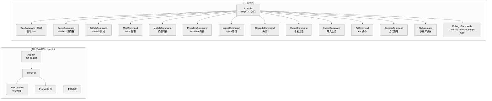
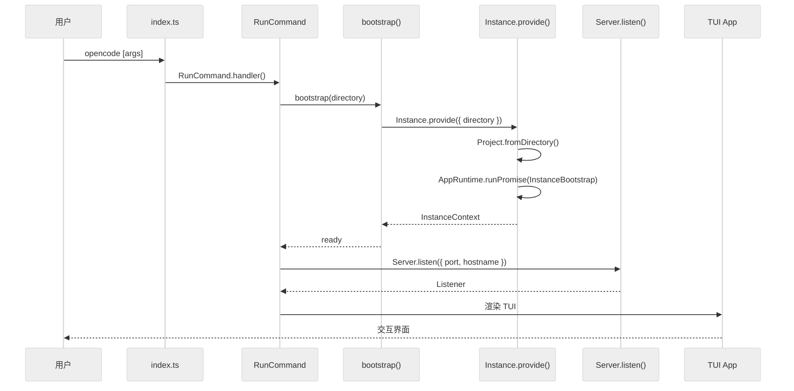

# 第十二章：CLI 与终端 UI

> **一句话概括**: OpenCode 的 CLI 使用 yargs 注册 23 个子命令，默认命令通过 Worker 线程启动 Server 并在主线程运行基于 SolidJS + opentui 的终端 UI，TUI 通过 SDK Client 与 Server 通信。

## 12.1 CLI 架构图



## 12.2 命令注册

所有子命令在 `index.ts` 中通过 yargs 注册：

```typescript
const cli = yargs(args)
  .scriptName("opencode")
  .command(RunCommand)        // 默认命令 — 启动 TUI
  .command(ServeCommand)      // headless 服务器
  .command(GithubCommand)     // GitHub 操作
  .command(McpCommand)        // MCP 服务器管理
  .command(ModelsCommand)     // 列出可用模型
  .command(ProvidersCommand)  // 列出 Provider
  .command(AgentCommand)      // Agent 管理
  .command(UpgradeCommand)    // 升级 opencode
  .command(ExportCommand)     // 导出会话
  .command(ImportCommand)     // 导入会话
  .command(PrCommand)         // PR 操作
  .command(SessionCommand)    // 会话管理
  .command(DbCommand)         // 数据库操作
  .command(DebugCommand)      // 调试
  .command(StatsCommand)      // 统计
  .command(WebCommand)        // Web 服务器
  .command(PluginCommand)     // 插件管理
  .command(AcpCommand)        // ACP 服务器
  // ...
```

### RunCommand (默认命令)

`cli/cmd/run.ts` (691 行) 是最重要的命令：

1. 调用 `bootstrap(directory)` 初始化项目实例
2. 启动 Hono HTTP Server
3. 创建 SDK Client 连接到 Server
4. 启动 TUI 或执行单次命令

## 12.3 TUI 架构

TUI 基于 SolidJS + `@opentui/solid`，将 SolidJS 的响应式渲染引擎适配到终端。

### Worker 线程架构

默认的 `$0` 命令 (`cmd/tui/thread.ts`) 使用 **Worker 线程** 分离 Server 和 UI：

- **主线程**: 运行 SolidJS TUI (UI 渲染、用户输入)
- **Worker 线程**: 运行 Hono Server + Agent 引擎

两者通过 RPC 通信。这确保了 LLM 调用和工具执行不会阻塞 UI 渲染。

### 组件树

```
App.tsx (864 行)
├── ThemeProvider (context/theme.tsx)
├── Router
│   ├── SessionRoute (routes/session/index.tsx, 2288 行)
│   │   ├── MessageList — 消息列表
│   │   ├── ToolCallView — 工具调用展示
│   │   └── PermissionDialog — 权限确认
│   └── PromptInput (component/prompt/index.tsx, 1274 行)
├── StatusBar
└── PluginRuntime (plugin/runtime.ts, 1031 行)
```

### 关键 TUI 组件

| 组件 | 文件 | 行数 | 职责 |
|------|------|------|------|
| `App` | `tui/app.tsx` | 864 | TUI 根组件、路由、全局状态 |
| `SessionRoute` | `tui/routes/session/index.tsx` | 2288 | 会话视图 — 消息渲染、工具展示 |
| `Prompt` | `tui/component/prompt/index.tsx` | 1274 | 输入框 — 自动补全、文件引用 |
| `Theme` | `tui/context/theme.tsx` | 1238 | 主题系统 — 颜色、样式 |
| `PluginRuntime` | `tui/plugin/runtime.ts` | 1031 | 插件运行时 — 自定义 UI |
| `Permission` | `tui/routes/session/permission.tsx` | 691 | 权限确认对话框 |

### TUI 事件系统

`tui/event.ts` 定义了 TUI 内部事件：

```typescript
export const TuiEvent = {
  // UI 事件
  Focus: BusEvent.define("tui.focus", ...)
  Blur: BusEvent.define("tui.blur", ...)
  // 操作事件
  Copy: BusEvent.define("tui.copy", ...)
  // ...
}
```

## 12.4 TUI 工具展示

`run.ts` 中为每个内置工具定义了 TUI 展示逻辑：

```typescript
function glob(info: ToolProps<typeof GlobTool>) {
  const title = `Glob "${info.input.pattern}"`
  inline({ icon: "🔍", title, description: info.input.path })
}

function read(info: ToolProps<typeof ReadTool>) {
  inline({ icon: "📄", title: `Read "${info.input.file_path}"` })
}
```

每个工具都有自定义的图标和格式化逻辑。

## 12.5 SDK Client 集成

TUI 通过 `@opencode-ai/sdk/v2` 与内嵌 Server 通信：

```typescript
import { createOpencodeClient } from "@opencode-ai/sdk/v2"

const client = createOpencodeClient({ url: server.url })
// 发送消息
await client.session.message({ sessionID, content: "Hello" })
// 订阅事件
client.event.subscribe((event) => { ... })
```

## 12.6 Bootstrap 流程



## 12.7 Windows 兼容

`tui/win32.ts` 处理 Windows 特定的终端兼容性问题：
- Windows Terminal 的 ANSI 支持
- ConPTY 集成
- 路径分隔符处理

## 12.8 本章关键文件

| 文件 | 行数 | 职责 |
|------|------|------|
| `index.ts` | ~180 | CLI 入口、命令注册 |
| `cli/cmd/run.ts` | 691 | 默认命令、TUI 启动 |
| `cli/cmd/serve.ts` | 24 | headless 服务器 |
| `cli/bootstrap.ts` | 18 | 实例引导 |
| `cli/cmd/tui/app.tsx` | 864 | TUI 应用根 |
| `cli/cmd/tui/routes/session/index.tsx` | 2288 | 会话视图 |
| `cli/cmd/tui/component/prompt/index.tsx` | 1274 | 输入组件 |
| `cli/cmd/tui/context/theme.tsx` | 1238 | 主题系统 |
| `cli/cmd/tui/plugin/runtime.ts` | 1031 | 插件 UI 运行时 |
| `cli/cmd/github.ts` | 1646 | GitHub 集成 |
| `cli/cmd/mcp.ts` | 796 | MCP 管理 |
