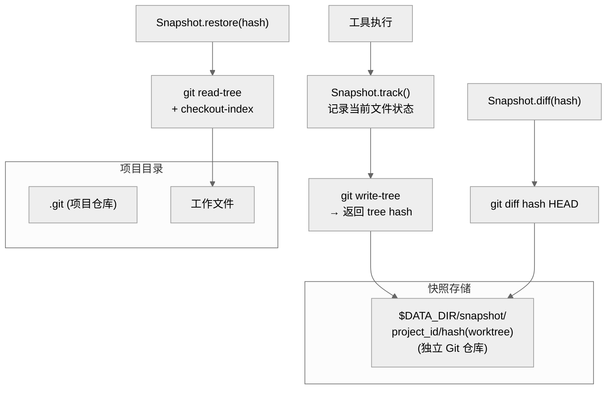
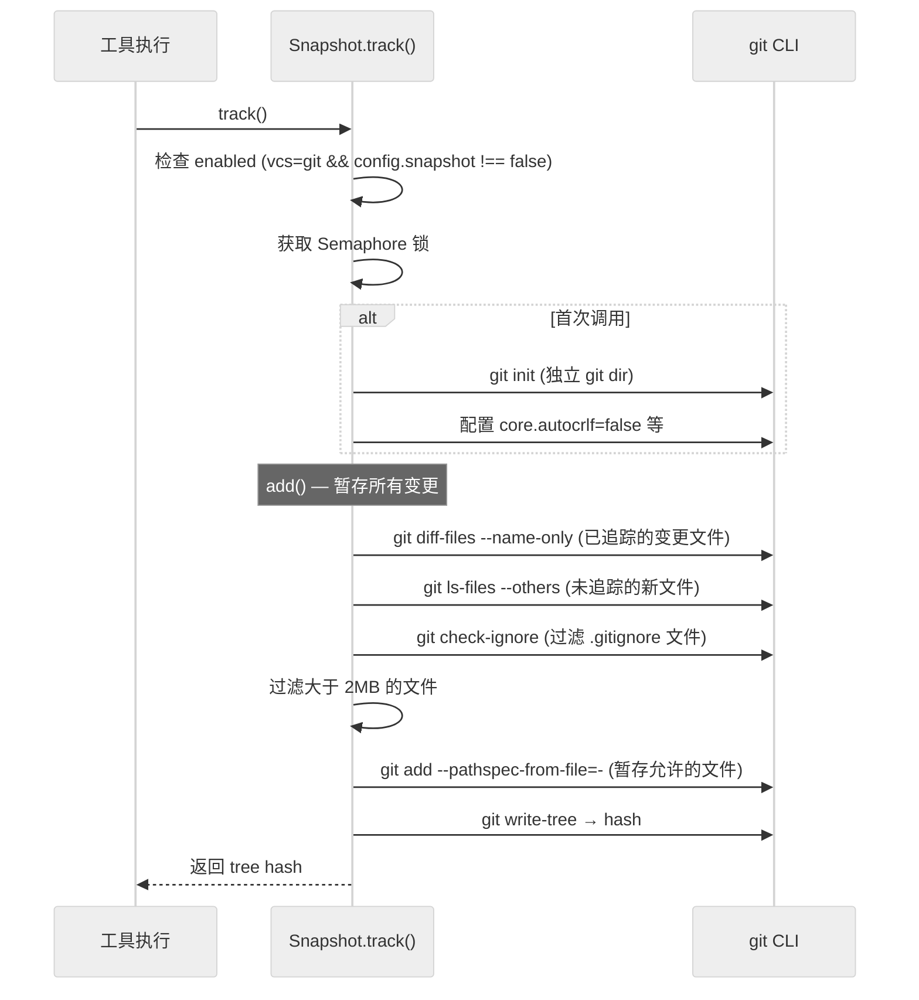

# 第十三章：快照与版本控制

> **一句话概括**: OpenCode 使用一个独立的 Git 仓库（与项目仓库分离）作为快照系统，在每次工具执行前后自动追踪文件变更，支持精确回滚到任意操作步骤。

## 13.1 快照系统架构图



## 13.2 核心概念

### 独立 Git 仓库

快照系统**不使用项目的 `.git` 仓库**，而是在数据目录中创建独立的 Git 仓库：

```typescript
const gitdir = path.join(Global.Path.data, "snapshot", ctx.project.id, Hash.fast(ctx.worktree))
```

路径结构：`~/.local/share/opencode/snapshot/{projectID}/{worktreeHash}/`

这样设计的优势：
- 不污染项目的 Git 历史
- 不受项目 Git 操作（rebase、reset 等）影响
- 可以追踪未提交的文件变更

### 关键常量

| 常量 | 值 | 含义 |
|------|-----|------|
| `prune` | `"7.days"` | Git GC 清理 7 天前的快照 |
| `limit` | `2 * 1024 * 1024` (2MB) | 单文件大小限制，超过不追踪 |

### Git 配置

快照 Git 仓库使用固定配置（`snapshot/index.ts:37`）：

```typescript
const core = ["-c", "core.longpaths=true", "-c", "core.symlinks=true"]
const cfg = ["-c", "core.autocrlf=false", ...core]
const quote = [...cfg, "-c", "core.quotepath=false"]
```

## 13.3 Snapshot.Interface

```typescript
interface Interface {
  init(): Effect.Effect<void>           // 初始化快照仓库
  cleanup(): Effect.Effect<void>        // GC 清理旧快照
  track(): Effect.Effect<string | undefined>  // 追踪当前状态，返回 tree hash
  patch(hash: string): Effect.Effect<Snapshot.Patch>  // 获取相对于 hash 的变更
  restore(snapshot: string): Effect.Effect<void>  // 恢复到指定快照
  revert(patches: Snapshot.Patch[]): Effect.Effect<void>  // 回滚一组补丁
  diff(hash: string): Effect.Effect<string>  // 获取 diff 文本
  diffFull(from: string, to: string): Effect.Effect<Snapshot.FileDiff[]>  // 完整差异
}
```

## 13.4 追踪流程 (track)

`Snapshot.track()` 是最常被调用的方法，在每次工具执行前后都会被调用：



### add() 函数的详细流程

1. **同步 .gitignore** — 将项目 `.gitignore` 规则复制到快照仓库
2. **检测变更** — 并行执行 `diff-files` (已追踪) 和 `ls-files --others` (未追踪)
3. **过滤忽略文件** — 使用 `check-ignore --no-index --stdin` 批量检查
4. **移除忽略文件** — 从快照索引中移除新被忽略的文件
5. **过滤大文件** — 跳过超过 2MB 的未追踪文件
6. **暂存** — 使用 `git add --pathspec-from-file=-` 通过 stdin 传入路径列表

### 性能优化

- 使用 `--pathspec-from-file=-` + `--pathspec-file-nul` 通过 stdin 批量传入文件路径，避免命令行长度限制 (ENAMETOOLONG)
- 使用 `\0` 分隔符安全处理含特殊字符的文件名
- 使用 `Semaphore` 保证同一时刻只有一个快照操作执行

## 13.5 恢复流程 (restore)

```typescript
const restore = function* (snapshot: string) {
  yield* git([...core, ...args(["read-tree", snapshot])], { cwd: state.worktree })
  yield* git([...core, ...args([
    "checkout-index", "-a", "--force", 
    "--prefix=" + state.worktree + path.sep
  ])], { cwd: state.worktree })
}
```

1. `git read-tree` — 将快照 tree 加载到索引
2. `git checkout-index -a --force` — 将索引中的文件还原到工作目录

## 13.6 回滚流程 (revert)

`revert` 接受一组 `Snapshot.Patch[]`，按**反序**应用：

```typescript
const revert = function* (patches: Snapshot.Patch[]) {
  for (const item of [...patches].reverse()) {
    yield* restore(item.hash)
  }
}
```

## 13.7 差异计算

### diff(hash)

返回从指定快照到当前状态的文本差异：

```typescript
const diff = function* (hash: string) {
  const result = yield* git([...quote, ...args([
    "diff", "--cached", "--no-ext-diff", hash, "--", "."
  ])])
  return result.text
}
```

### diffFull(from, to)

返回两个快照之间的结构化差异：

```typescript
interface FileDiff {
  file: string       // 文件路径
  patch: string      // 补丁文本
  additions: number  // 添加行数
  deletions: number  // 删除行数
  status?: "added" | "deleted" | "modified"
}
```

使用 `diff` npm 包的 `structuredPatch` 和 `formatPatch` 函数生成。

## 13.8 与会话的集成

快照系统与会话系统紧密集成：

1. **SessionPrompt.prompt()** — 调用 `revert.cleanup(session)` 清理过期回滚
2. **SessionRevert** (`session/revert.ts`) — 管理会话级别的回滚操作
3. **SessionSummary** (`session/summary.ts`) — 利用快照差异生成变更摘要（additions/deletions/files）
4. **InstanceBootstrap** — 启动时初始化快照系统

## 13.9 本章关键文件

| 文件 | 行数 | 职责 |
|------|------|------|
| `snapshot/index.ts` | 779 | 快照系统核心 — track/restore/revert/diff |
| `session/revert.ts` | ~170 | 会话回滚管理 |
| `session/summary.ts` | ~150 | 变更摘要生成 |
| `project/vcs.ts` | ~50 | VCS 类型检测 |
