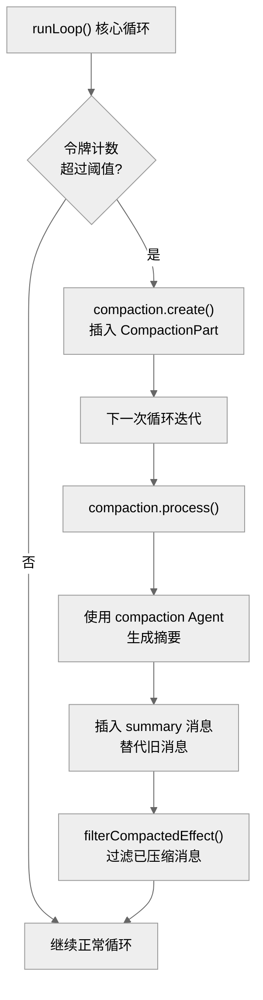

# 第十四章：上下文管理 — 压缩与令牌控制

> **一句话概括**: OpenCode 通过自动检测令牌溢出、使用专用 Agent 生成压缩摘要、将旧消息替换为摘要消息来管理 LLM 上下文窗口，确保长会话不会超出模型限制。

## 14.1 压缩架构图



## 14.2 关键常量

| 常量 | 值 | 位置 | 含义 |
|------|-----|------|------|
| Doom loop 阈值 | 3 | prompt.ts | 连续 3 次相同工具调用触发中断 |
| Prune 保护阈值 | 40,000 tokens | compaction.ts | 最近的工具输出保留量 |
| Prune 最小收益 | 20,000 tokens | compaction.ts | 至少节省这么多令牌才执行修剪 |
| Compaction 缓冲区 | 20,000 tokens | compaction.ts | 上下文限制下预留的缓冲空间 |
| Retry 初始延迟 | 2 秒 | retry.ts | 指数退避的初始延迟 |
| Retry 退避倍数 | 2x | retry.ts | 指数退避倍率 |

## 14.3 溢出检测

在核心循环中，每次迭代都会检查是否需要压缩 (`session/prompt.ts:1394`)：

```typescript
if (
  lastFinished &&
  lastFinished.summary !== true &&  // 不是摘要消息本身
  (yield* compaction.isOverflow({ tokens: lastFinished.tokens, model }))
) {
  yield* compaction.create({ sessionID, auto: true })
  continue
}
```

### 溢出阈值

`SessionCompaction.isOverflow()` 检查已使用的令牌是否超过模型上下文窗口的某个百分比。具体阈值取决于模型的 `maxTokens` 属性。

## 14.3 压缩流程

### Step 1: 创建压缩请求

```typescript
compaction.create({ sessionID, agent, model, auto: true, overflow?: boolean })
```

向最后一条用户消息追加一个 `CompactionPart`：

```typescript
interface CompactionPart {
  type: "compaction"
  auto: boolean      // true = 自动触发, false = 用户手动
  overflow?: boolean  // true = 中间溢出（LLM 响应未完成）
}
```

### Step 2: 处理压缩

在下一次循环迭代中，`compaction.process()` 执行实际压缩：

1. 选择压缩 Agent（`compaction` Agent）
2. 将需要压缩的消息作为输入
3. 调用 LLM 生成摘要
4. 创建一条 `summary: true` 的 assistant 消息
5. 标记旧消息为已压缩（通过 `time_compacting`）

### Step 3: 过滤已压缩消息

`MessageV2.filterCompactedEffect()` 在加载消息时自动过滤掉已被摘要替代的消息，确保发送给 LLM 的消息列表中只包含摘要和后续新消息。

## 14.4 Compaction Agent

压缩使用专用的 `compaction` Agent，其提示模板在 `agent/prompt/compaction.txt` 中定义。

该 Agent 的任务是：
- 保留关键上下文信息
- 压缩冗余的工具调用细节
- 维持对话连贯性
- 尽量减少信息丢失

## 14.5 自动 vs 手动压缩

| 类型 | 触发方式 | 场景 |
|------|---------|------|
| 自动 | `auto: true` | 令牌溢出自动检测 |
| 手动 | `auto: false` | 用户通过 API `/session/:id/compact` |
| 溢出 | `overflow: true` | LLM 响应中间被截断 |

## 14.6 压缩修剪

循环结束后，执行 `compaction.prune()` 清理多余的压缩数据：

```typescript
yield* compaction.prune({ sessionID }).pipe(Effect.ignore, Effect.forkIn(scope))
```

## 14.7 本章关键文件

| 文件 | 行数 | 职责 |
|------|------|------|
| `session/compaction.ts` | ~400 | 压缩服务 — 创建、处理、判断溢出 |
| `session/overflow.ts` | ~30 | 溢出阈值计算 |
| `session/prompt.ts` | 1859 | 核心循环中的压缩集成 |
| `session/message-v2.ts` | 1057 | filterCompactedEffect() |
| `agent/prompt/compaction.txt` | ~100 | 压缩 Agent 提示 |
