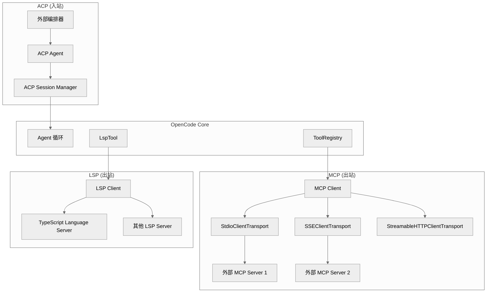

# 第十五章：外部协议集成 — MCP、ACP、LSP

> **一句话概括**: OpenCode 集成了三个外部协议：MCP (Model Context Protocol) 用于连接外部工具服务器，ACP (Agent Client Protocol) 让 OpenCode 作为可被编排的 Agent，LSP (Language Server Protocol) 提供代码诊断信息。

## 15.1 协议集成架构图



## 15.2 MCP (Model Context Protocol)

### 概述

MCP 是一个开放标准，允许 AI Agent 连接到外部工具服务器。OpenCode 作为 MCP **客户端**。

### 传输方式

| 传输 | 类 | 用途 |
|------|-----|------|
| stdio | `StdioClientTransport` | 本地进程（最常用） |
| SSE | `SSEClientTransport` | Server-Sent Events |
| HTTP | `StreamableHTTPClientTransport` | Streamable HTTP |

### 配置

```json
{
  "mcp": {
    "my-server": {
      "type": "stdio",
      "command": "node",
      "args": ["path/to/server.js"],
      "env": { "API_KEY": "..." }
    },
    "remote-server": {
      "type": "sse",
      "url": "https://mcp.example.com/sse"
    }
  }
}
```

### MCP.Interface

```typescript
interface MCP.Interface {
  init(): Effect.Effect<void>
  tools(): Effect.Effect<Record<string, AITool>>     // 获取所有 MCP 工具
  resources(): Effect.Effect<MCP.Resource[]>           // 获取资源
  reconnect(name: string): Effect.Effect<void>        // 重连
  disconnect(name: string): Effect.Effect<void>       // 断开
}
```

### OAuth 支持

MCP 支持 OAuth 认证：
- `mcp/oauth-provider.ts` — OAuth Provider 实现
- `mcp/oauth-callback.ts` — OAuth 回调处理
- `mcp/auth.ts` — 认证令牌管理

### MCP 工具集成

MCP 工具在 `SessionPrompt.resolveTools()` 中与内置工具一起注册：

```typescript
for (const [key, item] of Object.entries(yield* mcp.tools())) {
  // 对每个 MCP 工具：
  // 1. 转换 schema
  // 2. 包装 execute 函数（添加权限检查）
  // 3. 加入工具列表
  tools[key] = item
}
```

### 默认超时

```typescript
const DEFAULT_TIMEOUT = 30_000  // 30 秒
```

## 15.3 ACP (Agent Client Protocol)

### 概述

ACP 让 OpenCode 作为一个可被外部系统编排的 Agent。外部工具可以通过 ACP 协议创建会话、发送消息、接收响应。

### 核心文件

| 文件 | 行数 | 职责 |
|------|------|------|
| `acp/agent.ts` | 1842 | ACP Agent 实现 |
| `acp/session.ts` | ~300 | ACP 会话管理器 |
| `acp/types.ts` | ~50 | ACP 类型定义 |

### ACP 能力

```typescript
// 从 @agentclientprotocol/sdk 导入的操作类型
type Operations = 
  | InitializeRequest      // 初始化
  | NewSessionRequest      // 创建会话
  | LoadSessionRequest     // 加载会话
  | ResumeSessionRequest   // 恢复会话
  | ListSessionsRequest    // 列出会话
  | ForkSessionRequest     // 分支会话
  | PromptRequest          // 发送消息
  | CancelNotification     // 取消
  | AuthenticateRequest    // 认证
  | SetSessionModelRequest // 设置模型
  | SetSessionModeRequest  // 设置模式
```

## 15.4 LSP (Language Server Protocol)

### 概述

OpenCode 运行一个 LSP 服务器和客户端，用于获取代码诊断信息（错误、警告），这些信息可以被 Agent 使用。

### LSP 文件结构

| 文件 | 行数 | 职责 |
|------|------|------|
| `lsp/server.ts` | 1958 | LSP 服务器实现 |
| `lsp/client.ts` | ~200 | LSP 客户端 |
| `lsp/index.ts` | ~100 | LSP Service |
| `lsp/language.ts` | ~50 | 语言检测 |
| `lsp/launch.ts` | ~50 | LSP 服务器启动 |

### LspTool

`tool/lsp.ts` 提供了一个 `lsp` 工具，LLM 可以用它查询代码诊断：

```typescript
// 参数
{ path?: string }  // 可选的文件路径过滤

// 返回诊断信息
"Diagnostics for file.ts:
  Line 42: Type 'string' is not assignable to type 'number'"
```

## 15.5 本章关键文件

| 文件 | 行数 | 职责 |
|------|------|------|
| `mcp/index.ts` | 930 | MCP 客户端 — 连接管理、工具获取 |
| `mcp/oauth-provider.ts` | ~100 | MCP OAuth 支持 |
| `acp/agent.ts` | 1842 | ACP Agent 实现 |
| `acp/session.ts` | ~300 | ACP 会话管理 |
| `lsp/server.ts` | 1958 | LSP 服务器 |
| `lsp/client.ts` | ~200 | LSP 客户端 |
| `tool/lsp.ts` | ~80 | LSP 诊断工具 |
