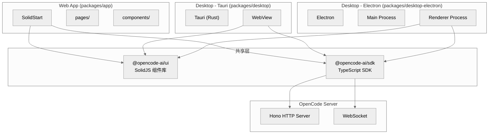

# 第十六章：Web 与桌面应用

> **一句话概括**: OpenCode 提供 SolidStart Web 应用和 Tauri/Electron 桌面应用，两者都通过 SDK Client 与 OpenCode Server 通信，共享 `@opencode-ai/ui` 组件库。

## 16.1 多端架构图



## 16.2 Web 应用 (packages/app)

### 技术栈

- **框架**: SolidStart (SolidJS 的 meta-framework)
- **路由**: `@solidjs/router`
- **样式**: TailwindCSS 4.x
- **国际化**: 自定义 i18n

### 页面结构

| 页面 | 文件 | 行数 | 功能 |
|------|------|------|------|
| Layout | `pages/layout.tsx` | 2505 | 全局布局、侧边栏、会话列表 |
| Session | `pages/session.tsx` | 2062 | 会话视图、消息渲染 |
| PromptInput | `components/prompt-input.tsx` | 1575 | 输入组件 |

### 与 Server 的连接

Web App 通过 SDK Client 连接到 OpenCode Server：

```typescript
import { createOpencodeClient } from "@opencode-ai/sdk/v2"

const client = createOpencodeClient({
  url: "http://localhost:PORT",
  password: "...",  // OPENCODE_SERVER_PASSWORD
})
```

## 16.3 UI 组件库 (packages/ui)

`@opencode-ai/ui` 提供了 TUI 和 Web 共享的组件：

### 关键组件

| 组件 | 文件 | 行数 | 功能 |
|------|------|------|------|
| `MessagePart` | `components/message-part.tsx` | 2326 | 消息内容渲染（最大文件） |

### 消息渲染

`MessagePart` 是 UI 层最复杂的组件，负责：
- Markdown 渲染
- 代码语法高亮 (Shiki)
- 工具调用展示
- 图片/文件附件
- 差异对比视图

## 16.4 桌面应用

### Tauri (packages/desktop)

- **框架**: Tauri 2.x (Rust + WebView)
- **优势**: 体积小，资源占用低
- **WebView**: 使用系统原生 WebView
- **启动命令**: `bun run --cwd packages/desktop tauri dev`

### Electron (packages/desktop-electron)

- **框架**: Electron
- **优势**: 跨平台一致性
- **打包**: `.dmg` (macOS), `.exe` (Windows), `.deb`/`.rpm`/AppImage (Linux)

### 桌面特殊功能

桌面应用包装了 OpenCode CLI + Server：
1. 启动内嵌 OpenCode Server
2. 在 WebView/渲染进程中加载 Web App
3. 提供原生功能（文件对话框、系统通知、菜单栏）

## 16.5 SDK (packages/sdk/js)

### 生成方式

SDK 从 OpenAPI 规范自动生成：

```bash
./packages/sdk/js/script/build.ts
```

### API 表面

```typescript
import { createOpencodeClient } from "@opencode-ai/sdk/v2"

const client = createOpencodeClient({ url, password })

// Session 操作
client.session.list()
client.session.create({ directory })
client.session.get(id)
client.session.message({ sessionID, content, parts })
client.session.cancel(sessionID)

// 事件订阅
client.event.subscribe((event) => { ... })

// Provider / Agent
client.provider.list()
client.agent.list()
client.model.list()
```

### 类型定义

`sdk/js/src/v2/gen/types.gen.ts` (5338 行) 包含所有自动生成的类型定义。

## 16.6 本章关键文件

| 文件 | 行数 | 职责 |
|------|------|------|
| `packages/app/src/pages/layout.tsx` | 2505 | Web 全局布局 |
| `packages/app/src/pages/session.tsx` | 2062 | Web 会话页面 |
| `packages/app/src/components/prompt-input.tsx` | 1575 | Web 输入组件 |
| `packages/ui/src/components/message-part.tsx` | 2326 | 消息渲染组件 |
| `packages/sdk/js/src/v2/gen/types.gen.ts` | 5338 | SDK 生成类型 |
| `packages/sdk/js/src/v2/gen/sdk.gen.ts` | 4274 | SDK 生成客户端 |
