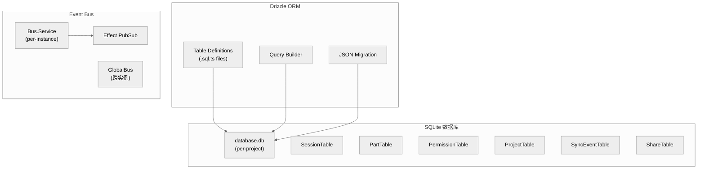

# 第十七章：存储与数据库

> **一句话概括**: OpenCode 使用 SQLite 作为嵌入式数据库，通过 Drizzle ORM 管理表结构，以 JSON 序列化存储复杂数据，辅以事件总线实现模块间异步通信。

## 17.1 存储架构图



## 17.2 数据库表

### SessionTable

```typescript
// session/session.sql.ts
export const SessionTable = sqliteTable("session", {
  id: text().primaryKey(),
  slug: text().notNull(),
  project_id: text().notNull(),
  workspace_id: text(),
  directory: text().notNull(),
  parent_id: text(),
  title: text().notNull(),
  version: integer().notNull(),
  permission: text(),
  revert: text(),
  share_url: text(),
  summary_additions: integer(),
  summary_deletions: integer(),
  summary_files: integer(),
  summary_diffs: text(),
  time_created: integer().notNull(),
  time_updated: integer().notNull(),
  time_compacting: integer(),
  time_archived: integer(),
})
```

### PartTable

```typescript
export const PartTable = sqliteTable("part", {
  id: text().primaryKey(),
  session_id: text().notNull(),
  message_id: text().notNull(),
  type: text().notNull(),
  data: text().notNull(),  // JSON 序列化
})
```

### PermissionTable

```typescript
export const PermissionTable = sqliteTable("permission", {
  project_id: text().primaryKey(),
  data: text(),  // JSON: Permission.Ruleset
})
```

### ProjectTable

```typescript
// project/project.sql.ts
export const ProjectTable = sqliteTable("project", {
  id: text().primaryKey(),
  directory: text().notNull(),
  vcs: text(),
  initialized: integer(),
  // ...
})
```

## 17.3 数据库访问模式

### Database.use()

同步访问数据库：

```typescript
Database.use((db) =>
  db.select()
    .from(SessionTable)
    .where(eq(SessionTable.project_id, projectId))
    .orderBy(desc(SessionTable.time_updated))
    .all(),
)
```

### 平台适配

通过条件导入支持 Bun 和 Node.js：

```json
{
  "#db": {
    "bun": "./src/storage/db.bun.ts",
    "node": "./src/storage/db.node.ts"
  }
}
```

- Bun: 使用 `bun:sqlite` 原生模块
- Node: 使用 `better-sqlite3` 或等效实现

### SQLite 配置

- **WAL 模式**: 启用 Write-Ahead Logging 提高并发性能
- **Cache 大小**: 64MB (`PRAGMA cache_size`)
- **10+ 表**: Session, Message, Part, Todo, SessionEntry, Permission, Project, SyncEvent, Share 等

## 17.4 JSON 迁移

`storage/json-migration.ts` 处理旧版本的 JSON 文件存储迁移到 SQLite：

- 检测是否存在旧格式数据
- 将 JSON 文件中的会话/消息导入 SQLite
- 保持向后兼容

## 17.5 事件总线 (Bus)

### Bus.Service (per-instance)

```typescript
interface Bus.Interface {
  publish<D extends BusEvent.Definition>(def: D, properties: z.output<D["properties"]>): Effect.Effect<void>
  subscribe<D extends BusEvent.Definition>(def: D): Stream.Stream<Payload<D>>
  subscribeAll(): Stream.Stream<Payload>
  subscribeCallback<D>(def: D, callback: (event: Payload<D>) => unknown): Effect.Effect<() => void>
  subscribeAllCallback(callback: (event: any) => unknown): Effect.Effect<() => void>
}
```

### 事件定义

使用 `BusEvent.define()` 创建类型安全的事件：

```typescript
export const Event = {
  Asked: BusEvent.define("permission.asked", Request),
  Replied: BusEvent.define("permission.replied", z.object({
    sessionID: SessionID.zod,
    requestID: PermissionID.zod,
    reply: Reply,
  })),
}
```

### GlobalBus vs InstanceBus

| Bus | 范围 | 用途 |
|-----|------|------|
| `GlobalBus` | 跨所有实例 | 全局事件（如配置变更） |
| `Bus.Service` | per-instance | 实例内事件（如会话消息） |

### 实现

基于 Effect 的 `PubSub.unbounded()`：

```typescript
const wildcard = yield* PubSub.unbounded<Payload>()
const typed = new Map<string, PubSub.PubSub<Payload>>()
```

- `wildcard` — 接收所有事件
- `typed` — 按事件类型分路由

## 17.6 存储路径

| 数据 | 路径 |
|------|------|
| 数据库 | `~/.local/share/opencode/data.db` |
| 快照 | `~/.local/share/opencode/snapshot/{project_id}/` |
| 日志 | `~/.local/share/opencode/logs/` |
| 配置 | `~/.config/opencode/config.json` |
| 缓存 | `~/.cache/opencode/` |

路径遵循 XDG Base Directory 规范 (Linux/macOS) 或 `%APPDATA%` (Windows)。

## 17.7 Sync 系统

`sync/` 目录包含数据同步功能：

```typescript
// sync/event.sql.ts
export const SyncEventTable = sqliteTable("sync_event", {
  id: text().primaryKey(),
  type: text().notNull(),
  data: text().notNull(),
  time_created: integer().notNull(),
})
```

用于跨设备/实例的数据同步。

## 17.8 本章关键文件

| 文件 | 行数 | 职责 |
|------|------|------|
| `storage/db.ts` | ~100 | 数据库初始化和访问 |
| `storage/db.bun.ts` | ~30 | Bun SQLite 适配器 |
| `storage/db.node.ts` | ~30 | Node.js SQLite 适配器 |
| `storage/storage.ts` | ~50 | 存储路径管理 |
| `storage/json-migration.ts` | ~200 | JSON → SQLite 迁移 |
| `session/session.sql.ts` | ~100 | Session/Part/Permission 表定义 |
| `project/project.sql.ts` | ~50 | Project 表定义 |
| `bus/index.ts` | 193 | 事件总线 Service |
| `bus/bus-event.ts` | 33 | 事件定义工具 |
| `bus/global.ts` | ~30 | 全局事件总线 |
| `sync/event.sql.ts` | ~30 | 同步事件表 |
