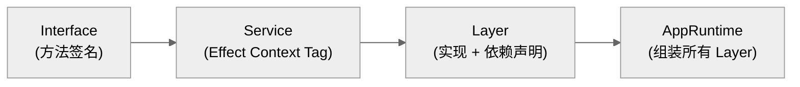

# 第十八章：设计哲学与架构模式

> **一句话概括**: OpenCode 遵循 "Effect 驱动的服务化架构" 理念，通过 namespace + Service + Layer 三件套实现模块化，以事件总线解耦通信，用独立 Git 仓库实现非侵入式快照。

## 18.1 核心设计原则

### 原则 1：Effect 作为统一的计算模型

OpenCode 全面采用 Effect 库作为核心编程模型，而不是传统的 async/await：

```typescript
// OpenCode 的典型代码风格
const track = Effect.fn("Snapshot.track")(function* () {
  const config = yield* Config.Service
  const fs = yield* AppFileSystem.Service
  // ...
})
```

**为什么不用 async/await？**
- **依赖注入**: `yield* SomeService` 自动从 Layer 获取依赖
- **资源管理**: `Scope` + `addFinalizer` 保证资源释放
- **可组合性**: `Effect.all`、`Effect.forEach` 支持并发控制
- **错误类型化**: `Effect<A, E, R>` 中 E 追踪所有可能的错误
- **可测试性**: 替换 Layer 即可注入 mock

### 原则 2：Namespace 模式

几乎所有模块都使用 TypeScript namespace 组织：

```typescript
export namespace Session {
  // 类型定义
  export const Info = z.object({ ... })
  export type Info = z.infer<typeof Info>
  
  // Effect Service 定义
  export interface Interface { ... }
  export class Service extends Context.Service<Service, Interface>()("@opencode/Session") {}
  
  // Layer 实现
  export const layer = Layer.effect(Service, Effect.gen(function* () { ... }))
  
  // 纯函数
  export function isDefaultTitle(title: string) { ... }
}
```

这种模式的优势：
- **命名空间隔离**: `Session.Info`、`Session.Service` 不会与其他模块冲突
- **类型与值同名**: Zod schema 和 TypeScript 类型可以同名
- **树摇友好**: namespace 中的函数可以被 tree-shake

### 原则 3：数据驱动的配置

设计决策通过配置外化，而不是硬编码：

| 配置层 | 优先级 | 示例 |
|--------|--------|------|
| 托管配置 | 最高 | 企业 MDM 推送 |
| 全局配置 | 高 | `~/.config/opencode/config.json` |
| 项目配置 | 中 | `.opencode/config.json` |
| 环境变量 | 按场景 | `OPENCODE_*` |
| 代码默认值 | 最低 | 硬编码常量 |

### 原则 4：事件驱动解耦

模块间通信主要通过事件总线：

```typescript
// 发布事件
yield* bus.publish(Session.Event.Error, { sessionID, error })

// 订阅事件
yield* bus.subscribeCallback(Command.Event.Executed, async (payload) => {
  if (payload.properties.name === Command.Default.INIT) {
    Project.setInitialized(Instance.project.id)
  }
})
```

这让模块可以在不知道彼此存在的情况下协作。

## 18.2 关键架构模式

### 模式 1：Service + Layer

这是 Effect 生态的核心模式，OpenCode 在每个子系统中一致使用：



```typescript
// 1. 定义接口
export interface Interface {
  readonly ask: (input: AskInput) => Effect.Effect<void, Error>
}

// 2. 定义 Service Tag
export class Service extends Context.Service<Service, Interface>()("@opencode/Permission") {}

// 3. 实现 Layer
export const layer = Layer.effect(
  Service,
  Effect.gen(function* () {
    const bus = yield* Bus.Service  // 声明依赖
    return Service.of({ ask, reply, list })
  }),
)
```

### 模式 2：InstanceState

`InstanceState` 是 OpenCode 特有的模式，用于管理 per-instance（per-project-directory）的可变状态：

```typescript
const state = yield* InstanceState.make<State>(
  Effect.fn("Permission.state")(function* (ctx) {
    // ctx.directory, ctx.project 来自当前实例上下文
    return { pending: new Map(), approved: [] }
  }),
)

// 使用时
const { pending, approved } = yield* InstanceState.get(state)
```

**为什么需要 InstanceState？**
- OpenCode 可以同时管理多个项目目录
- 每个目录有独立的配置、会话、快照
- InstanceState 确保状态按目录隔离

### 模式 3：Lazy 初始化

```typescript
import { lazy } from "@/util/lazy"

export const Default = lazy(() => create({}))
```

`lazy()` 确保 Server、Config 等重量级对象只在首次访问时创建。

### 模式 4：品牌类型 (Branded Types)

```typescript
export const SessionID = {
  zod: z.string().brand("SessionID"),
  ascending: () => ulid() as SessionID,
  make: (id: string) => id as SessionID,
}
```

品牌类型防止 ID 混用（不能把 MessageID 传给期望 SessionID 的函数）。

### 模式 5：ProjectorPattern

Server 使用 "projector" 模式将内部事件转化为外部 SSE 流：

```typescript
// server/projectors.ts
export function initProjectors() {
  // 监听内部事件，转换为 Server-Sent Events
}
```

### 模式 6：条件导入 (Conditional Imports)

```json
// package.json
{
  "imports": {
    "#db": {
      "bun": "./src/storage/db.bun.ts",
      "node": "./src/storage/db.node.ts"
    },
    "#pty": {
      "bun": "./src/pty/pty.bun.ts",
      "node": "./src/pty/pty.node.ts"
    }
  }
}
```

这允许同一份代码在 Bun 和 Node.js 环境下使用不同的底层实现。

## 18.3 非传统设计选择

### 选择 1：Zod 4 而非 TypeScript interfaces

```typescript
// OpenCode 的风格：Zod schema 生成类型
export const Info = z.object({
  id: SessionID.zod,
  title: z.string(),
  // ...
})
export type Info = z.infer<typeof Info>
```

**好处**：
- 运行时验证免费获得
- 自动生成 JSON Schema（用于 OpenAPI 和 AI SDK）
- Schema 可以序列化/传输

### 选择 2：SQLite 而非文件系统

会话和消息存储在 SQLite 中（通过 Drizzle ORM），而不是 JSON 文件：

- **ACID 事务**: 崩溃安全
- **查询灵活性**: 按时间、项目、标题搜索
- **并发安全**: 多进程同时访问
- **紧凑存储**: Part 数据 JSON 化存入单列

### 选择 3：独立 Git 仓库做快照

而不是使用 git stash 或分支：

- **完全隔离**: 不影响用户的 Git 工作流
- **精确追踪**: 每次工具执行都有独立的 tree hash
- **自动清理**: 7 天过期的 `gc --prune`

### 选择 4：SolidJS 做 TUI

通过 `@opentui/solid` 将 SolidJS 渲染到终端：

- **复用技能**: Web 和 TUI 使用同一套组件模型
- **响应式**: SolidJS 的细粒度响应式非常适合终端 UI
- **组件化**: 比 blessed/ink 更现代的开发体验

### 选择 5：Process 隔离的工具执行

Bash 工具通过 PTY (pseudo-terminal) 执行，而非直接 `exec`：

- **真实终端**: 支持 ANSI 颜色、交互式程序
- **超时控制**: 可以强制终止超时进程
- **输出捕获**: 完整的 stdout + stderr

## 18.4 技术债务与演进痕迹

### message-v2.ts

文件名中的 "v2" 表明消息模型经历过一次大的重构。旧的 `message.ts` (5192 字节) 仍然存在但可能不再使用。

### Provider Transform

`provider/transform.ts` (1067 行) 是所有提供商兼容性修复的集中地 — 表明不同 LLM 提供商在工具调用格式上有大量不一致。

### Copilot SDK

`provider/sdk/copilot/` 目录包含一个完整的 OpenAI 兼容 SDK 实现（~5000 行），专门为 GitHub Copilot 定制 — 说明标准 SDK 无法满足 Copilot 的特殊需求。

## 18.5 架构约束

| 约束 | 原因 | 影响 |
|------|------|------|
| Bun 运行时 | 性能 + 原生 SQLite | Node.js 需要适配层 |
| Effect 库 | 依赖注入 | 学习曲线陡峭 |
| 单进程服务器 | 简化架构 | 每个目录一个 Instance |
| SQLite | 嵌入式数据库 | 不适合多机部署 |
| Git CLI | 快照实现 | 依赖系统安装的 Git |

## 18.6 本章关键文件

| 文件 | 行数 | 职责 |
|------|------|------|
| `effect/app-runtime.ts` | ~100 | Effect 运行时组装 |
| `effect/instance-state.ts` | ~100 | Per-instance 状态管理 |
| `bus/index.ts` | ~80 | 事件发布/订阅 |
| `bus/bus-event.ts` | ~30 | 事件定义工具 |
| `util/lazy.ts` | ~15 | Lazy 初始化工具 |
| `util/wildcard.ts` | ~20 | Wildcard 匹配 |
